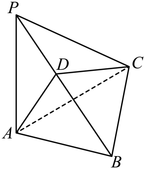

## 错法

看到l垂直α内一条线a便写l⊥α，或验证两条平行线就认为数量够了。原因是把定义“任意方向都垂直”缩成了一个方向；两条平行线只是重复同一方向约束。

## 正解

判定要α内两条相交线a、b，分别l⊥a、l⊥b。先核对同面与交点，再转垂面。若只是反驳l⊥α，一条面内不垂直的线就足够；证明与否定所需证据不对称。已证l⊥α后才能用定义得l垂面内其他线，不能反转这个单条结论。

## 例题

### 原例：已垂中线仍不能垂整个平面的反例

来源：`HSMA-B2-C8-D847cdf96960d-P0198-P0218`；原件《专题8.6 空间直线、平面的垂直（一）（举一反三讲义）高一数学人教A版必修第二册（解析版）.docx》。题号、学年及地区按讲义原标注，未另作来源核验。

以下完整保留原题、原答案与原详解（仅统一等价排版及配图路径）：

【变式3-1】（24-25高二上·山西·期末）如图，在三棱锥$P-ABC$中，$PA\perp $平面$ABC$，$AB$ $\perp $ $BC$，$PA=AB$，$D$为$PB$的中点，则下列结论正确的有（    ）

①$BC\perp $平面$PAB$；②$AD\perp PC$；③$AD\perp $平面$PBC$；④$PB\perp $平面$ADC$.

A．$0$个  B．$1$个

C．$2$个  D．$3$个

【答案】D

【解题思路】由线面垂直定义和判定定理进行辨析即可.

【解答过程】对于①，∵$PA\perp $平面$ABC$，$BC\subset $平面$ABC$，∴$PA\perp BC$，

又∵$AB$ $\perp $ $BC$，$PA\cap AB=A$，$PA\subset $平面$PAB$，$AB\subset $平面$PAB$，

∴$BC\perp $平面$PAB$，故①正确；

对于②，③，由①，∵$BC\perp $平面$PAB$，$AD\subset $平面$PAB$，∴$BC\perp AD$，

又∵$PA=AB$，$D$为$PB$的中点，∴$AD\perp PB$，

又∵$BC\cap PB=B$，$BC\subset $平面$PBC$，$PB\subset $平面$PBC$，∴$AD\perp $平面$PBC$，

又∵$PC\subset $平面$PBC$，∴$AD\perp PC$，故②，③正确；

对于④，假设$PB\perp $平面$ADC$，则∵$CD\subset $平面$ADC$，∴$PB\perp CD$，

又∵$D$为$PB$的中点，∴$PC=BC$，

∵$PA\perp $平面$ABC$，$AC\subset $平面$ABC$，∴$PA\perp AC$，∴$Rt\triangle PAC$中，$PC>AC$，

又∵$AB$ $\perp $ $BC$，∴$Rt\triangle ABC$中，$AC>BC$，∴$PC>AC>BC$，$PC\ne BC$，

∴假设不成立，故④错误.

∴正确的有①②③，共$3$个.

故选：D.

#### 补充讲解

先由PA垂直底面得到PA⊥BC，再与已知AB⊥BC合用；PA、AB在PAB内相交于A，得到①。PA=AB使三角形PAB为等腰三角形，底边PB的中线AD同时是高，所以AD⊥PB；又AD在PAB内，①给AD⊥BC。PB、BC在PBC内交于B，故③成立，③再推出②。

④不能由AD⊥PB反推PB垂直整个ADC。若④成立，则PB⊥CD，D又是PB中点，C在PB的垂直平分线上，得到PC=BC。但两个直角三角形给PC>AC>BC，矛盾。因此①②③共3项，D正确；其他数量遗漏或多算了结论。
