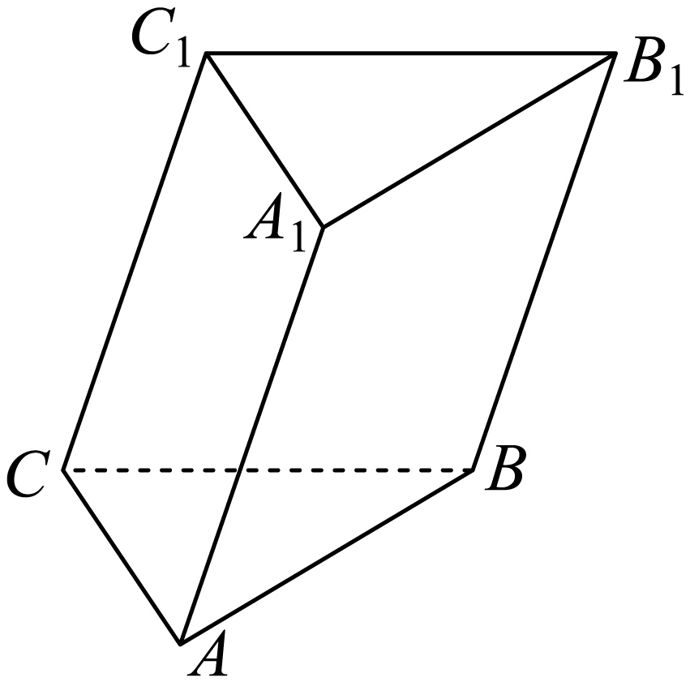

## 错法

只证明 a∥b、b⊂α 就写 a∥α。若 a 也在 α 内，前两项完全可能成立，但 a 与 α 有无限多个公共点，当然不满足无公共点的定义。错因是把线的“平行方向”误当它相对平面的位置。

## 正解

三条件缺一不可：a∥b、b⊂α、a⊄α，才有 a∥α。证明 a⊄α 不需要先证明没有公共点，只须指出 a 上某点不在 α 内即可。例如目标面和另一个已知面交于 l，a 上点 P 在后一个面内而不在 l，则 P 不在目标面。

a⊄α 表示不整条在面内；它本身不能排除相交。这正是平行判定要补做的工作，而非循环地先宣称 a∥α 再当条件使用。

## 例题

### 原例（HSMA-B2-C8-Dcd55fda808b2-P0142–P0150）

> 原件：专题8.5 空间直线、平面的平行（举一反三讲义）高一数学人教A版必修第二册（解析版）.docx。题源标注沿用原资料。完整原题、原答案、原解题思路与详解保留，Unicode空格等价转写。

【例3】（2025高二上·黑龙江·学业考试）如图，在三棱柱$ABC-{A}_{1}{B}_{1}{C}_{1}$中，与平面$A{A}_{1}{B}_{1}B$平行的直线为（    ）

A．$AB$  B．$C{C}_{1}$  C．$BC$  D．$AC$

【答案】B

【解题思路】根据线面平行的判定定理即可得出答案.

【解答过程】由题意，$AB\subset $平面$A{A}_{1}{B}_{1}B$，$BC,AC$与平面$A{A}_{1}{B}_{1}B$都相交，

因为$C{C}_{1}//A{A}_{1}$，$C{C}_{1}\not\subset $平面$A{A}_{1}{B}_{1}B$，$A{A}_{1}\subset $平面$A{A}_{1}{B}_{1}B$，

所以$C{C}_{1}//$平面$A{A}_{1}{B}_{1}B$.

故选：B.

**补讲：每一步的依据**

CC₁∥AA₁、AA₁⊂目标面还差 CC₁⊄目标面。由于目标面与底面交于 AB，而 C 在底面内但不在 AB 上，C 不在目标面，故第三项补齐，B 正确。选项 A 的 AB 整条在目标面中，即使能找到面内另一条与 AB 平行的线，也不能据此说 AB∥该面。C、D 的两条直线各有端点 B、A 在目标面中，是相交情形。

## 易错

- 面外条件应从点的归属或交线证明，不能写“由图知在面外”代替理由。
- 证明一条线与某面内线平行后，还要查原线是否就是面内线。

## 来源

- HSMA-B2-C8-Dcd55fda808b2-P0021–P0029；原件《专题8.5 空间直线、平面的平行（举一反三讲义）高一数学人教A版必修第二册（解析版）.docx》；知识与分类口径。
- HSMA-B2-C8-Dcd55fda808b2-P0142–P0150；原件《专题8.5 空间直线、平面的平行（举一反三讲义）高一数学人教A版必修第二册（解析版）.docx》；知识与分类口径。
- HSMA-B2-C8-Dcd55fda808b2-P0274–P0275；原件《专题8.5 空间直线、平面的平行（举一反三讲义）高一数学人教A版必修第二册（解析版）.docx》；知识与分类口径。
