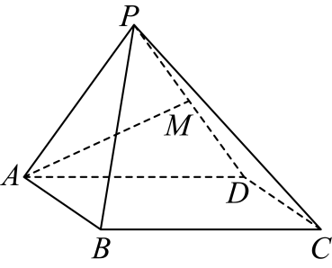

## 错法

只知α⊥β，就把α内任意线a写成a⊥β。错误来自把面的开合角90°理解成面内每个方向都90°；交线本身同时包含于两面，已经不可能垂直其中的面。

## 正解

写出α∩β=l，检查a包含于α且a⊥l，才推出a⊥β。若a沿交线方向，或在α内斜着交l，性质都不能用；若a不在α内，也不能从这组面面条件得它的垂直关系。找到合法面垂线后，才能进一步证其垂β内任意线。

## 例题

### 原例：正方形边为何能成为侧面的垂线

来源：`HSMA-B2-C8-De11de002464c-P0441-P0451`；原件《专题8.7 空间直线、平面的垂直（二）（举一反三讲义）高一数学人教A版必修第二册（解析版）.docx》。题号、学年及地区按讲义原标注，未另作来源核验。

以下完整保留原题、原答案与原详解（仅统一等价排版及配图路径）：

【变式5-2】（2025高三·全国·专题练习）如图，在四棱锥$P-ABCD$中，底面ABCD为正方形，侧面ADP是正三角形，侧面ADP⊥底面ABCD，M是DP的中点．证明：$AM\perp $平面CDP．

【答案】证明见解析

【解题思路】利用面面垂直的性质证明线面垂直，然后根据线面垂直的判定定理可得$AM\perp $平面CDP．

【解答过程】因为侧面ADP为正三角形，且M是DP的中点，所以$AM\perp DP$，

又底面ABCD为正方形，所以$CD\perp AD$．

因为平面$ADP\perp $平面ABCD，且平面$ADP\cap $平面$ABCD=AD$，$CD\subset $平面ABCD，

所以$CD\perp $平面ADP，

又$AM\subset $平面ADP，所以$CD\perp AM$，

因为$CD\cap DP=D$，且CD，$DP\subset $平面CDP，

所以$AM\perp $平面CDP．

#### 补充讲解

先找交线AD：CD在底面内且垂直AD，两面垂直性质才给CD⊥PAD，进一步得到CD⊥AM。另由正三角形PAD和M为PD中点，AM是底边PD的中线兼高，AM⊥PD。CD、PD在PCD内交于D，所以AM垂直PCD。

两个垂直事实来自不同理由：CD⊥AM来自面面垂直性质的完整条件；PD⊥AM来自正三角形的中线性质。不能把面面垂直解释成PAD内任意线都垂直底面。

### 原例：缺必要性与缺垂交线条件的区别

来源：`HSMA-B2-C8-De11de002464c-P0409-P0418`；原件《专题8.7 空间直线、平面的垂直（二）（举一反三讲义）高一数学人教A版必修第二册（解析版）.docx》。题号、学年及地区按讲义原标注，未另作来源核验。

以下完整保留原题、原答案与原详解（仅统一等价排版及配图路径）：

【例5】（24-25高三上·河北邢台·期末）已知$m$，$n$，$l$是三条不同的直线，$\alpha $，$\beta $是两个不同的平面，$m\subset \alpha $，$n\subset \beta $，$\alpha \cap \beta =l$，$m\perp l$，则“$\alpha \perp \beta $”是“$m\perp n$”的（   ）

A．充分不必要条件  B．必要不充分条件

C．充要条件  D．既不充分也不必要条件

【答案】A

【解题思路】根据线面、面面垂直的判定定理与性质定理判断即可.

【解答过程】充分性：若$\alpha \perp \beta $，因为$\alpha \cap \beta =l$，$m\subset \alpha $，$m\perp l$，所以$m\perp \beta $，

因为$n\subset \beta $，所以$m\perp n$，则充分性成立.

必要性：当$n//l$时，$\alpha $与$\beta $不一定垂直，则必要性不成立.

所以“$\alpha \perp \beta $”是“$m\perp n$”的充分不必要条件.

故选：A.

#### 补充讲解

条件“α⊥β”加上m在α内、m⊥交线l，可用性质定理得m⊥β，继而m垂直β内任意n，因此是充分条件。

为什么不必要：原解令n∥l，m⊥l便推出m⊥n，完全不需要两面为90°。可将β绕l改变开合而保持n∥l，这一方向关系始终不变。因此A正确；B缺充分性，C错误添加必要性，D错误否定充分性。若省去m⊥l，α⊥β也不能保证m⊥n，所以“两个面垂直”的信息必须和面内线的方向合用。
