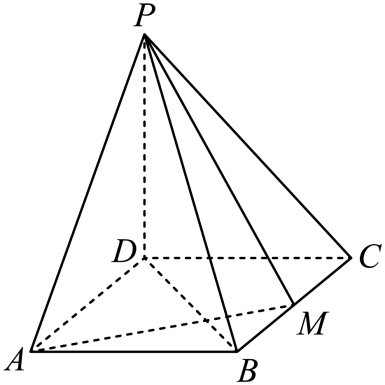

## 讲解

### 是什么

两个相交平面所成二面角为90°，称α⊥β。判定：若b包含于β且b⊥α，则β⊥α。理由是b在β内且垂α，故b与α交点O在两面交线l上；在α内过O作a⊥l，b也垂l并垂a，于是a、b形成90°的二面角平面角。

### 怎么来的

若α⊥β、α∩β=l，a包含于α且a⊥l，则a⊥β。a与l在O相交；在β内过O作b⊥l。由二面角定义a⊥b，同时已知a⊥l，b、l在β内相交，所以双线判定使a⊥β。

### 什么时候能用

性质的四项条件缺一不可：两面垂直、找准交线、a在其中一个面内、a垂交线。它把面面关系变成具体线面垂直，再可推出线线垂直、构造射影或距离垂足。两面垂直只是方向约束，不表示一面内任意线都垂另一面。

## 易错

判定是“面包含另一个面的垂线”，性质是“在一面内且垂交线的线垂另一个面”，两者方向和附加条件不同。来源De11de002464c-P0311至P0329给出的定义、判定、性质与载体已按完整条件读回；画图时边垂直只是示意，不能用其外观替代90°平面角证明。

## 例题

### 原例：面内找到一条目标面的垂线

来源：`HSMA-B2-C8-De11de002464c-P0345-P0351`；原件《专题8.7 空间直线、平面的垂直（二）（举一反三讲义）高一数学人教A版必修第二册（解析版）.docx》。题号、学年及地区按讲义原标注，未另作来源核验。

以下完整保留原题、原答案与原详解（仅统一等价排版及配图路径）：

【例4】（2025高三·全国·专题练习）如图，四棱锥$P-ABCD$的底面是矩形，$PD\perp $底面$ABCD$，$M$为$BC$的中点，且$PB\perp AM$．证明：平面$PAM\perp $平面$PBD$.

【答案】证明见解析

【解题思路】由$PD\perp $底面$ABCD$可得$PD\perp AM$，又$PB\perp AM$，由线面垂直的判定定理可得$AM\perp $平面$PBD$，再根据面面垂直的判定定理即可证出平面$PAM\perp $平面$PBD$.

【解答过程】因为$PD\perp $底面$ABCD$，$AM\subset $平面$ABCD$，所以$PD\perp AM$，

又$PB\perp AM$，$PB\cap PD=P$，$PB$、$PD\subset $平面$PBD$，所以$AM\perp $平面$PBD$，

而$AM\subset $平面$PAM$，所以平面$PAM\perp $平面$PBD$．

#### 补充讲解

PD是底面的垂线，AM在底面内，因此PD⊥AM；PB⊥AM是题给，不是从矩形外观猜来。PB与PD在PBD内交于P，双线判定使AM⊥PBD；AM又在PAM内，所以PAM包含另一个面的垂线，两个平面垂直。

判定面面垂直不需要证明一个面内所有线都垂直另一面，只需找出一条合法垂线；但这条线必须确实包含在第一个面内。矩形与M中点等条件用于确定图形位置，不能代替题给PB⊥AM。

### 原例：完整面面垂直性质与充分不必要条件

来源：`HSMA-B2-C8-De11de002464c-P0409-P0418`；原件《专题8.7 空间直线、平面的垂直（二）（举一反三讲义）高一数学人教A版必修第二册（解析版）.docx》。题号、学年及地区按讲义原标注，未另作来源核验。

以下完整保留原题、原答案与原详解（仅统一等价排版及配图路径）：

【例5】（24-25高三上·河北邢台·期末）已知$m$，$n$，$l$是三条不同的直线，$\alpha $，$\beta $是两个不同的平面，$m\subset \alpha $，$n\subset \beta $，$\alpha \cap \beta =l$，$m\perp l$，则“$\alpha \perp \beta $”是“$m\perp n$”的（   ）

A．充分不必要条件  B．必要不充分条件

C．充要条件  D．既不充分也不必要条件

【答案】A

【解题思路】根据线面、面面垂直的判定定理与性质定理判断即可.

【解答过程】充分性：若$\alpha \perp \beta $，因为$\alpha \cap \beta =l$，$m\subset \alpha $，$m\perp l$，所以$m\perp \beta $，

因为$n\subset \beta $，所以$m\perp n$，则充分性成立.

必要性：当$n//l$时，$\alpha $与$\beta $不一定垂直，则必要性不成立.

所以“$\alpha \perp \beta $”是“$m\perp n$”的充分不必要条件.

故选：A.

#### 补充讲解

条件“α⊥β”加上m在α内、m⊥交线l，可用性质定理得m⊥β，继而m垂直β内任意n，因此是充分条件。

为什么不必要：原解令n∥l，m⊥l便推出m⊥n，完全不需要两面为90°。可将β绕l改变开合而保持n∥l，这一方向关系始终不变。因此A正确；B缺充分性，C错误添加必要性，D错误否定充分性。若省去m⊥l，α⊥β也不能保证m⊥n，所以“两个面垂直”的信息必须和面内线的方向合用。
