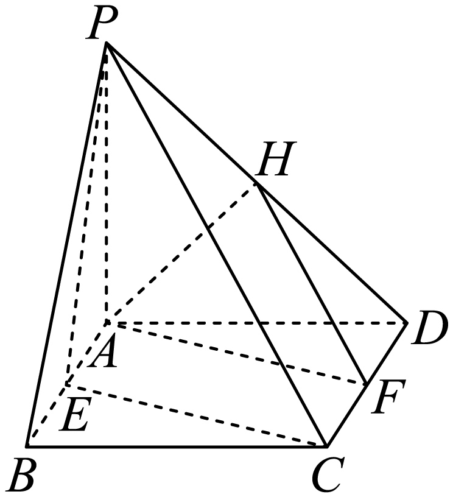

## 讲解

### 是什么

两个不同平面 α∥β 的定义是无公共点。判定定理：在 α 中有两条不同相交直线 a、b，且 a∥β、b∥β，就能推出 α∥β。核心是“同在一个面内”“两线相交”“都平行于另一个面”。

常用推论是两个**不同**平面内各有两条相交直线，分别对应平行，则两面平行。使用时仍须防止两面重合；对应平行方向只确定平面方向，不能排除两个面在同一位置。

性质定理：α∥β，第三个平面 γ 分别与两面相交于 a、b，则 a∥b。还有：α 内每条直线都与 β 平行；两个不同平面分别平行于第三个平面，也互相平行。

### 为什么双线足够，单线不够

若判定中的两面相交于 l，则由线面平行性质，a、b 在 α 中都平行于 l，从而 a∥b。这与 a、b 相交矛盾，所以两面不能相交，只能平行。一条线或者同方向的许多平行线没有这个矛盾，无法确定整个平面的第二个方向。

性质中 a、b 都在 γ 内；若它们有公共点，该点也属于 α、β，违背 α∥β。因此两条交线在同一面内不相交，便平行。α 内任一直线若与 β 有公共点，也会成为两面公共点，所以每条都与 β 平行。

### 什么时候能用

证面面平行通常选同一面内过同一点的两条线，分别完成线面平行，再合并。已知面面平行则作一个同时截两面的辅助面，得到交线平行，回到平面相似或平行四边形求量。平行直线若均与两平行面相交，两面截出的两段等长：两条截线确定的平面内，两个截面交线也平行，四个交点组成平行四边形。

**资料澄清**：来源 P0051/image13 的推论需补“两平面不同”；同一平面内也可作两组对应平行的相交线，此时两面是重合，不能称平行。来源平行传递和等长性质也默认相关对象不同且所说交点存在。

## 例题

### 原例（HSMA-B2-C8-Dcd55fda808b2-P0230–P0239）

> 原件：专题8.5 空间直线、平面的平行（举一反三讲义）高一数学人教A版必修第二册（解析版）.docx。题源标注沿用原资料。完整原题、原答案、原解题思路与详解保留，Unicode空格等价转写。

【变式4-1】（24-25高一下·河南郑州·期中）已知$\alpha ,\beta $是两个不重合的平面，下列选项中，一定能得出平面$\alpha $与平面$\beta $平行的是（   ）

A．平面$\alpha $内有一条直线与平面$\beta $平行  B．平面$\alpha $内有两条直线与平面$\beta $平行

C．平面$\alpha $内有无数条直线与平面$\beta $平行  D．平面$\alpha $内有两条相交直线与平面$\beta $平行

【答案】D

【解题思路】由面面平行的判定定理即可判断.

【解答过程】对于A：平面$\alpha $内有一条直线与平面$\beta $平行，$\alpha ,\beta $可能平行，也可能相交，

对于B：平面$\alpha $内有两条直线与平面$\beta $平行，$\alpha ,\beta $可能平行，也可能相交，

对于C：平面$\alpha $内有无数条直线与平面$\beta $平行，$\alpha ,\beta $可能平行，也可能相交，

对于D：平面$\alpha $内有两条相交直线与平面$\beta $平行，则$\alpha //\beta $，面面平行判定定理，

故选：D.

**补讲：每一步的依据**

D 符合相交双线判定。为什么 C 的“无数条”仍不够：若 α、β 相交于 l，在 α 内作不与 l 重合且平行于 l 的线，每一条都没有点落到 β 内，因而都与 β 平行；这样的线可有无数条，两个面却仍相交。A 的一条、B 的两条同向线同样不能排除这种情况。数量不能替代“相交”带来的第二个方向。

### 原例（HSMA-B2-C8-Dcd55fda808b2-P0240–P0253）

> 原件：专题8.5 空间直线、平面的平行（举一反三讲义）高一数学人教A版必修第二册（解析版）.docx。题源标注沿用原资料。完整原题、原答案、原解题思路与详解保留，Unicode空格等价转写。

【变式4-2】（24-25高一下·全国·课堂例题）如图所示，已知四棱锥$P-ABCD$的底面$ABCD$为矩形，$E$，$F$，$H$分别为$AB$，$CD$，$PD$的中点．求证：平面$AFH//$平面PCE．

【答案】证明见解析

【解题思路】由$FH//PC$，所以$FH//$平面$PCE$，由四边形$AECF$为平行四边形，所以$AF//CE$，可得$AF//$平面$PCE$，进而可得结果.

【解答过程】证明  ：因为$F$，$H$分别为$CD$，$PD$的中点，

所以$FH//PC$．

因为$PC\subset $平面$PCE$，$FH\not\subset $平面$PCE$，

所以$FH//$平面$PCE$．

又由已知得$AE//CF$，且$AE=CF$，

所以四边形$AECF$为平行四边形，

所以$AF//CE$．而$CE\subset $平面$PCE$，$AF\not\subset $平面$PCE$，

所以$AF//$平面$PCE$．

又$FH\subset $平面$AFH$，$AF\subset $平面$AFH$，$FH\cap AF=F$，

所以平面$AFH//$平面$PCE$．

**补讲：每一步的依据**

△DCP 中 F、H 是两边中点，先由中位线得 FH∥PC。底面与平面 PCE 交于 CE；D 不在 CE 上，所以平面 PCD 与 PCE 不重合，而其交线为 PC。F 在 CD 内且不是 C，因此 F 不在 PC，故 F 不在 PCE，FH 是面外直线。由 PC⊂PCE 得 FH∥平面 PCE。

矩形中 AE∥CF，且 AE=CF，都是 AB 长的一半，故四边形 AECF 为平行四边形，AF∥CE。A 不在底面交线 CE 上，所以 AF⊄平面 PCE；结合 CE⊂PCE 得 AF∥平面 PCE。最后 AF 与 FH 都在 AFH 内并交于 F，两个方向齐全，面面平行判定给出结论。

## 易错

- 一条、两条平行线、无数条同向线都不足以判整个平面平行。
- 两面与同一第三面平行时，若未说明前两面不同，还可能重合。
- 两条交线平行是面面平行的必要条件，一般不是充分条件；不能倒用性质当判定。

## 来源

- HSMA-B2-C8-Dcd55fda808b2-P0040–P0070；原件《专题8.5 空间直线、平面的平行（举一反三讲义）高一数学人教A版必修第二册（解析版）.docx》；知识与分类口径。
- HSMA-B2-C8-Dcd55fda808b2-P0201–P0253；原件《专题8.5 空间直线、平面的平行（举一反三讲义）高一数学人教A版必修第二册（解析版）.docx》；知识与分类口径。
- HSMA-B2-C8-Dcd55fda808b2-P0276–P0277；原件《专题8.5 空间直线、平面的平行（举一反三讲义）高一数学人教A版必修第二册（解析版）.docx》；知识与分类口径。
