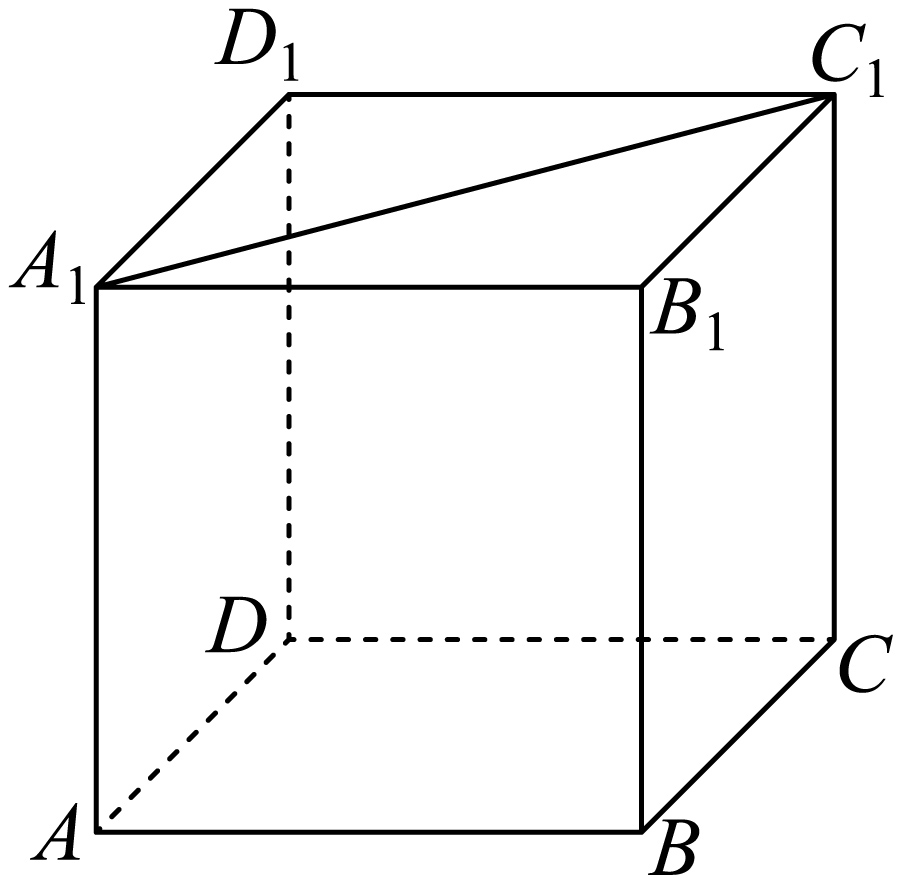

## 讲解

### 是什么

异面直线是不在同一个平面内的两条直线。过任一点O分别作a′∥a、b′∥b，两条新线相交，把其中的锐角或直角定义为a、b所成角θ。方向相同的平行线作出的角相等，所以换O不改变θ。

$$0<\theta\le\frac\pi2.$$

### 怎么来的

异面线不能平行，所以不能取0；直线没有指定正方向，两相交线作出的钝角要改取补角。若θ=90°，称两线垂直，记a⊥b；空间垂直可以发生在相交线，也可以发生在异面线。

### 什么时候能用

优先把其中一条平移到另一条的端点，找到可计算三角形。平移必须有平行证明，如棱柱对应棱、三角形中位线。然后求两新线的锐角或直角，不能把有向向量角直接当异面直线角。若算出cosγ<0，应取θ=π−γ，cosθ=−cosγ。

## 易错

图上两线没画成交点不表示异面，需判断能否共面；图上两线交叉也不表示真相交。一次平移以后所得角可能是所求角的补角，最后必须检查范围。来源D847cdf96960d-P0018至P0022的定义与范围按这一口径使用。

## 例题

### 原例：正方体对角线与异面棱的夹角

来源：`HSMA-B2-C8-D847cdf96960d-P0024-P0031`；原件《专题8.6 空间直线、平面的垂直（一）（举一反三讲义）高一数学人教A版必修第二册（解析版）.docx》。题号、学年及地区按讲义原标注，未另作来源核验。

以下完整保留原题、原答案与原详解（仅统一等价排版及配图路径）：

【例1】（24-25高一下·新疆阿克苏·期末）如图，在正方体$ABCD-{A}_{1}{B}_{1}{C}_{1}{D}_{1}$中，异面直线${A}_{1}{C}_{1}$与$BC$所成的角是（   ）

A．$30^{\circ}$  B．$45^{\circ}$  C．$60^{\circ}$  D．$90^{\circ}$

【答案】B

【解题思路】利用几何法确定异面直线夹角.

【解答过程】由正方体可知$BC//{B}_{1}{C}_{1}$，且四边形${A}_{1}{B}_{1}{C}_{1}{D}_{1}$为正方形，

所以异面直线${A}_{1}{C}_{1}$与$BC$所成的角的平面角为$\angle {A}_{1}{C}_{1}{B}_{1}=45^{\circ}$，

故选：B.

#### 补充讲解

BC平移到同方向的B₁C₁，顶面是正方形，所以对角线A₁C₁与边C₁B₁的锐角为45°，B正确。平移只改直线位置，不改方向；正方形的对角线平分该顶点的90°角来自两直角三角形全等，不是图画得像45°。A、C、D均不满足这个顶面角。

### 原例：垂直方向可沿平行线传递

来源：`HSMA-B2-C8-D847cdf96960d-P0067-P0072`；原件《专题8.6 空间直线、平面的垂直（一）（举一反三讲义）高一数学人教A版必修第二册（解析版）.docx》。题号、学年及地区按讲义原标注，未另作来源核验。

以下完整保留原题、原答案与原详解（仅统一等价排版及配图路径）：

【例2】（24-25高二上·上海浦东新·期末）已知三条直线${l}_{1}$，${l}_{2}$，${l}_{3}$满足${l}_{1}\parallel {l}_{2}$且${l}_{2}\perp {l}_{3}$，则${l}_{1}$与${l}_{3}$（    ）

A．平行  B．垂直  C．共面  D．异面

【答案】B

【解题思路】根据空间直线平行垂直的定义，结合等角定理进行判定.

【解答过程】若${l}_{1}\parallel {l}_{2}$且${l}_{2}\perp {l}_{3}$，根据空间直线垂直的定义，可得${l}_{1}\perp {l}_{3}$，不平行，有可能共面，也有可能异面.

故选：B.

#### 补充讲解

l₁与l₂方向平行，替换一条线的方向不改直线角；l₂与l₃角90°，所以l₁也垂直l₃，B正确。C、D各只是一种可能位置，不能作为必然结论；A与90°矛盾。空间中的垂直只要求方向成90°，可能相交，也可能异面。
