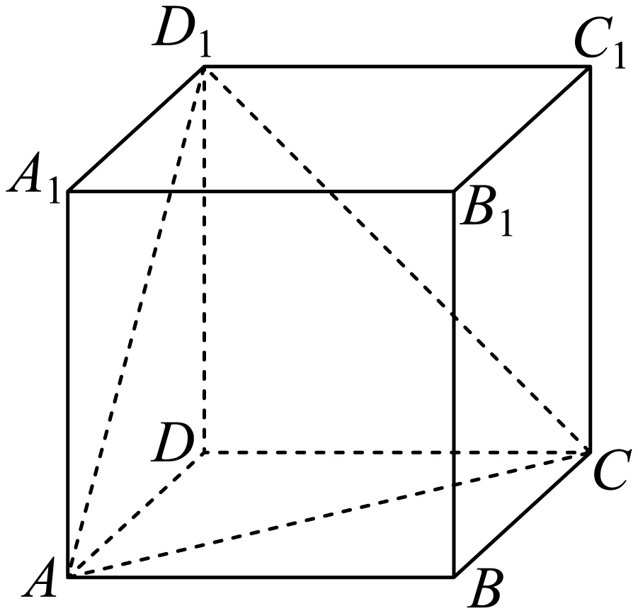
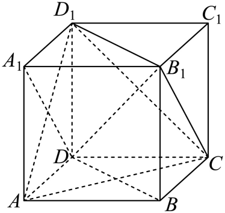
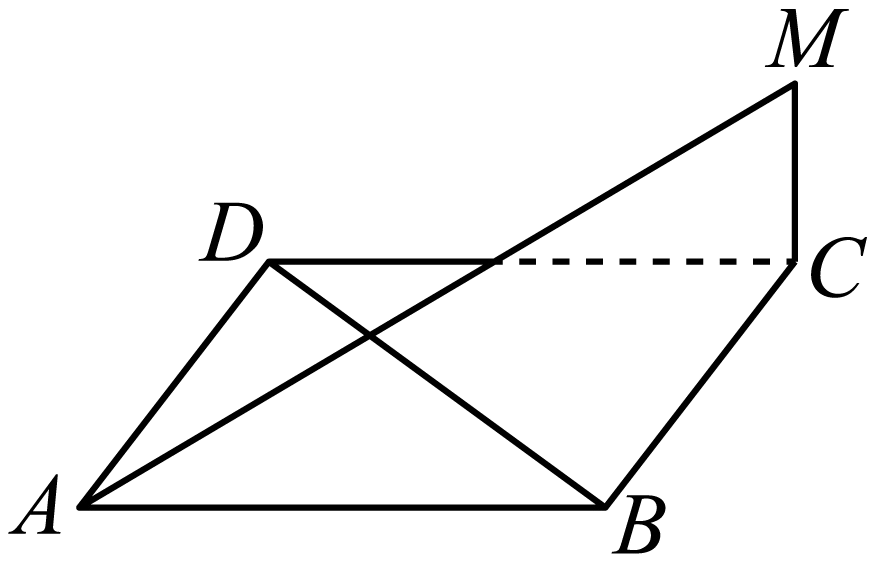
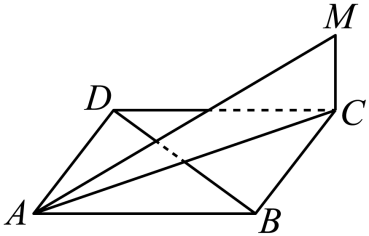

## 讲解

### 是什么

若直线l与平面α内任意直线都垂直，称l⊥α；它与α唯一交点H是垂足。定义涉及任意方向，证明时不逐条穷尽，用判定定理：a、b包含于α、相交于O，l⊥a且l⊥b，则l⊥α。a、b只平行而不相交时，两个条件仍只约束一个方向，不能推出结论。

### 怎么来的

把l平行移至过O，方向角不变。在该线上取OP=OQ>0、P与Q分居O两侧。在a、b上分别取不等于O的A、B，并选择线段AB与待证的过O方向交于C≠O；对于不同于a、b的方向可这样选择，且C不等于A、B。因l垂直a、b，有PA=QA、PB=QB。三角形PAB与QAB由三边全等。PA=QA、AC公共、∠PAC=∠QAC，再得三角形PAC与QAC全等，故PC=QC。于是等腰三角形PCQ中，CO作为底边PQ的中线垂直PQ。

给平面内任意过O且不同于a、b的方向，都可选A、B使AB与该方向相交于C。因此l垂直面内各方向；其余不过O的线可平移成过O的同方向线。这个全等理由说明“相交”保证覆盖平面两个独立方向，不能删掉。

### 什么时候能用

由l⊥α可直接得l垂直α内任意线，不要求这些线都通过垂足。两条不同直线都垂直同一平面时互相平行：将一条平行移到另一条经过的点，过一点对已知平面的垂线唯一，所以两方向一致。两平行线中一条垂直α，另一条也垂直α。

## 易错

来源D847cdf96960d-P0150把判定简记为“若线线垂直，则线面垂直”，本条恢复“同一面内的两条相交线都垂直”。先核对双线在目标面内，再写交点；不能用面外两条垂线硬套判定。

## 例题

### 原例：两次构造垂面确定正方体中的面垂线

来源：`HSMA-B2-C8-D847cdf96960d-P0182-P0197`；原件《专题8.6 空间直线、平面的垂直（一）（举一反三讲义）高一数学人教A版必修第二册（解析版）.docx》。题号、学年及地区按讲义原标注，未另作来源核验。

以下完整保留原题、原答案与原详解（仅统一等价排版及配图路径）：

【例3】（2025高二上·黑龙江·学业考试）如图，在正方体$ABCD-{A}_{1}{B}_{1}{C}_{1}{D}_{1}$中，与平面$AC{D}_{1}$垂直的直线是（    ）

A．$DC$  B．$DA$  C．$D{D}_{1}$  D．$D{B}_{1}$

【答案】D

【解题思路】连接$BD$，${B}_{1}{D}_{1}$，即可证明$AC\perp $平面$BD{D}_{1}{B}_{1}$，从而得到$D{B}_{1}\perp AC$，同理可证$D{B}_{1}\perp A{D}_{1}$，即可得到$D{B}_{1}\perp $平面$AC{D}_{1}$.

【解答过程】连接$BD$，${B}_{1}{D}_{1}$，由正方体的性质可知$AC\perp BD$，$D{D}_{1}\perp $平面$ABCD$，

又$AC\subset $平面$ABCD$，所以$D{D}_{1}\perp AC$，

又$BD\cap D{D}_{1}=D$，$BD,D{D}_{1}\subset $平面$BD{D}_{1}{B}_{1}$，所以$AC\perp $平面$BD{D}_{1}{B}_{1}$，

又$D{B}_{1}\subset $平面$BD{D}_{1}{B}_{1}$，所以$D{B}_{1}\perp AC$，

同理可证$A{D}_{1}\perp $平面$DC{B}_{1}{A}_{1}$，又$D{B}_{1}\subset $平面$DC{B}_{1}{A}_{1}$，所以$D{B}_{1}\perp A{D}_{1}$，

又$AC\cap A{D}_{1}=A$，$AC,A{D}_{1}\subset $平面$AC{D}_{1}$，所以$D{B}_{1}\perp $平面$AC{D}_{1}$，故D正确；

显然$DC$与$AC$不垂直，$AC\subset $平面$AC{D}_{1}$，所以$DC$不垂直平面$AC{D}_{1}$，故A错误；

显然$DA$与$AC$不垂直，$AC\subset $平面$AC{D}_{1}$，所以$DA$不垂直平面$AC{D}_{1}$，故B错误；

显然$D{D}_{1}$与$A{D}_{1}$不垂直，$A{D}_{1}\subset $平面$AC{D}_{1}$，所以$D{D}_{1}$不垂直平面$AC{D}_{1}$，故C错误；

故选：D.

#### 补充讲解

要证DB₁垂直平面ACD₁，选面内相交于A的AC、AD₁。原解先让AC垂直平面BDD₁B₁，从而垂直该面内DB₁；再让AD₁垂直平面DCB₁A₁，从而垂直同一条DB₁。

原解“同理”的依据补全：AD₁与DC垂直，因为DC垂直侧面ADD₁A₁；在正方形ADD₁A₁中，AD₁垂直DA₁。DC与DA₁相交于D，且在平面DCB₁A₁内，所以AD₁垂直该面。最终AC、AD₁同面且相交，双线判定才成立。

排除A、B：DC、DA都与底面对角线AC成45°；排除C：DD₁与侧面对角线AD₁成45°。每个反例都是目标平面内一条不垂直的线，不能仅凭图上的倾斜程度排除。

### 原例：从菱形对角线与面垂线推出异面垂直

来源：`HSMA-B2-C8-D847cdf96960d-P0348-P0360`；原件《专题8.6 空间直线、平面的垂直（一）（举一反三讲义）高一数学人教A版必修第二册（解析版）.docx》。题号、学年及地区按讲义原标注，未另作来源核验。

以下完整保留原题、原答案与原详解（仅统一等价排版及配图路径）：

【例5】（24-25高一下·全国·课后作业）如图，如果$MC\perp $菱形$ABCD$所在的平面，那么$MA$与$BD$的位置关系是（    ）

A．平行  B．不垂直

C．垂直  D．相交

【答案】C

【解题思路】连接$AC$，易知$AC\perp BD$，由线面垂直的性质有$MC\perp BD$，再根据线面垂直的判定证$BD\perp $面$MAC$，最后由线面垂直的性质确定$MA$与$BD$的位置关系.

【解答过程】

连接$AC$，因为$ABCD$是菱形，所以$AC\perp BD$，

又$MC\perp $菱形$ABCD$所在的平面，$BD\subset $面$ABCD$，所以$MC\perp BD$，

又$MC\cap AC=C$，$MC,AC\subset $面$MAC$，所以$BD\perp $面$MAC$，$MA\subset $面$MAC$，

所以$MA\perp $ $BD$.

故选：C.

#### 补充讲解

菱形对角线AC⊥BD，面垂线MC又垂直面内BD。MC与AC在MAC内交于C，所以BD垂直MAC，MA在这个面内，故MA⊥BD，C正确。

这里MA与BD可以异面而垂直；不能把“垂直”强行要求成交于一点。A与90°冲突，B否定了已证结论，D没有说明方向关系且不是必然相交。判断垂直依据双线判定和线面垂直定义，不是看图中MA、BD是否画成交叉。
