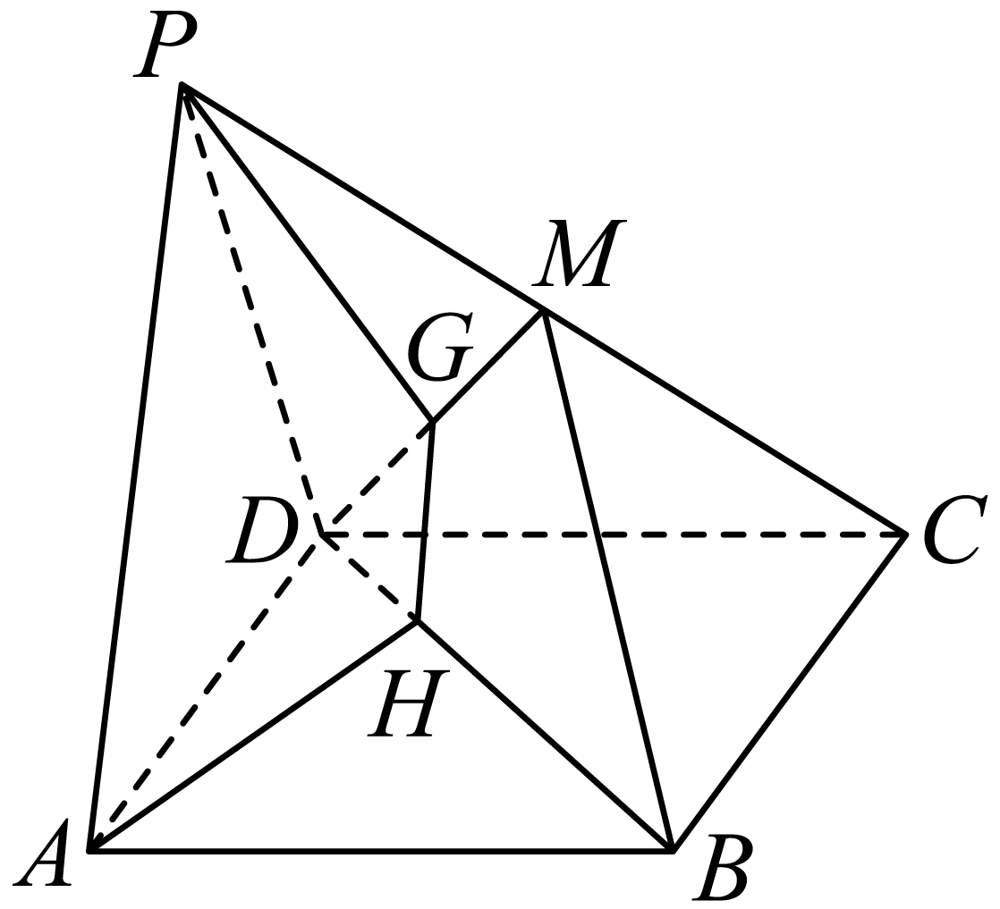
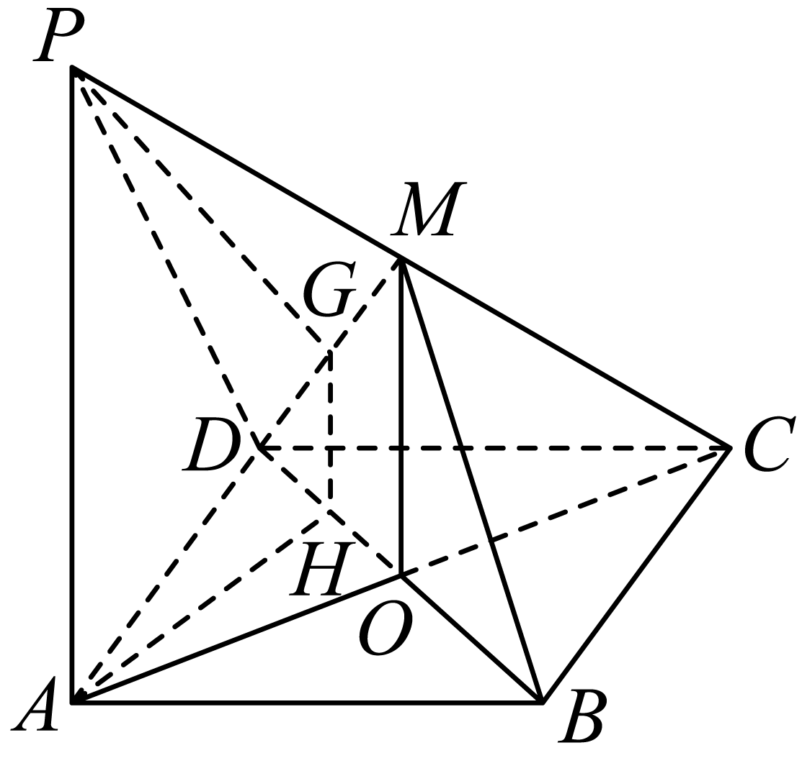

## 讲解

### 是什么

线面平行 a∥α 的定义是 a 与 α 没有公共点。判定定理从线线平行得到线面平行：a⊄α，b⊂α，a∥b，三项同时满足，才有 a∥α。这里 a⊄α 是“不是整条在面内”，包含有待排除的相交情形；不能省略。

性质定理反向提取一条指定的平行线：a∥α，a⊂β，β∩α=b，则 a∥b。性质中的 b 是**过 a 的辅助平面 β 与目标面 α 的交线**，不是 α 中任意一条线。

### 为什么判定与性质成立

判定：因为 a∥b，两线共面于 γ。a⊄α 使 γ≠α，而 b 属于两个面，所以 γ∩α=b。若 a 与 α 有公共点 P，则 P 也在 γ，必在交线 b 上，这会让 a、b 相交，与 a∥b 矛盾。因此 a 与 α 无公共点。

性质：a 与交线 b 都在 β 内；b⊂α，而 a∥α，所以它们不相交。两条不同直线在同一平面内不相交，便有 a∥b。这条证明也说明为什么必须有“过 a 的平面”和“交线”的条件。

### 什么时候能用

要证 a∥α，先在 α 中找 b（常由中位线或平行四边形获得），再说明 a⊄α。要从 a∥α 求比例或定点，取一个包含 a 的平面 β，找到两面交线 b，把空间条件转到 β 中的平面三角形。a∥α 并不意味着 a 平行于 α 内的任意直线。

## 例题

### 原例（HSMA-B2-C8-Dcd55fda808b2-P0142–P0150）

> 原件：专题8.5 空间直线、平面的平行（举一反三讲义）高一数学人教A版必修第二册（解析版）.docx。题源标注沿用原资料。完整原题、原答案、原解题思路与详解保留，Unicode空格等价转写。

【例3】（2025高二上·黑龙江·学业考试）如图，在三棱柱$ABC-{A}_{1}{B}_{1}{C}_{1}$中，与平面$A{A}_{1}{B}_{1}B$平行的直线为（    ）

A．$AB$  B．$C{C}_{1}$  C．$BC$  D．$AC$

【答案】B

【解题思路】根据线面平行的判定定理即可得出答案.

【解答过程】由题意，$AB\subset $平面$A{A}_{1}{B}_{1}B$，$BC,AC$与平面$A{A}_{1}{B}_{1}B$都相交，

因为$C{C}_{1}//A{A}_{1}$，$C{C}_{1}\not\subset $平面$A{A}_{1}{B}_{1}B$，$A{A}_{1}\subset $平面$A{A}_{1}{B}_{1}B$，

所以$C{C}_{1}//$平面$A{A}_{1}{B}_{1}B$.

故选：B.

**补讲：每一步的依据**

侧棱 CC₁∥AA₁ 是棱柱结构的性质；AA₁ 属于目标侧面。目标侧面与底面交于 AB，而底面顶点 C 不在 AB 上，故 C 不在目标侧面，CC₁ 不是面内直线。三条件齐全，判定 CC₁ 平行于该面，B 正确。AB 整条在面内，排除 A；BC、AC 分别在 B、A 与该面相交，排除 C、D。

### 原例（HSMA-B2-C8-Dcd55fda808b2-P0282–P0293）

> 原件：专题8.5 空间直线、平面的平行（举一反三讲义）高一数学人教A版必修第二册（解析版）.docx。题源标注沿用原资料。完整原题、原答案、原解题思路与详解保留，Unicode空格等价转写。

【例5】（24-25高二下·四川绵阳·月考）如图，四边形ABCD是平行四边形，点P是平面ABCD外一点，M是PC的中点，在DM上取一点G，过G和AP作平面交平面BDM于HG，求证：$AP//HG$．

【答案】证明见详解

【解题思路】连接$AC$交$BD$于点$O$，连接$OM$，先利用三角形中位线性质和线面平行判定定理证明$PA//$平面$BDM$，然后由线面平行性质定理可证.

【解答过程】连接$AC$交$BD$于点$O$，连接$OM$，

因为ABCD是平行四边形，所以$O$为$AC$中点，

又M是PC的中点，所以$OM//PA$，

因为$OM\subset $平面$BDM$，$PA\not\subset $平面$BDM$，

所以$PA//$平面$BDM$，

又因为$PA\subset $平面$PAHG$，平面$PAHG\cap $平面$BDM=GH$，

所以$AP//HG$.

  

**补讲：每一步的依据**

先取 O=AC∩BD。平行四边形对角线互相平分，所以 O 为 AC 中点；M 为 PC 中点，于是 △CAP 中 OM 是中位线，OM∥AP。OM 在平面 BDM 内。

还须证明 AP 不在平面 BDM：该面与底面交于 BD，若 A 也在该面，就会有 A∈BD，与非退化平行四边形相矛盾。由 OM∥AP 和面内外条件，得到 AP∥平面 BDM。题设另一个平面含 AP，且与 BDM 的交线是 HG，性质定理才给 AP∥HG。不是见到“两个平面”就能把任意线与交线判平行。

## 易错

- 判定与性质方向不同，但不是删掉条件后可任意互推的两个口号。
- 面内线不称“与该平面平行”，因为已有无限多个公共点。
- 过 a 的辅助面若与 α 平行，就没有交线 b，不能使用交线性质。

## 来源

- HSMA-B2-C8-Dcd55fda808b2-P0021–P0039；原件《专题8.5 空间直线、平面的平行（举一反三讲义）高一数学人教A版必修第二册（解析版）.docx》；知识与分类口径。
- HSMA-B2-C8-Dcd55fda808b2-P0141–P0180；原件《专题8.5 空间直线、平面的平行（举一反三讲义）高一数学人教A版必修第二册（解析版）.docx》；知识与分类口径。
- HSMA-B2-C8-Dcd55fda808b2-P0274–P0275；原件《专题8.5 空间直线、平面的平行（举一反三讲义）高一数学人教A版必修第二册（解析版）.docx》；知识与分类口径。
- HSMA-B2-C8-Dcd55fda808b2-P0281–P0293；原件《专题8.5 空间直线、平面的平行（举一反三讲义）高一数学人教A版必修第二册（解析版）.docx》；知识与分类口径。
