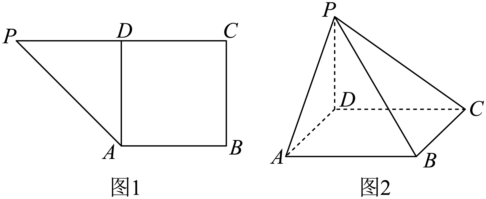
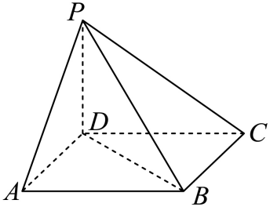

## 讲解

### 是什么

直线l与α相交于A但不垂直α时，称斜线，A是斜足。取l上A以外一点P，作PH⊥α、H在α上，连AH；AH就是l在α上的射影，l与AH的锐角是线面角。两个足的含义不同：A在原线上，H是面垂线的足。

### 怎么来的

换P不会换射影方向：两点向同一面引垂线彼此平行，所成截面里斜线与其投影对应，投影都落在同一直线AH上。非退化三角形PAH在H处直角，所以

$$\sin\theta=\frac{PH}{PA},\qquad \cos\theta=\frac{AH}{PA},\qquad \tan\theta=\frac{PH}{AH}.$$

### 什么时候能用

斜交时0°<θ<90°；l在α内或与α平行，规定θ=0°；l垂直α，射影退成一点，规定θ=90°。总范围是[0°,90°]，边界用规定，不能在投影长0时硬算正切。求角时先找足、证垂直、连射影，再解直角三角形。

## 易错

面内任意线与l的角一般不是线面角，必须是射影。来源D847cdf96960d-P0155的image29原载体写0°<θ≤90°，漏掉同段平行或在面内时的0°；本条明确采用含0的总范围，原式保留于原始资料。

## 例题

### 原例：翻折后先证垂足再求线面角

来源：`HSMA-B2-C8-D847cdf96960d-P0291-P0302`；原件《专题8.6 空间直线、平面的垂直（一）（举一反三讲义）高一数学人教A版必修第二册（解析版）.docx》。题号、学年及地区按讲义原标注，未另作来源核验。

以下完整保留原题、原答案与原详解（仅统一等价排版及配图路径）：

【变式4-1】（24-25高一下·湖南永州·期末）如图1，已知四边形PABC是直角梯形，$AB//PC$，$AB\perp BC$，$PC=2AB=2BC$，D是线段PC中点.将$\triangle PAD$沿AD翻折，使$\angle PDC=\frac{\pi }{2}$，连接PB，PC，如图2所示，则PB与平面ABCD所成角的正弦值是（    ）

A．$\frac{\sqrt{10}}{4}$  B．$\frac{\sqrt{6}}{4}$  C．$\frac{\sqrt{6}}{3}$  D．$\frac{\sqrt{3}}{3}$

【答案】D

【解题思路】根据定义找出直线与平面所成的角，然后在直角三角形中计算.

【解答过程】由已知$PD\perp DC$，$PD\perp AD$，又$AD\cap CD=D,AD,CD\subset $平面$ABCD$，

所以$PD\perp $平面$ABCD$，所以$\angle PBD$是PB与平面ABCD所成角，

$BD\subset $平面ABCD，则$PD\perp BD$，

由题意$BD=\sqrt{2}AB$，$PD=AB$，所以$PB=\sqrt{P{D}^{2}+B{D}^{2}}=\sqrt{3}AB$，

所以$\sin \angle PBD=\frac{PD}{PB}=\frac{\sqrt{3}}{3}$，

故选：D.

#### 补充讲解

翻折前，设AB=BC=a，则PC=2a，D为PC中点，PD=DC=a，ABCD为边长a的正方形；AD⊥PD。绕AD翻折保留AD与PD的直角，又新条件∠PDC=90°给PD⊥DC。AD、DC在底面相交于D，因此PD是底面的垂线，D才是真正垂足。

PB的射影是BD，线面角为∠PBD。底面对角线BD=√2a，PD=a，勾股给PB=√3a，正弦PD/PB=1/√3，D正确。A、B、C的比值均不是这组直角三角形的对边/斜边。翻折不保留P与不在折叠三角形内的B、C的距离，不能直接搬用平面图中PB、PC的长度。
