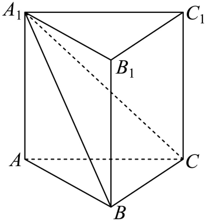
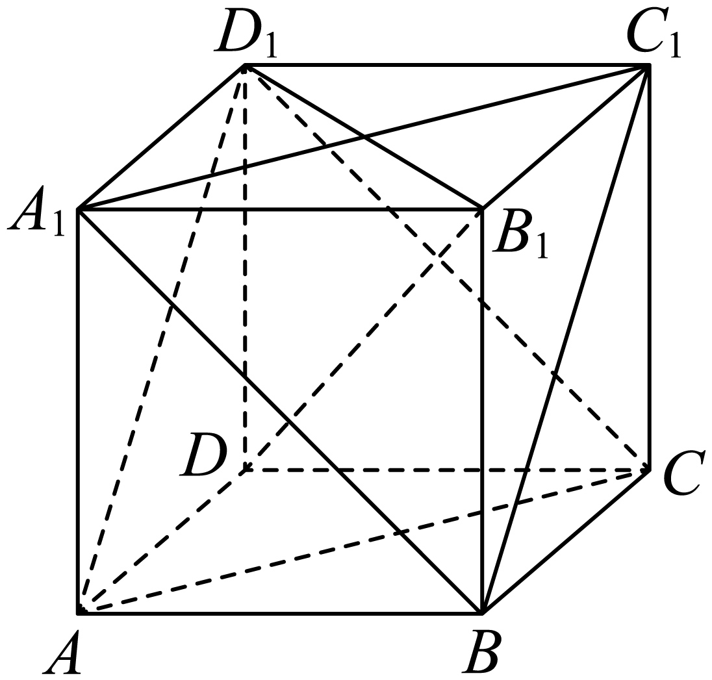

## 讲解

### 是什么

过P作PH⊥α、H在α内，PH的非负长度称点面距离；P在α内时为0。为什么必须取垂线段：对α内任意Q，PH⊥HQ，勾股给PQ²=PH²+HQ²≥PH²，等号只在Q=H成立，所以PH是从点到该面的最短长度。垂足可在图示三角形外，平面是无限延展的，不能把它限制在有限的面片里。

### 怎么来的

#### 线面与面面距离

直线l平行α时，其上任意点到α距离相同：取两点向α作垂线，垂线平行，平行截面内构成矩形，对应垂线段等长。因此可挑最易作足的一点。两不同平面平行时，同样取任意点向另一面引公共垂线，垂线段长恒定。先证明平行再用“任意一点”；相交线面或相交两面在本章不定义正的平行间距，其最小距离为0。

### 什么时候能用

直接法先证PH⊥α再求长；转移法把平行线上的点或平行面内点换成便于计算的点。等体积法把同一四面体更换底面：四面体的顶点集合不变，体积不变。以目标面内三角形为底，点到该面的距离就是高。

$$V=\frac13Sd,\qquad d=\frac{3V}{S},\quad S>0.$$

## 易错

目标底面积必须与高配套，不能把整个棱柱或另一底面的面积直接代入；若目标三点共线，S=0且平面未确定，公式不能用。来源D847cdf96960d-P0167至P0178的距离定义与直接/转化/等体积分类按此使用。

## 例题

### 原例：同一四面体换底求点面距离

来源：`HSMA-B2-C8-D847cdf96960d-P0534-P0547`；原件《专题8.6 空间直线、平面的垂直（一）（举一反三讲义）高一数学人教A版必修第二册（解析版）.docx》。题号、学年及地区按讲义原标注，未另作来源核验。

以下完整保留原题、原答案与原详解（仅统一等价排版及配图路径）：

【例8】（24-25高一下·河南郑州·期中）如图，直三棱柱$ABC-{A}_{1}{B}_{1}{C}_{1}$的体积为$4$，$\triangle {A}_{1}BC$的面积为$2\sqrt{2}$，则点$A$到平面${A}_{1}BC$的距离为（   ）

A．$4$

B．$3\sqrt{2}$

C．$2$

D．$\sqrt{2}$

【答案】D

【解题思路】利用等体积法即可求点$A$到平面${A}_{1}BC$的距离．

【解答过程】解：由直三棱柱$ABC-{A}_{1}{B}_{1}{C}_{1}$的体积为$4$，

可得${V}_{{A}_{1}-ABC}=\frac{1}{3}{V}_{{A}_{1}{B}_{1}{C}_{1}-ABC}=\frac{4}{3}$，

设$A$到平面${A}_{1}BC$的距离为$d$，

由${V}_{{A}_{1}-ABC}={V}_{A-{A}_{1}BC}$得$\frac{1}{3}{S}_{\triangle {A}_{1}BC}\cdot d=\frac{4}{3}$

$\therefore \frac{1}{3}\times 2\sqrt{2}\cdot d=\frac{4}{3}$，解得$d=\sqrt{2}$．

故选：D．

#### 补充讲解

这两种写法用的是同一个四面体：顶点均为A、A₁、B、C。以ABC为底时，A₁的高为棱柱的高，所以四面体体积是原棱柱的1/3，即4/3；换成A₁BC为底时，顶点A的高才是本题距离d。

由(1/3)×(2√2)×d=4/3，两边乘3得2√2d=4，再除以正面积2√2得d=√2，D正确。直接把棱柱体积4代到四面体公式，会错出3√2即B；A、C均没有保持同一体积与对应底面积。等体积法计算的是垂直高，无需猜某条斜棱就是高。

### 原例：公共垂线上的两平行截面距离

来源：`HSMA-B2-C8-D847cdf96960d-P0614-P0631`；原件《专题8.6 空间直线、平面的垂直（一）（举一反三讲义）高一数学人教A版必修第二册（解析版）.docx》。题号、学年及地区按讲义原标注，未另作来源核验。

以下完整保留原题、原答案与原详解（仅统一等价排版及配图路径）：

【例9】（24-25高一下·贵州贵阳·期末）正方体$ABCD-{A}_{1}{B}_{1}{C}_{1}{D}_{1}$的棱长为$2\sqrt{3}$，则平面${A}_{1}B{C}_{1}$到平面$A{D}_{1}C$的距离为（    ）

A．1  B．2  C．3  D．4

【答案】B

【解题思路】证明${B}_{1}D\perp $平面${A}_{1}B{C}_{1}$，${B}_{1}D\perp $平面$A{D}_{1}C$，等体积法求${B}_{1}$点到平面${A}_{1}B{C}_{1}$的距离和$D$点到平面$A{D}_{1}C$的距离，可得平面${A}_{1}B{C}_{1}$到平面$A{D}_{1}C$的距离.

【解答过程】连接${B}_{1}D,{B}_{1}{D}_{1}$，正方体中，$D{D}_{1}\perp $平面${A}_{1}{B}_{1}{C}_{1}{D}_{1}$，${A}_{1}{C}_{1}\subset $平面${A}_{1}{B}_{1}{C}_{1}{D}_{1}$，则$D{D}_{1}\perp {A}_{1}{C}_{1}$，

正方形${A}_{1}{B}_{1}{C}_{1}{D}_{1}$中，有${B}_{1}{D}_{1}\perp {A}_{1}{C}_{1}$，

$D{D}_{1},{B}_{1}{D}_{1}\subset $平面$D{D}_{1}{B}_{1}$，$D{D}_{1}\cap {B}_{1}{D}_{1}={D}_{1}$，所以${A}_{1}{C}_{1}\perp $平面$D{D}_{1}{B}_{1}$，

${B}_{1}D\subset $平面$D{D}_{1}{B}_{1}$，则有${A}_{1}{C}_{1}\perp {B}_{1}D$，

同理有${A}_{1}B\perp {B}_{1}D$，${A}_{1}{C}_{1},{A}_{1}B\subset $平面${A}_{1}B{C}_{1}$，${A}_{1}{C}_{1}\cap {A}_{1}B={A}_{1}$，

所以${B}_{1}D\perp $平面${A}_{1}B{C}_{1}$，同理有${B}_{1}D\perp $平面$A{D}_{1}C$，

正方体棱长为$2\sqrt{3}$，则${A}_{1}{B}_{1}={B}_{1}{C}_{1}=B{B}_{1}=2\sqrt{3}$，${A}_{1}{C}_{1}={A}_{1}B=2\sqrt{6}$，

设点${B}_{1}$到平面${A}_{1}B{C}_{1}$的距离为$h$，由${V}_{{A}_{1}-B{B}_{1}{C}_{1}}={V}_{{B}_{1}-{A}_{1}B{C}_{1}}$，

有$\frac{1}{3}\times \frac{1}{2}\times {\left( 2\sqrt{3}\right)}^{3}=\frac{1}{3}\times \frac{1}{2}\times 2\sqrt{6}\times 2\sqrt{6}\times \frac{\sqrt{3}}{2}h$，解得$h=2$，

即点${B}_{1}$到平面${A}_{1}B{C}_{1}$的距离为2，同理点$D$到平面$A{D}_{1}C$的距离为2，

${B}_{1}D=\sqrt{{\left( 2\sqrt{3}\right)}^{2}+{\left( 2\sqrt{3}\right)}^{2}+{\left( 2\sqrt{3}\right)}^{2}}=6$，

则平面${A}_{1}B{C}_{1}$到平面$A{D}_{1}C$的距离为$6-2-2=2$.

故选：B.

#### 补充讲解

两平面中分别找两条相交线证B₁D为公共垂线，才能确认平面平行且把问题放到一条垂线上。原解等体积给B₁到第一个面的垂线长2，D到第二个面的垂线长2，而体对角线B₁D长6。

为何做6−2−2：两个截面都是切去一个顶角的等边三角形，其垂足在体对角线内部；由正方体中心对称，两截面沿B₁到D方向依次出现。各端削去2后，中间剩下2，B正确。若只知道两段垂线长而没有确认足点顺序，就不能机械相减。A、C、D不是这条公共垂线上两面之间的长度。
