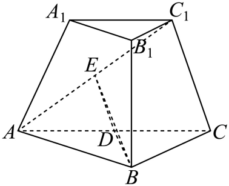
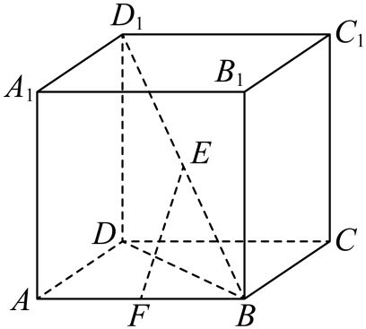
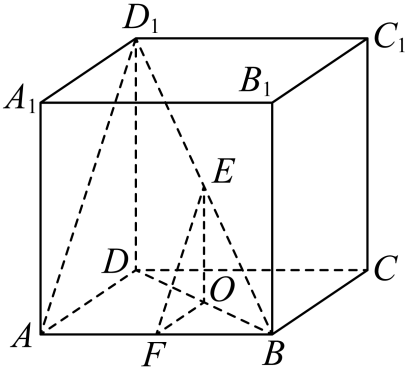

## 讲解

### 判据与流程

1. 先写棱l及题给两个半平面，选O在l上。垂面法是在第一个指定半平面内取不在棱上的P，向另一个半平面的所在平面作垂线PH，再在该平面内过H作HO⊥l，O在l上；还需按第3步核对射线方向。
2. 确认PH⊥目标面，故PH⊥l；HO⊥l且PH、HO相交，所以l垂直平面PHO，进而l⊥PO。这样O处两射线都垂棱，才可称∠POH为平面角。
3. 按半平面方向选射线，不把外侧补角冒称原角；解包含该角的三角形，用勾股、余弦定理或三角比。
4. 结果范围按指定半平面为0至180°，钝二面角允许负余弦；它和异面角的锐直范围不同。若构造退化，改选点或先处理端点。

## 易错

面外点的垂足不保证恰好在棱上，通常要再作HO⊥l。只证一条射线垂棱，或截面没有垂棱，不能完成定义法。

## 例题

### 原例：相交双线逐步证明两射线垂同一棱

来源：`HSMA-B2-C8-De11de002464c-P0045-P0060`；原件《专题8.7 空间直线、平面的垂直（二）（举一反三讲义）高一数学人教A版必修第二册（解析版）.docx》。题号、学年及地区按讲义原标注，未另作来源核验。

以下完整保留原题、原答案与原详解（仅统一等价排版及配图路径）：

【变式1-1】（24-25高一下·浙江嘉兴·期末）在三棱台$ABC-{A}_{1}{B}_{1}{C}_{1}$中，平面$ABC\perp $平面$AC{C}_{1}{A}_{1},\triangle ABC$是以$B$为直角顶点的等腰直角三角形，且$AC=2{A}_{1}{C}_{1}=2A{A}_{1}=2C{C}_{1}$，则二面角$B-A{C}_{1}-C$的正切值为（    ）

A．$\frac{\sqrt{5}}{5}$  B．$\frac{1}{2}$  C．$\frac{2\sqrt{5}}{5}$  D．2

【答案】D

【解题思路】设$AC=2{A}_{1}{C}_{1}=2A{A}_{1}=2C{C}_{1}=2$，若$D,E$分别为$AC,A{C}_{1}$的中点，连接$BD,DE,BE$，根据已知及线面垂直的判定、性质定理证明$A{C}_{1}\perp DE$、$A{C}_{1}\perp BE$，结合二面角的定义找到其平面角，进而求其正切值.

【解答过程】设$AC=2{A}_{1}{C}_{1}=2A{A}_{1}=2C{C}_{1}=2$，易知$AC{C}_{1}{A}_{1}$为等腰梯形，故$A{C}_{1}=\sqrt{3}$，

所以$A{C}_{1}^{2}+C{C}_{1}^{2}=A{C}^{2}$，故$A{C}_{1}\perp C{C}_{1}$，

若$D,E$分别为$AC,A{C}_{1}$的中点，连接$BD,DE,BE$，则$DE//C{C}_{1}$，即$A{C}_{1}\perp DE$，

由$\triangle ABC$是以$B$为直角顶点的等腰直角三角形，则$AC\perp BD$，

平面$ABC\perp $平面$AC{C}_{1}{A}_{1}$，平面$ABC\cap $平面$AC{C}_{1}{A}_{1}=AC$，$BD\subset $平面$ABC$，

所以$BD\perp $平面$AC{C}_{1}{A}_{1}$，而$A{C}_{1}\subset $平面$AC{C}_{1}{A}_{1}$，故$BD\perp A{C}_{1}$，

由$DE\cap BD=D$且都在平面$BDE$内，则$A{C}_{1}\perp $平面$BDE$，

由$BE\subset $平面$BDE$，则$A{C}_{1}\perp BE$，

综上，二面角$B-A{C}_{1}-C$的平面角为$\angle BED$，且$\triangle BED$为直角三角形，

由$DE=\frac{1}{2}C{C}_{1}=\frac{1}{2}$，$BD=\frac{1}{2}AC=1$，所以$\tan \angle BED=\frac{BD}{DE}=2$.

故选：D.

#### 补充讲解

底面ABC是直角等腰三角形，D为斜边AC中点，BD⊥AC；两面垂直且BD在ABC内垂交线AC，才可得BD垂直侧面ACC₁A₁。侧面等腰梯形中，下底2、上底1、两腰1，腰的水平投影各1/2，高√3/2；对角线AC₁的水平投影3/2，因此AC₁=√3。

在三角形ACC₁中，AC₁²+CC₁²=3+1=AC²，所以AC₁⊥CC₁。DE是其中位线，平行CC₁，所以DE⊥AC₁。BD也垂直侧面内AC₁；DE、BD相交于D，推出AC₁⊥BDE，从而BE也垂直棱AC₁。E在棱上，EB、ED分别指向B侧与C侧，∠BED为指定二面角平面角。

BD=1、DE=1/2，而且BD垂直侧面内DE，故tan∠BED=BD/DE=2，D正确。A、B、C都不等于这个对边与邻边的比；不能只凭BE、DE在两个面内便称其夹角为平面角。

### 原例：中位线构造棱上同点双垂线

来源：`HSMA-B2-C8-De11de002464c-P0032-P0044`；原件《专题8.7 空间直线、平面的垂直（二）（举一反三讲义）高一数学人教A版必修第二册（解析版）.docx》。题号、学年及地区按讲义原标注，未另作来源核验。

以下完整保留原题、原答案与原详解（仅统一等价排版及配图路径）：

【例1】（24-25高一下·陕西汉中·期末）已知$ABCD-{A}_{1}{B}_{1}{C}_{1}{D}_{1}$为正方体，$F$、$E$分别为$AB$、$B{D}_{1}$的中点，则二面角$E-BF-C$的大小为（   ）

A．30°  B．45°  C．60°  D．90°

【答案】B

【解题思路】作出二面角的平面角，再利用平面几何知识计算即可.

【解答过程】如图，设正方体的棱长为$1$，取$BD$中点$O$，连结$OE,OF,A{D}_{1}$，则$OF//AD,EF//A{D}_{1}$，

又因为$AD\perp AB$，所以$OF\perp AB$，

因为$AB\perp $平面$AD{D}_{1}{A}_{1}$，$A{D}_{1}\subset $平面$AD{D}_{1}{A}_{1}$，所以$AB\perp A{D}_{1}$，

又因为$EF//A{D}_{1}$，所以$EF\perp AB$，

故$\angle EFO$为所求二面角的平面角，

因为$OE=OF=\frac{1}{2}$，所以$\angle EFO=45^{\circ}$.

故选：B.

#### 补充讲解

棱BF与AB是同一条直线，F在棱上。O是BD中点，F是AB中点，所以在三角形BAD中OF∥AD；E是BD₁中点，在三角形BAD₁中EF∥AD₁。AD⊥AB，且AB垂直侧面ADD₁A₁内AD₁，所以OF、EF都垂直棱BF。

FE在指定E侧半平面，FO在指定C侧底面半平面，故∠EFO才是所求平面角。设棱长1，OE∥DD₁且长1/2，OF长1/2；OE垂直底面，故三角形EOF在O处直角。等长两直角边给45°，B正确。原解只列OE=OF，补上这个直角依据后才足以求角；A、C、D不合等腰直角三角形。
