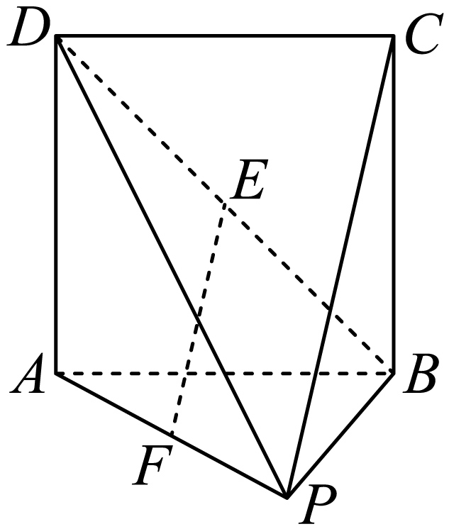
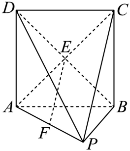
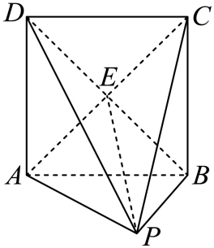

## 讲解

### 判据与流程

1. 指定斜线与目标面，找两者交点A；取线上且位于面外的另一点P。目标面变化，射影也变化，不能固定把底面当目标。
2. 找H在目标面且PH⊥该面。可由面面垂直性质、相交双线判定或等腰中线构造，但每一步写全条件。
3. A本来在面上，射影是AH；所求锐角为∠PAH。用PH作对边、AH作邻边、PA作斜边求角；若题给体积，先用对应底面积与垂直高求缺的长度。
4. 单独处理平行/在面内0°与垂面90°；普通斜交才用非退化直角三角形，并检查结果在(0°,90°)。

## 易错

H必须同时满足在面内和PH垂面，仅在某条面内线段上或垂其中一线不够。角顶点应在斜足处，不能把直角三角形的另一个锐角报成线面角。

## 例题

### 原例：目标面为侧截面时的射影与30°

来源：`HSMA-B2-C8-D847cdf96960d-P0303-P0322`；原件《专题8.6 空间直线、平面的垂直（一）（举一反三讲义）高一数学人教A版必修第二册（解析版）.docx》。题号、学年及地区按讲义原标注，未另作来源核验。

以下完整保留原题、原答案与原详解（仅统一等价排版及配图路径）：

【变式4-2】（24-25高一下·广东东莞·期末）如图，在四棱锥$P-ABCD$中，底面$ABCD$是边长为2的正方形，点$E, F$分别是$BD, AP$的中点．

(1)证明：$EF//$平面$PBC$；

(2)若$PA=PC=2\sqrt{2}$，求直线$PC$与平面$PBD$所成角的大小．

【答案】(1)证明见解析

(2)$\frac{\pi }{6}$．

【解题思路】（1）连接$AC$，利用三角形中位线定理证明$EF//PC$，再由线线平行证线面平行即可.

（2）先证明$AC\perp $平面$PBD$，即得$\angle CPE$为直线$PC$与平面$PBD$所成角，借助于$Rt\triangle CPE$，即可求得答案.

【解答过程】（1）如图，连接$AC$，因为四边形$ABCD$是正方形，所以点$E$是$AC$的中点，

又因$F$是$AP$的中点，故得$EF//PC$，

又因$EF\not\subset $平面$PBC$，$PC\subset $平面$PBC$，所以$EF//$平面$PBC$．

（2）如图，连接$EP$，由（1）得$E$是$AC$中点，

因为$PA=PC$，所以$EP\perp AC$，

又因为底面$ABCD$是正方形，且$AC, BD$为对角线，所以$BD\perp AC$，

又因为$BD\cap EP=E, BD, EP\subset $平面$PBD$，所以$AC\perp $平面$PBD$

所以直线$PC$与平面$PBD$所成角为$\angle CPE$，

因为在$Rt\triangle CPE$中， $CE=\sqrt{2}, PC=2\sqrt{2}$，则$\sin \angle CPE=\frac{CE}{PC}=\frac{1}{2}$，

故$\angle CPE=\frac{\pi }{6}$，即直线$PC$与平面$PBD$所成角的大小为$\frac{\pi }{6}$．

#### 补充讲解

第一问E为正方形对角线AC的中点，F为AP中点，三角形APC中位线EF∥PC；EF不在平面PBC内，故线面平行。这个面外条件与原解保留一致。

第二问PA=PC、E为AC中点，所以PE⊥AC；正方形两对角线给BD⊥AC。PE、BD在PBD内交于E，推出AC垂直平面PBD，因而C的垂足是E。P本来在目标面内，所以PC的射影是PE，所求角∠CPE，不能取底面上的任一角。CE为半条正方形对角线，长√2；PC=2√2，正弦CE/PC=1/2，角在(0,90°)，故30°。

### 原例：翻折中由完整垂足求正弦

来源：`HSMA-B2-C8-D847cdf96960d-P0291-P0302`；原件《专题8.6 空间直线、平面的垂直（一）（举一反三讲义）高一数学人教A版必修第二册（解析版）.docx》。题号、学年及地区按讲义原标注，未另作来源核验。

以下完整保留原题、原答案与原详解（仅统一等价排版及配图路径）：

【变式4-1】（24-25高一下·湖南永州·期末）如图1，已知四边形PABC是直角梯形，$AB//PC$，$AB\perp BC$，$PC=2AB=2BC$，D是线段PC中点.将$\triangle PAD$沿AD翻折，使$\angle PDC=\frac{\pi }{2}$，连接PB，PC，如图2所示，则PB与平面ABCD所成角的正弦值是（    ）

A．$\frac{\sqrt{10}}{4}$  B．$\frac{\sqrt{6}}{4}$  C．$\frac{\sqrt{6}}{3}$  D．$\frac{\sqrt{3}}{3}$

【答案】D

【解题思路】根据定义找出直线与平面所成的角，然后在直角三角形中计算.

【解答过程】由已知$PD\perp DC$，$PD\perp AD$，又$AD\cap CD=D,AD,CD\subset $平面$ABCD$，

所以$PD\perp $平面$ABCD$，所以$\angle PBD$是PB与平面ABCD所成角，

$BD\subset $平面ABCD，则$PD\perp BD$，

由题意$BD=\sqrt{2}AB$，$PD=AB$，所以$PB=\sqrt{P{D}^{2}+B{D}^{2}}=\sqrt{3}AB$，

所以$\sin \angle PBD=\frac{PD}{PB}=\frac{\sqrt{3}}{3}$，

故选：D.

#### 补充讲解

翻折前，设AB=BC=a，则PC=2a，D为PC中点，PD=DC=a，ABCD为边长a的正方形；AD⊥PD。绕AD翻折保留AD与PD的直角，又新条件∠PDC=90°给PD⊥DC。AD、DC在底面相交于D，因此PD是底面的垂线，D才是真正垂足。

PB的射影是BD，线面角为∠PBD。底面对角线BD=√2a，PD=a，勾股给PB=√3a，正弦PD/PB=1/√3，D正确。A、B、C的比值均不是这组直角三角形的对边/斜边。翻折不保留P与不在折叠三角形内的B、C的距离，不能直接搬用平面图中PB、PC的长度。
