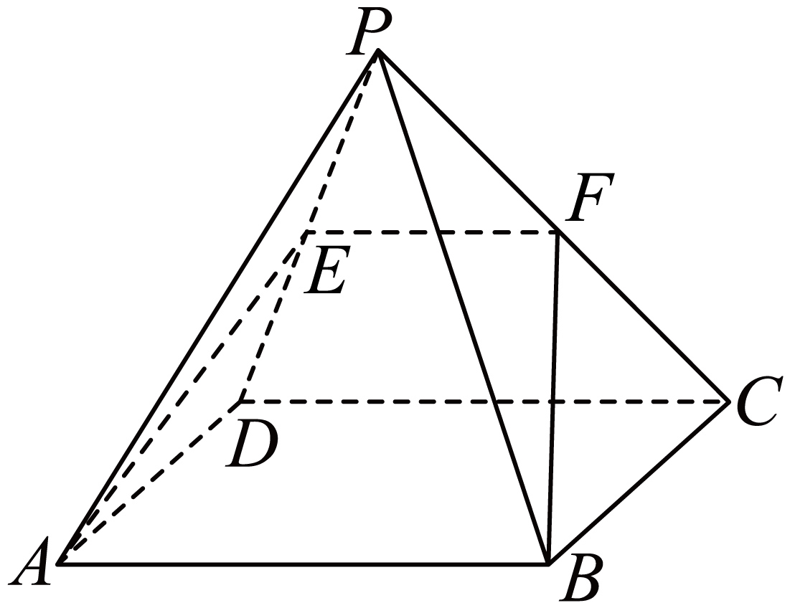

## 讲解

### 判据

题目要求证明线/面平行或从已知线面平行导出中点、比例时，先找目标所需要的完整定理条件，再安排辅助线与辅助面。三种平行能转化，但每个箭头有自己的前提。

### 流程

1. 线线→线面：给目标面内找到一条与目标线平行的线，再排除目标线在面内。面内平行线常来自三角形中位线或平行四边形。
2. 线面→线线：用包含已知平行线的辅助面截目标面，交线才与该线平行。先写“包含”与“相交于哪条线”两项。
3. 线面→面面：在同一平面中找到两条相交线，各自平行于另一面；写出交点与所属面才能合并结论。
4. 面面→线面/线线：前者用一面内任意线与另一面无交点；后者用第三面截两面得到两条交线。不能只凭两面平行就说两面内任意两线都平行。
5. 转入合法平面三角形后，再用相似或中位线的逆命题推出中点/比例，最终代回检查原空间条件。

## 例题

### 原例（HSMA-B2-C8-Dcd55fda808b2-P0165–P0180）

> 原件：专题8.5 空间直线、平面的平行（举一反三讲义）高一数学人教A版必修第二册（解析版）.docx。题源标注沿用原资料。完整原题、原答案、原解题思路与详解保留，Unicode空格等价转写。

【变式3-2】（24-25高一下·浙江杭州·期中）四棱锥$P-ABCD$中底面$ABCD$是平行四边形，E是$PD$中点，平面$EAB$与$PC$交于F．

(1)求证：$CD//$平面$EAB$．

(2)求证：F是$PC$中点．

【答案】(1)证明见解析

(2)证明见解析

【解题思路】（1）即证$AB//CD$，利用线面平行的判定定理即可得证；

（2）由（1）有$CD//$平面$EAB$，利用线面平行的性质定理即可得$CD//EF$，进而得证.

【解答过程】（1）由底面$ABCD$是平行四边形，所以$AB//CD$，

又$AB\subset $平面$EAB,CD\not\subset $平面$EAB$，

所以$CD//$平面$EAB$；

（2）由（1）有$CD//$平面$EAB$，

又$CD\subset $平面$PCD$，平面$EAB\cap $平面$PCD=EF$，

所以$CD//EF$，

又E是$PD$中点，

所以F是$PC$中点.

**补讲：每一步的依据**

(1)底面为平行四边形，得 AB∥CD；AB 已在 EAB 中。E 为 PD 内部中点、P 在底面外，所以 EAB 与底面是不同平面，公共直线是 AB；C 不在 AB 上，故 CD⊄平面 EAB。三条件齐全，线面平行判定得到 CD∥平面 EAB。

(2)CD 在面 PCD 内，而该面与 EAB 有两个公共点 E、F，且 E 位于 PD、F 位于 PC，两点不同，交线是 EF。由(1)及性质得到 EF∥CD。现在在 △PDC 中，PE/PD=1/2；△PEF∼△PDC 给 PF/PC=PE/PD=1/2，所以 F 为 PC 中点。这里中点不是由空间图估计，而是性质先产出平面中的平行线，再由相似得到。

## 易错

- 把“线线平行”简写成“线面平行”时漏面内外条件，证明链会断。
- 线面性质所需辅助面必须包含给定直线；取任意面不能自动得到目标交线。
- 平行结论后求中点仍要用比例理由，不能跳为“所以是中点”。

## 来源

- HSMA-B2-C8-Dcd55fda808b2-P0021–P0065；原件《专题8.5 空间直线、平面的平行（举一反三讲义）高一数学人教A版必修第二册（解析版）.docx》；知识与分类口径。
- HSMA-B2-C8-Dcd55fda808b2-P0165–P0180；原件《专题8.5 空间直线、平面的平行（举一反三讲义）高一数学人教A版必修第二册（解析版）.docx》；知识与分类口径。
- HSMA-B2-C8-Dcd55fda808b2-P0271–P0280；原件《专题8.5 空间直线、平面的平行（举一反三讲义）高一数学人教A版必修第二册（解析版）.docx》；知识与分类口径。
