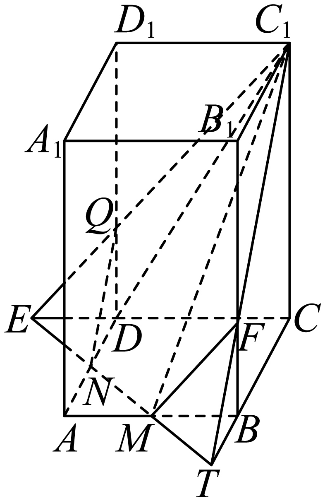

## 讲解

### 判据

一个平面截凸多面体所得边界由它与各个面的交线段组成。平面由三个不共线已知点确定；截面顶点应在几何体的棱上，辅助交点则可以在棱的延长线上。不能把三个已知点直接连成三角形就宣布作完截面。

### 流程

1. 先找同属一个面的两个截面点，连线确定该面与截平面的交线。若连的是不同面上的点，需先证明整条线在所用面内。
2. 将该交线延长，与同面其他棱或延长线求交；这些新点仍在截平面内，可拿去与其他已知截面点确定下一面的交线。
3. 逐个面查交线实际进入、离开几何体的位置，只取棱上的真实交点作截面顶点；外部辅助点不能计入边数。
4. 按相邻面顺序闭合多边形，再核对所有边都分别在某个表面内，且未漏经过的面。凸体的一次平面截面应是凸多边形。
5. 求周长/面积时回到真实长度关系和同面直角三角形；透视图上的长度与角度不能直接测量代入。

## 例题

### 原例（HSMA-B2-C8-D916045a86699-P0335–P0348）

> 原件：专题8.4 空间点、直线、平面之间的位置关系（举一反三讲义）高一数学人教A版必修第二册（解析版）.docx。题源标注沿用原资料。完整原题、原答案、原解题思路与详解保留，Unicode空格等价转写。

【变式5-1】（24-25高一下·海南·月考）在正四棱柱$ABCD-{A}_{1}{B}_{1}{C}_{1}{D}_{1}$中，$AB=2, A{A}_{1}=3$，$M, N$分别是$AB, AD$的中点，则平面$MN{C}_{1}$截该四棱柱所得截面的周长为（   ）

A．$7\sqrt{2}$  B．$9\sqrt{2}$  C．$5+3\sqrt{2}$  D．$5+5\sqrt{2}$

【答案】A

【解题思路】作出辅助线，得到五边形${C}_{1}QNMF$即为平面$MN{C}_{1}$截该四棱柱所得截面，由勾股定理和三角形相似得到各边长，相加得到截面周长．

【解答过程】直线$MN$分别与$CB,CD$相交于点$T,E$，连接${C}_{1}T,{C}_{1}E$，分别与$B{B}_{1},D{D}_{1}$交于点$F,Q$，

连接$FM,QN$，故五边形${C}_{1}QNMF$即为平面$MN{C}_{1}$截该四棱柱所得截面，

其中$M,N$分别是$AB,AD$的中点，故$AM=AN=BT=BM=1$．

$\frac{BT}{CT}=\frac{1}{1+2}=\frac{1}{3}$，故$BF=\frac{1}{3}C{C}_{1}=1$，

由勾股定理得$MF=\sqrt{B{M}^{2}+B{F}^{2}}=\sqrt{2}$，$MN=\sqrt{A{M}^{2}+A{N}^{2}}=\sqrt{2}$，

同理可得$QN=MF=\sqrt{2}$，

又${D}_{1}Q={B}_{1}F=2$，故${C}_{1}Q={C}_{1}F=\sqrt{{2}^{2}+{2}^{2}}=2\sqrt{2}$，

故平面$MN{C}_{1}$截四棱柱所得截面的周长为$\sqrt{2}\times 3+2\sqrt{2}\times 2=7\sqrt{2}$．

故选：A．

**补讲：每一步的依据**

M、N 都在底面，所以 MN 是截平面与底面的交线，延长后得到 T、E。T 在 BC 的延长线上，C₁、T 同属侧面 BCC₁B₁，连接它们并与 BB₁ 相交于 F；E 在 CD 的延长线上，C₁、E 同属侧面 CDD₁C₁，连接它们并与 DD₁ 相交于 Q。F 与 M 又同属前侧面，Q 与 N 同属左侧面，故 FM、QN 分别是这些面的截线。真正截面顶点顺序是 C₁、Q、N、M、F，T、E 在体外，只是作图工具。

底面为边长2的正方形，M、N 是中点，AM=AN=BM=1，MN∥BD。底面中 BM∥AB、BT∥AD、MT∥BD，故 △BMT∼△ABD，BM/AB=BT/AD=1/2，得到 BT=1、CT=CB+BT=3。侧面内 △BTF∼△CTC₁，因 BT、CT 在同一直线上、BF∥CC₁ 且两三角形共用斜线 TC₁，得 BF/CC₁=BT/CT=1/3，所以 BF=1。MF 所在侧面为矩形，BM⊥BF，得 MF=√(1²+1²)=√2；底面中 MN=√2。交换 B、D 的对称关系给 QN=√2。上部竖直差为2，水平差为2，所以 C₁F=C₁Q=√(2²+2²)=2√2。五条边相加为 3√2+4√2=7√2，A 正确。B 多计长度，C、D 不满足这些五段实际长度。

## 易错

- 外部辅助点不属于截面顶点，别把延长线上的 T、E 算作截面边角。
- 从已有截面点跨到任意棱上连线，若没有同面/共面依据，就不是合法交线。
- 图中的棱画斜不改变题目“正四棱柱”的真实直角与等长条件。

## 来源

- HSMA-B2-C8-D916045a86699-P0322–P0348；原件《专题8.4 空间点、直线、平面之间的位置关系（举一反三讲义）高一数学人教A版必修第二册（解析版）.docx》；知识与分类口径。
