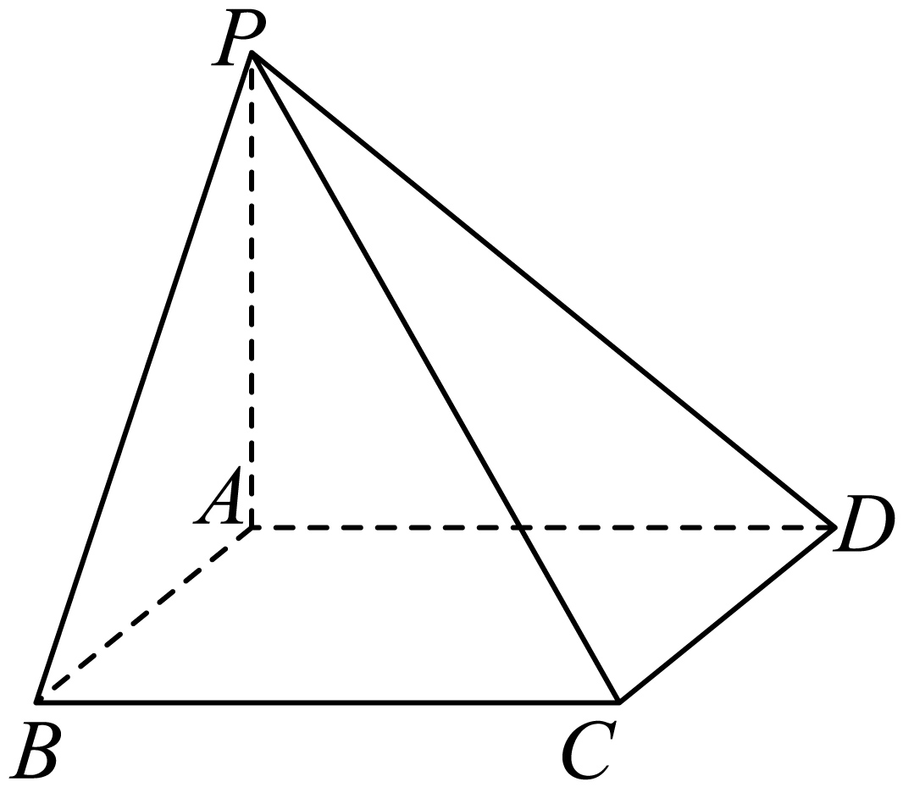
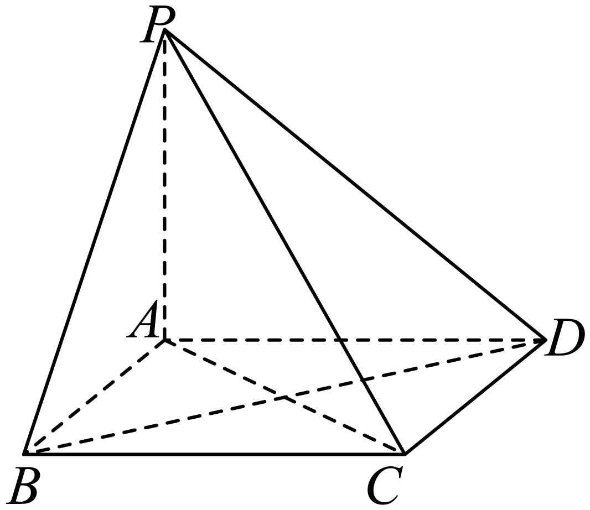
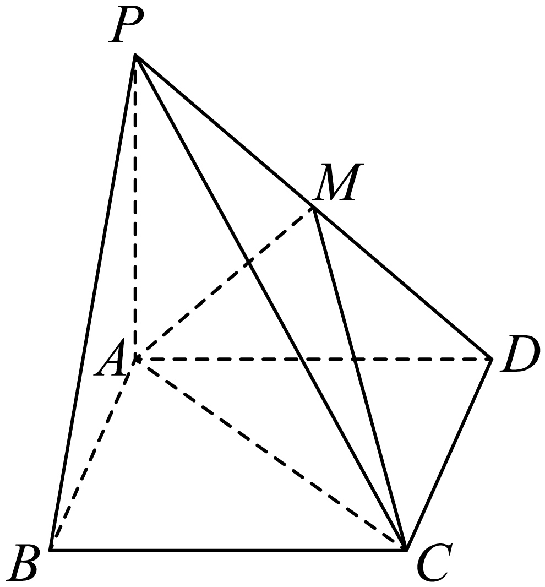
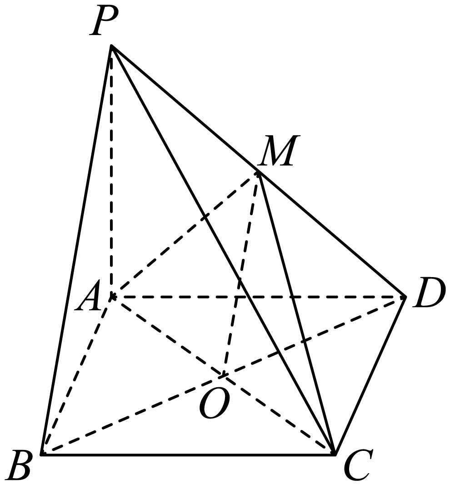

## 讲解

### 判据与流程

能找到垂足就直接法；垂足难画而已有体积与目标底面积就等体积法。二者求的是同一条垂直高，不是不同定义。

1. 点面距离：找H在目标面且PH垂面，通常证PH垂面内两相交线；确认后才将PH放入直角三角形求长度。
2. 线面距离先证线面平行，挑该线上好处理的一点转点面距离；两平行面也先证平行，再取公共垂线。
3. 换底时写清同一个四面体的四个顶点。在一种底面下算体积V，在目标面下算非退化三角形面积S，再由V=Sd/3求d=3V/S。
4. 结果应非负、有长度单位。若数值算对但未证所画线垂直目标面，直接法证明仍不完整；等体积法需说明d是对应垂直高。

## 易错

换顶点与底面顺序不会换四面体，但把原四棱锥/棱柱整体当成选中的小四面体会换体积。若垂足落在三角形外，仍能取其所在无限平面的距离，不能擅自取最近顶点。

## 例题

### 原例：菱形底面中直接作足与换底核对

来源：`HSMA-B2-C8-D847cdf96960d-P0570-P0588`；原件《专题8.6 空间直线、平面的垂直（一）（举一反三讲义）高一数学人教A版必修第二册（解析版）.docx》。题号、学年及地区按讲义原标注，未另作来源核验。

以下完整保留原题、原答案与原详解（仅统一等价排版及配图路径）：

【变式8-2】（24-25高一下·四川成都·期末）如图，在四棱锥$P-ABCD$中，底面$ABCD$是边长为2的菱形，侧棱$PA\perp $底面$ABCD$，且$PA=2,\angle BAD=120^{\circ}$．

(1)证明：$BD\perp $平面$PAC$；

(2)求点$C$到平面$PAD$的距离．

【答案】(1)证明见解析

(2)$\sqrt{3}$

【解题思路】（1）由四边形为菱形得到对角线垂直，由线面垂直得到$PA\perp BD$，从而证明线面垂直；

（2）设$C$到平面$PAD$的距离为h，利用等体积法列出方程，求解即可.

【解答过程】（1）因为底面$ABCD$是菱形，所以$AC\perp BD$，

因为$PA\perp $底面$ABCD$，$BD\subset $底面$ABCD$，所以$PA\perp BD$，

又因为$PA\cap AC=A$，$PA\subset $平面$PAC$，$AC\subset $平面$PAC$，

所以$BD\perp $平面$PAC$．

（2）设点$C$到平面$PAD$的距离为h，

由题可知PA为三棱锥$P-ACD$的高，${S}_{\triangle ACD}=\frac{1}{2}AD\cdot CD\cdot \sin {60}^\circ=\frac{1}{2}\times 2\times 2\times \frac{\sqrt{3}}{2}=\sqrt{3}$，

所以三棱锥$P-ACD$的体积为${V}_{P-ACD}=\frac{1}{3}PA\cdot {S}_{\triangle ACD}=\frac{1}{3}\times 2\times \sqrt{3}=\frac{2}{3}\sqrt{3}$，

又因为${V}_{P-ACD}={V}_{C-PAD}$，且${S}_{\triangle PAD}=\frac{1}{2}AP\cdot AD=\frac{1}{2}\times 2\times 2=2$，

所以$\frac{2}{3}\sqrt{3}=\frac{1}{3}\times 2\times h$，解得$h=\sqrt{3}$，

所以点$C$到平面$PAD$的距离为$\sqrt{3}$．

#### 补充讲解

第一问：菱形对角线AC⊥BD，加上PA⊥底面给PA⊥BD；PA与AC在PAC内交于A，故BD垂直PAC。这里不能只用菱形对角线这一条。

第二问换底仍是四面体P、A、C、D。菱形内角∠ADC=60°，所以三角形ACD面积为(1/2)×2×2×sin60°=√3；PA=2是对底面ACD的高，体积2√3/3。三角形PAD在A处直角，面积2，因此(1/3)×2×h=2√3/3，h=√3。

也可直接确认垂足：在底面过C作CH⊥AD，H在AD上；PA⊥底面给CH⊥PA。PA、AD相交，所以CH垂直PAD，H就是点面垂足。CH=CD·sin60°=√3，与等体积法一致。PA或PC是连接其他点的线段，不能直接当C到PAD的距离。

### 原例：平行线面转移到可证的垂足

来源：`HSMA-B2-C8-D847cdf96960d-P0589-P0612`；原件《专题8.6 空间直线、平面的垂直（一）（举一反三讲义）高一数学人教A版必修第二册（解析版）.docx》。题号、学年及地区按讲义原标注，未另作来源核验。

以下完整保留原题、原答案与原详解（仅统一等价排版及配图路径）：

【变式8-3】（24-25高一下·浙江·期中）四棱锥$P-ABCD$的底面$ABCD$是边长为$3$的正方形，$M$是$PD$的中点，

(1)证明：$PB//$平面$MAC$；

(2)若$M$在底面$ABCD$上的投影为底面中心，求直线$BP$到平面$MAC$的距离．

【答案】(1)证明见解析

(2)$\frac{3\sqrt{2}}{2}$

【解题思路】（1）连接$BD$交$AC$于点O，证明$OM//PB$，根据线面平行判定定理证明结论；

（2）由条件先证明$MO\perp BD$，再结合（1）将问题求直线$BP$到平面$MAC$的距离转化为求点$B$到平面$MAC$的距离，证明$BD\perp AC$，根据线面垂直判定定理证明$BD\perp $平面$MAC$，由此可得结论.

【解答过程】（1）证明：连接$BD$交$AC$于点$O$，连接$OM$

因为四边形$ABCD$是正方形，所以$O$是$BD$的中点

因为$M$是$PD$的中点，所以$OM//PB$

又因为$OM\subset $平面$MAC$，$PB\not\subset $平面$MAC$，

所以$PB//$平面$MAC$；

（2）因为$M$在底面$ABCD$上的投影为底面中心，所以$MO\perp $平面$ABCD$，

因为$BD\subset $平面$ABCD$，所以$MO\perp BD$，

由（1）知，$PB//$平面$MAC$，

所以直线$BP$到平面$MAC$的距离等于点$B$到平面$MAC$的距离，

因为$ABCD$为正方形，所以$BD\perp AC$

因为$AC\subset $平面$MAC$，$MO\subset $平面$MAC$，$AC\cap MO=O$，

所以$BD\perp $平面$MAC$，

所以点$B$到平面$MAC$的距离即线段$BO$的长度，

在正方形$ABCD$中，$AB=BC=3$，

所以$BO=\frac{1}{2}BD=\frac{1}{2}\times 3\sqrt{2}=\frac{3\sqrt{2}}{2}$，所以直线$BP$到平面$MAC$的距离为$\frac{3\sqrt{2}}{2}$.

#### 补充讲解

第一问O是BD中点，M是PD中点，三角形PDB中位线OM∥PB；OM在MAC内、PB在该面外，所以线面平行。第二问“投影为底面中心”才允许写MO⊥底面，不能由示意图猜它。

于是BD⊥MO；正方形另给BD⊥AC，MO、AC在MAC内交于O，得到BD⊥MAC。B的垂足是O，距离BO=3√2/2。BP已证平行MAC，所以线面距离可转成B的点面距离。这里BO虽是底面对角线的一部分，却因完整双线证明而成为目标面的垂线段；不能把BM等斜线段替代它。
