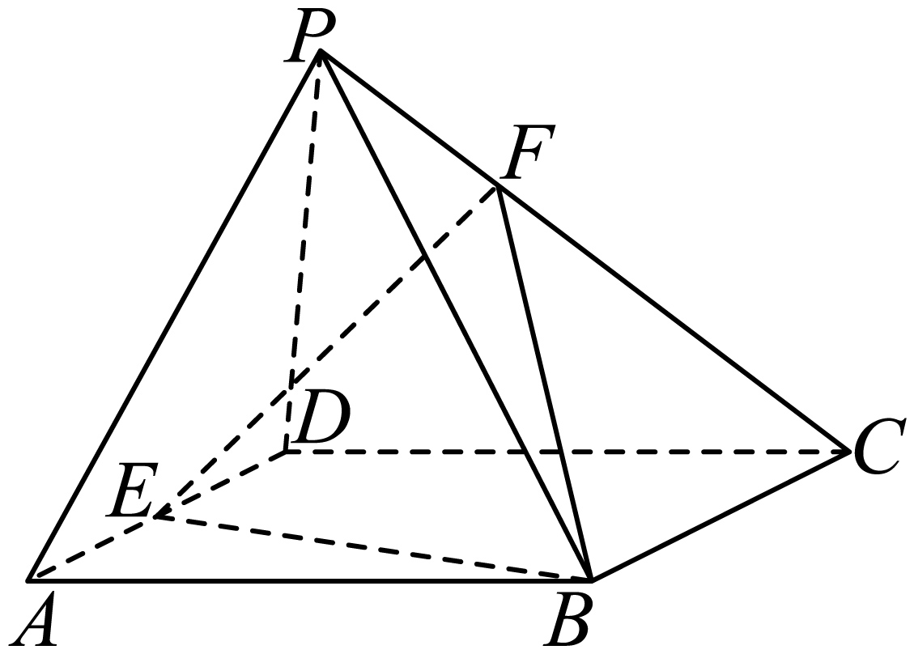
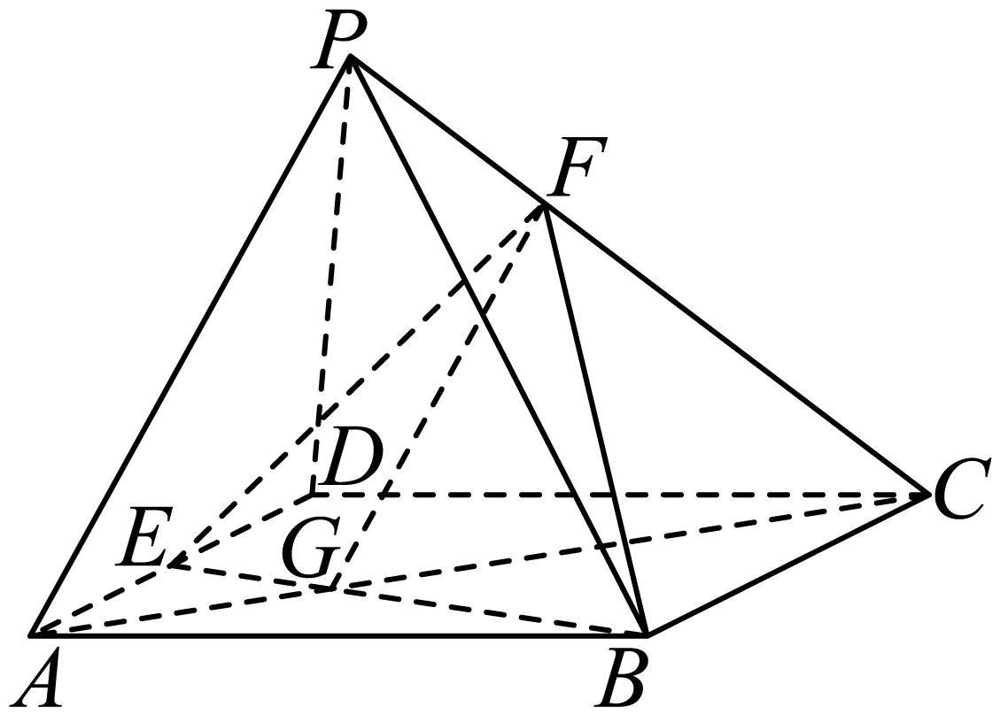
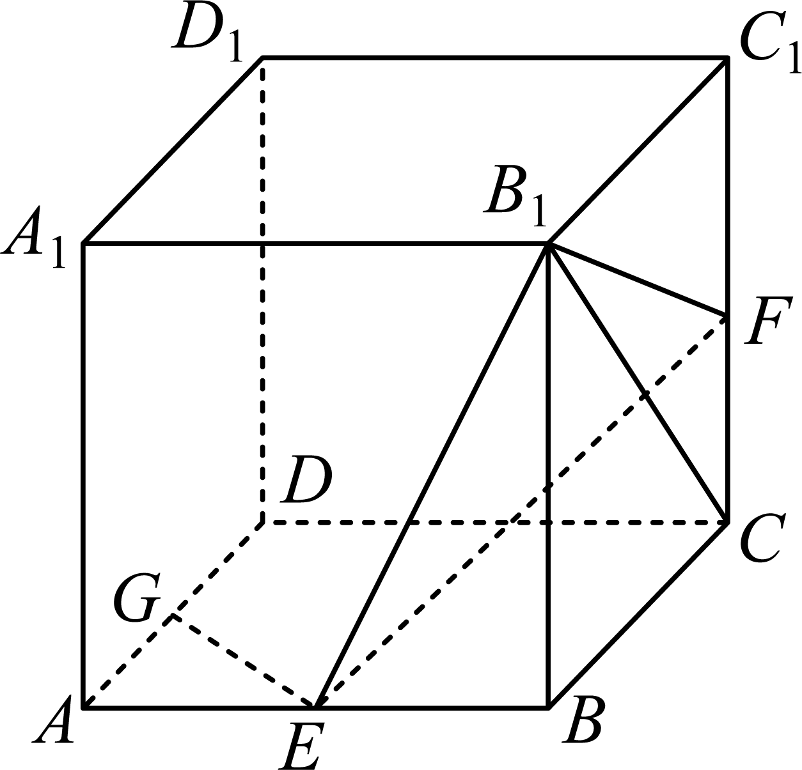
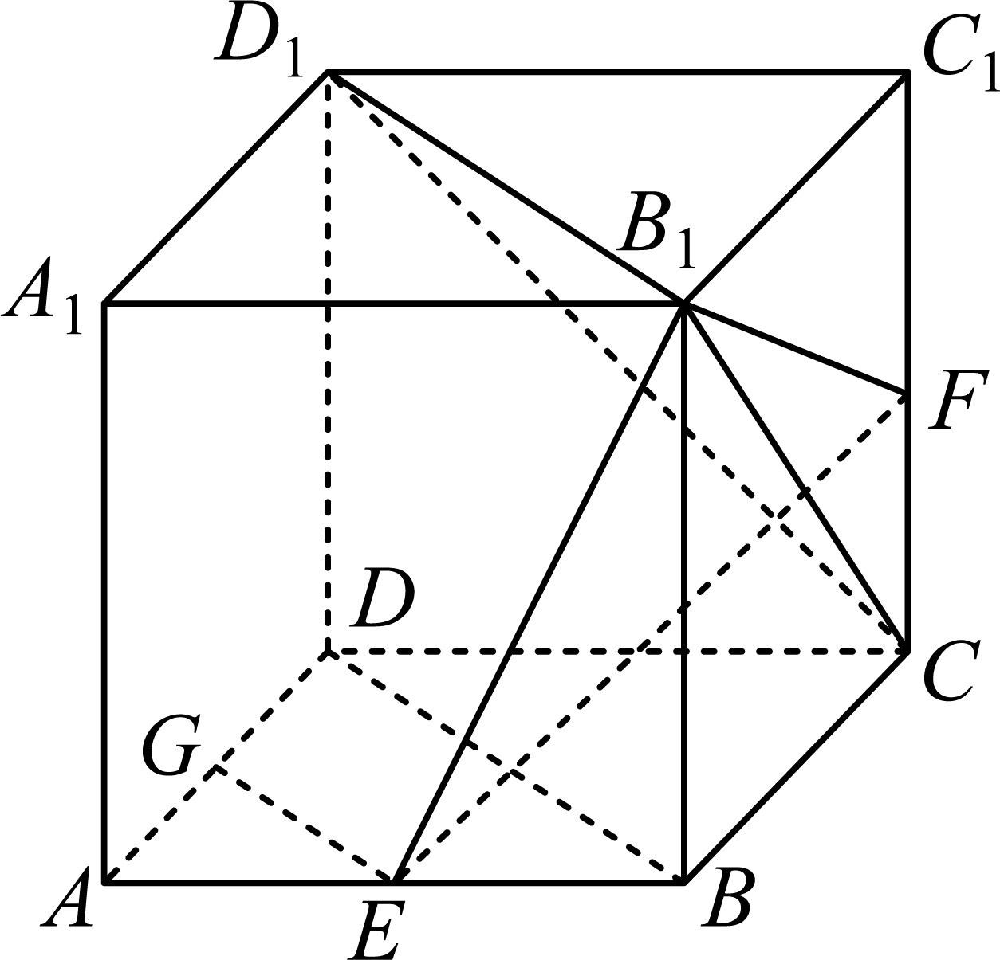
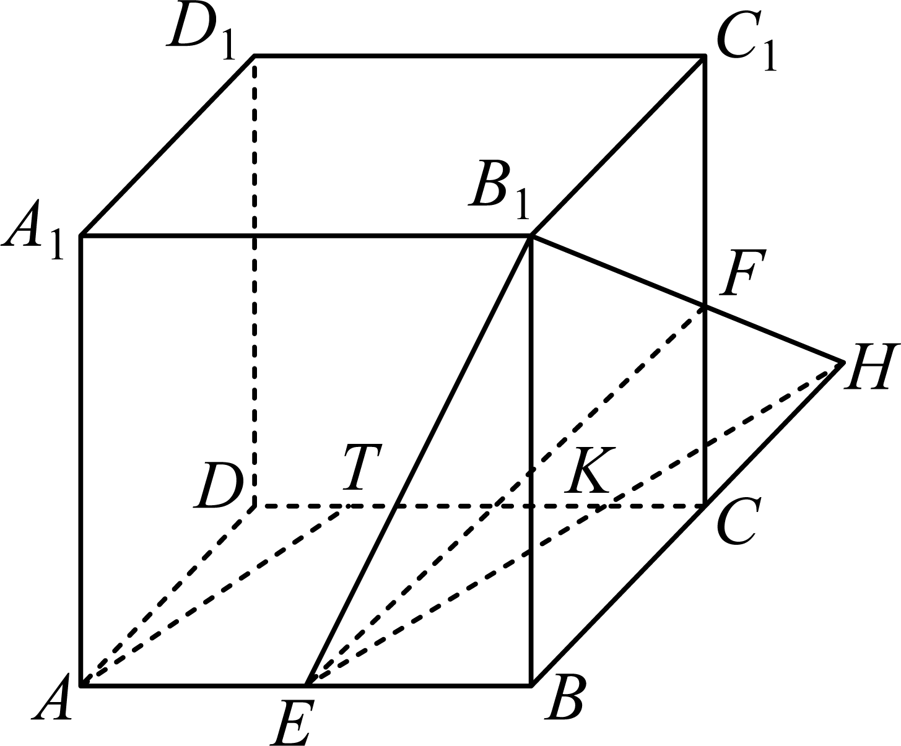

## 讲解

### 判据

待求点在一条固定棱上，且相应直线与一个平面平行，先用过该线的辅助平面取交线，得到同一平面内的平行线。之后用相似/平行四边形确定分点，最后还要证明候选点确实满足原平行条件。

### 流程

1. 将题设的线、目标面、点所在棱分别标清，检查端点是否在面内。端点在目标面内可能使整条线不满足线面平行。
2. 选择含给定线又含待求棱的辅助面，与目标面找两个不同公共点确定交线；据线面性质推出线线平行。
3. 在辅助面内的三角形中，写对应顶点和边的比例；分清 CF/CP 与 PF/PC 是互补比例，不交换。
4. 对“是否存在”问题，先按存在得到必要位置，再检查候选在题目指定线段上，并用判定定理反向证明充分性。只有必要推导，不足以宣布存在。
5. 若构造交点在延长线外侧，仍可用于证明，但最后目标点必须回到允许的棱段范围。

## 例题

### 原例（HSMA-B2-C8-Dcd55fda808b2-P0324–P0334）

> 原件：专题8.5 空间直线、平面的平行（举一反三讲义）高一数学人教A版必修第二册（解析版）.docx。题源标注沿用原资料。完整原题、原答案、原解题思路与详解保留，Unicode空格等价转写。

【例6】（24-25高一下·江苏淮安·月考）如图，P为平行四边形$ABCD$所在平面外一点，E为线段AD的中点，F为PC上一点，当$PA//$平面$EBF$时，$\frac{CF}{PC}$=（      ）

A．$\frac{2}{3}$  B．$\frac{1}{4}$  C．$\frac{1}{3}$  D．$\frac{1}{2}$

【答案】A

【解题思路】连接$AC$交$BE$于$G$点，连接$GF$，由线面平行的性质得$PA//GF$，即有$\frac{GC}{AC}=\frac{CF}{CP}$，结合已知得$\frac{AG}{GC}=\frac{AE}{BC}=\frac{1}{2}$，即可得.

【解答过程】连接$AC$交$BE$于$G$点，连接$GF$，显然平面$ACP\cap $平面$BEF=GF$，

又$PA//$平面$EBF$，$PA\subset $平面$ACP$，则$PA//GF$，即$\frac{GC}{AC}=\frac{CF}{CP}$，

由$ABCD$为平行四边形，且E为线段AD的中点，易知$\frac{AG}{GC}=\frac{AE}{BC}=\frac{1}{2}$，

所以$\frac{GC}{AC}=\frac{CF}{CP}=\frac{2}{3}$.

故选：A.

**补讲：每一步的依据**

G=AC∩BE 属于面 ACP 和面 EBF；F 属于 PC 也属于 EBF，所以两个不同平面的交线是 GF。已知 PA∥面 EBF 且 PA⊂面 ACP，性质给 PA∥GF。于是 △CGF∼△CAP，对应边 CF/CP=CG/CA。

底面内 AE∥BC，A、G、C 共线，E、G、B 共线，故 △AGE∼△CGB。E 是 AD 中点，AE=AD/2，而 AD=BC，所以 AG/GC=AE/BC=1/2。设 AG 是一份、GC 是两份，则 AC 是三份，GC/AC=2/3，进而 CF/PC=2/3，A 正确。C 的1/3实际为 PF/PC，B、D 不符合两个相似三角形的对应关系。F 为 PC 内部点，GF 确实是一条直线。

### 原例（HSMA-B2-C8-Dcd55fda808b2-P0356–P0378）

> 原件：专题8.5 空间直线、平面的平行（举一反三讲义）高一数学人教A版必修第二册（解析版）.docx。题源标注沿用原资料。完整原题、原答案、原解题思路与详解保留，Unicode空格等价转写。

【变式6-3】（24-25高三上·黑龙江牡丹江·期末）如图，在正方体$ABCD-{A}_{1}{B}_{1}{C}_{1}{D}_{1}$中，$E,F,G$分别是$AB,C{C}_{1},AD$的中点.

(1)证明：$EG//$平面${D}_{1}{B}_{1}C$；

(2)棱$CD$上是否存在点$T$，使$AT//$平面${B}_{1}EF$？若存在，求出$\frac{DT}{DC}$的值；若不存在，请说明理由.

【答案】(1)证明见解析

(2)存在，$\frac{DT}{DC}=\frac{1}{4}$

【解题思路】（1）利用三角形中位线性质和平行四边形性质可证得$EG//{B}_{1}{D}_{1}$，根据线面平行的判定可证得结论；

（2）假设存在点$T$，延长$BC,{B}_{1}F$交于$H$，连接$EH$交$DC$于$K$，根据三角形中位线性质可确定$KC=\frac{1}{4}DC$，利用线面平行的性质可证得四边形$ATKE$为平行四边形，由此可确定$DT=\frac{1}{4}DC$.

【解答过程】（1）连接$BD,{B}_{1}{D}_{1},C{D}_{1}$，

$\because E,G$分别为$AB,AD$中点，$\therefore EG//BD$，

$\because B{B}_{1}//D{D}_{1}$，$B{B}_{1}=D{D}_{1}$，$\therefore $四边形$BD{D}_{1}{B}_{1}$为平行四边形，$\therefore BD//{B}_{1}{D}_{1}$，

$\therefore EG//{B}_{1}{D}_{1}$，又$EG\not\subset $平面${D}_{1}{B}_{1}C$，${B}_{1}{D}_{1}\subset $平面${D}_{1}{B}_{1}C$，

$\therefore EG//$平面${D}_{1}{B}_{1}C$.

（2）假设在棱$CD$上存在点$T$，使得$AT//$平面${B}_{1}EF$，

延长$BC,{B}_{1}F$交于$H$，连接$EH$交$DC$于$K$，

$\because C{C}_{1}//B{B}_{1}$，$F$为$C{C}_{1}$中点，$\therefore C$为$BH$中点，

$\because CD//AB$，$\therefore KC//AB$，$\therefore KC=\frac{1}{2}EB=\frac{1}{4}DC$，

$\because AT//$平面${B}_{1}EF$，$AT\subset $平面$ABCD$，平面${B}_{1}EF\cap $平面$ABCD=EK$，

$\therefore AT//EK$，又$TK//AE$，$\therefore $四边形$ATKE$为平行四边形，$\therefore TK=AE=\frac{1}{2}DC$，

$\therefore DT=KC=\frac{1}{4}DC$；

$\therefore $当$\frac{DT}{DC}=\frac{1}{4}$时，$AT//$平面${B}_{1}EF$.

**补讲：每一步的依据**

(1)△ABD 中 EG∥BD；对角面 BDD₁B₁ 是平行四边形，BD∥B₁D₁，所以 EG∥B₁D₁。B₁D₁ 在目标面内，且因 B₁ 在底面外、BD 在底面内、B₁D₁∥BD，可判 B₁D₁∥底面。目标面含 B₁D₁ 并与底面交于过 C 的线，性质给该交线也平行 BD。若 E 在交线上，就有 CE∥BD，底面内 △BEC∼△ABD 给 BE/AB=BC/AD=1，但 E 是 AB 中点，BE/AB=1/2，矛盾。因此 E 不在目标面，EG 是面外线，判定得 EG 平行于目标面。

(2)延长 BC 和 B₁F 相交于 H。侧面中 BB₁∥CF、CF=BB₁/2，△HCF∼△HBB₁，故 HC/HB=1/2，C 是 BH 中点。EH 属于目标面，且属于底面，所以底面与目标面的交线为 EH，即 EK；K 是 EH 与 DC 的交点，需用相似核对它在 CD 内的位置。

△HBE 内，KC∥BE，HC/HB=1/2，故 KC=BE/2=DC/4，K 在 C、D 之间。若 AT 与目标面平行，性质迫使 AT∥EK。AE∥TK，且 A、E、K、T 在底面，四边形 ATKE 是平行四边形，TK=AE=DC/2。按 D—T—K—C 的次序，DT=DC−KC−TK=DC−DC/4−DC/2=DC/4。

按必要条件所得 T 在 CD 内且 DT/DC=1/4。反过来取这个 T，则 TK=DC/2=AE，又 TK∥AE，故 AT∥EK。A 不在目标面与底面的交线 EK 上，故 AT⊄目标面；EK⊂目标面，判定得 AT∥目标面，确实存在。这样分别检查了必要位置与反向充分性。

## 易错

- 将 PF/PC 与 CF/PC 对换，常把1/3写成2/3或相反。
- 延长线交点在棱外时，应先写各点顺序，再用线段加减，不能把不同段强行等同。
- 存在题要用候选反证/正向验证并查棱段范围，推一个必要数值还没结束。

## 来源

- HSMA-B2-C8-Dcd55fda808b2-P0323–P0378；原件《专题8.5 空间直线、平面的平行（举一反三讲义）高一数学人教A版必修第二册（解析版）.docx》；知识与分类口径。
