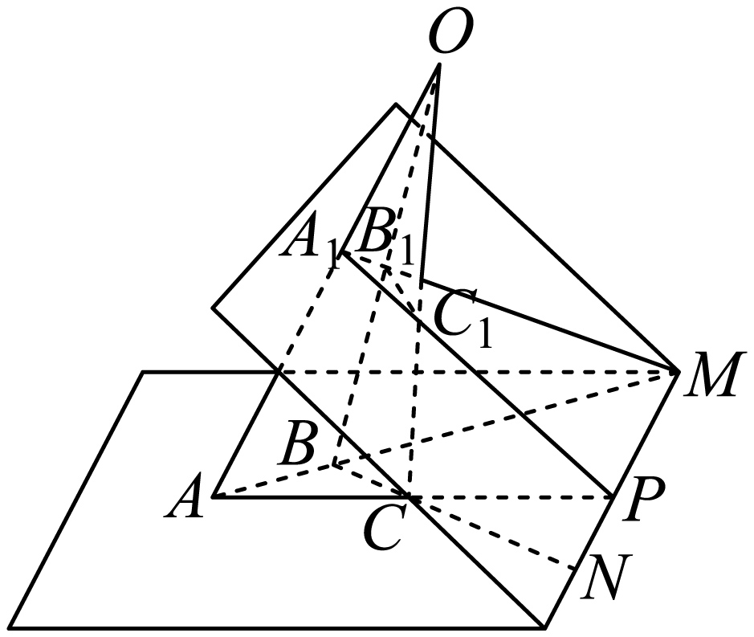
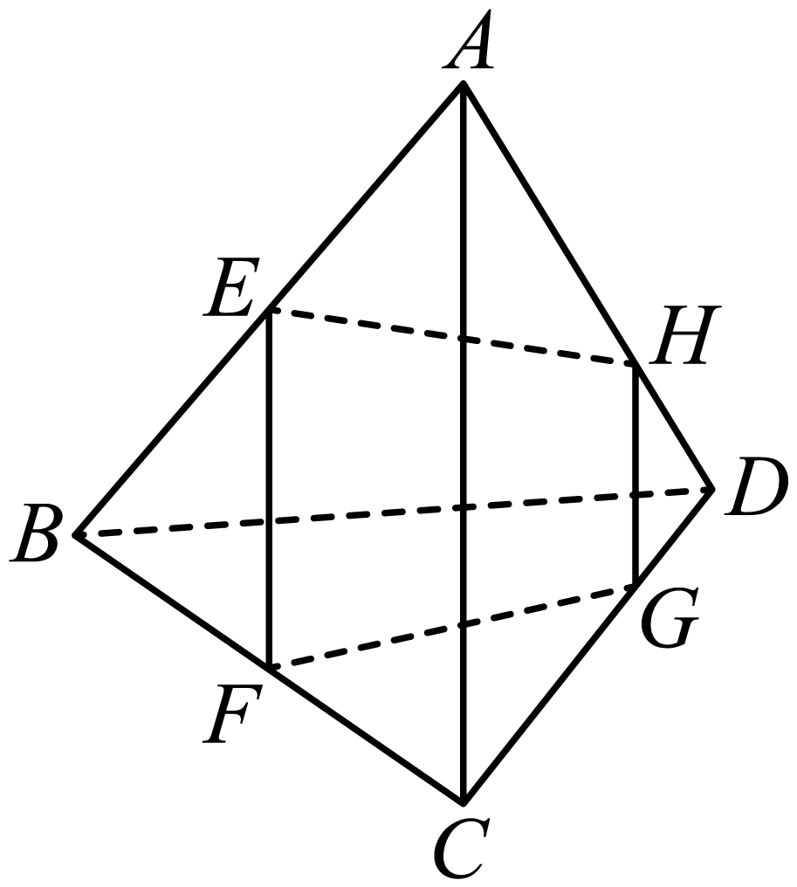

## 讲解

### 判据

题目要证明点共线、点线共面或多条直线共点，先把结论转成“同一条直线/同一个平面/同一个交点”的成员关系，而不是凭图连线。交线法特别适合空间四边形、两个三角形所在平面相交等题目。

### 流程

1. 证明共面：用三个不共线点、两相交线或两平行线定一个面，再逐个将其他点纳入；要纳入整条线，找其两个不同面内点。
2. 证明共线：选两个不同平面 α、β，先确定其交线 l。逐点证明同时在 α、β 内，基本事实3迫使各点在 l 上。若用两点给交线命名，需这两点不同。
3. 证明共点：先证明两条线确实相交，记交点 P；再证 P 在第三线。若第三线正是两个不同面的交线，只须证 P 同属两面。
4. 需要中位线或比例时，先在合法平面三角形内得到平行，再确定新平面。不能在尚未证明共面的四边形中直接使用梯形性质。
5. 最后区分直线与线段：交点可能在边的延长线上；若题目只说直线共点，不要求交点都在原线段内。

## 例题

### 原例（HSMA-B2-C8-D916045a86699-P0158–P0166）

> 原件：专题8.4 空间点、直线、平面之间的位置关系（举一反三讲义）高一数学人教A版必修第二册（解析版）.docx。题源标注沿用原资料。完整原题、原答案、原解题思路与详解保留，Unicode空格等价转写。

【变式2-2】（2025高一下·全国·专题练习）已知$\triangle ABC$与$\triangle {A}_{1}{B}_{1}{C}_{1}$所在平面相交，并且$A{A}_{1},B{B}_{1},C{C}_{1}$交于一点.若$AB\cap {A}_{1}{B}_{1}=M,BC\cap {B}_{1}{C}_{1}=N,AC\cap {A}_{1}{C}_{1}=P$，求证:$M,N,P$共线.

【答案】证明见解析.

【解题思路】先证明平面$ABC$与平面${A}_{1}{B}_{1}{C}_{1}$相交于$PM$,再根据线面关系证明$N$在直线$PM$上,即可证明$M,N,P$三点共线.

【解答过程】因为$AB\cap {A}_{1}{B}_{1}=M,AC\cap {A}_{1}{C}_{1}=P$,

所以平面$ABC\cap $平面${A}_{1}{B}_{1}{C}_{1}=PM$ ,

因为$BC\subset $平面$ABC$,${B}_{1}{C}_{1}\subset $平面${A}_{1}{B}_{1}{C}_{1}$,且$BC\cap {B}_{1}{C}_{1}=N$,

所以$N\in PM$,

即$M,N,P$三点位于同一直线$PM$上.

**补讲：每一步的依据**

记两个已知相交平面为 α=ABC、β=A₁B₁C₁，交线为 l。M 属于 AB，又属于 A₁B₁，所以 M 同时在 α、β 内，故 M∈l；同理 P∈l。N 属于 BC 和 B₁C₁，也同时在两个面内，故 N∈l。三点落在同一交线上即共线。原题“对应连线共点”的条件未必每一步都要用到；不能为了用遍条件而扩大证明。以已有两面交线 l 起步，也避免在未核对 M≠P 前先写直线 PM。

### 原例（HSMA-B2-C8-D916045a86699-P0247–P0264）

> 原件：专题8.4 空间点、直线、平面之间的位置关系（举一反三讲义）高一数学人教A版必修第二册（解析版）.docx。题源标注沿用原资料。完整原题、原答案、原解题思路与详解保留，Unicode空格等价转写。

【例4】（24-25高一下·山东威海·期末）在空间四边形$ABCD$中，若$E$，$F$分别为$AB$，$BC$的中点，$G\in CD$，$H\in AD$，且$CG=2GD$，$AH=2HD$，则（    ）

A．直线$EH$与$FG$平行  B．直线$EH$，$FG$，$BD $相交于一点

C．直线$EH$与$FG$异面  D．直线$EG$，$FH$，$AC$相交于一点

【答案】B

【解题思路】首先利用相似三角形证明$HG//AC$且$HG=\frac{1}{3}AC$，再利用中位线定理证明$EF//AC$且$EF=\frac{1}{2}AC$，从而得到四边形$EFGH$为梯形，且$EH$，$FG$是梯形的两腰，设$EH$，$FG$交于一点$P$，利用平面的性质证明$P$是直线$EH$，$BD$，$FG$的公共点即可．

【解答过程】因为$CG=2GD$，$AH=2HD$，且$\angle ADC=\angle HDG$，

所以$\triangle ADC\sim \triangle HDG$，所以$HG//AC$且$HG=\frac{1}{3}AC$，

因为$E$，$F$分别为$AB$，$BC$的中点，所以$EF//AC$且$EF=\frac{1}{2}AC$，

所以$HG//EF$且$HG\ne EF$，故四边形$EFGH$为梯形，且$EH$，$FG$是梯形的两腰，

所以$EH$，$FG$交于一点，设交点为$P$，则$P\in EH$，$P\in FG$，

又因为$EH\subset $平面$ABD$，且$P\in $平面$BCD$，

所以$P\in $平面$ABD$，且$P\in $平面$BCD$，

又平面$ABD\cap $平面$BCD=BD$，

所以$P\in BD$，

所以点$P$是直线$EH$，$BD$，$FG$的公共点，

故直线$EH$、$FG$、$BD$相交于一点．

  

故选：B.

**补讲：每一步的依据**

AH=2HD、CG=2GD 给 DH/DA=DG/DC=1/3；△DAC 内用对应边成比例得到 HG∥AC、HG=AC/3。△ABC 内 EF 是中位线，所以 EF∥AC、EF=AC/2。于是 EF∥HG，两条不同平行线先确定一个平面，E、F、G、H 才确实共面。两底长度不同，侧线 EH、FG 不能平行，否则会组成平行四边形并使两底等长；故两条所在直线交于 P。

EH⊂平面 ABD，FG⊂平面 BCD，所以 P 同时属于两面。空间四边形保证这两面不同，它们的公共直线为 BD。于是 P∈BD，EH、FG、BD 三线共点，B 正确。A、C 都与已证两线相交矛盾；D 也不成立：AC 在面 ABC 内，EG 与面 ABC 仅交于 E，而 E 不在 AC 上，故 EG 与 AC 异面，不能与 AC 共点。

## 易错

- 不能直接把空间四边形叫作一个平面；要先证共面才用平面四边形性质。
- 公共点属于两个面，只有两面不同才能迫使它属于唯一交线。
- 共点允许交点在延长线上，不能因图上边段没交就认定两条直线不交。

## 来源

- HSMA-B2-C8-D916045a86699-P0028–P0086；原件《专题8.4 空间点、直线、平面之间的位置关系（举一反三讲义）高一数学人教A版必修第二册（解析版）.docx》；知识与分类口径。
- HSMA-B2-C8-D916045a86699-P0130–P0176；原件《专题8.4 空间点、直线、平面之间的位置关系（举一反三讲义）高一数学人教A版必修第二册（解析版）.docx》；知识与分类口径。
- HSMA-B2-C8-D916045a86699-P0246–P0264；原件《专题8.4 空间点、直线、平面之间的位置关系（举一反三讲义）高一数学人教A版必修第二册（解析版）.docx》；知识与分类口径。
