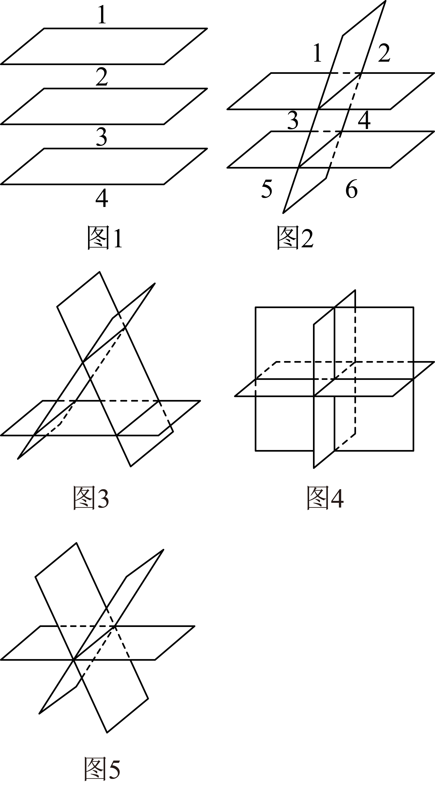

## 讲解

### 判据

不同平面分割整个空间时，不从透视图数“看见的块”。加入一个新平面，看旧平面在它上面留下的交线，把新平面分成多少区域，就新添多少空间区域。

### 流程

1. 从没有平面的空间1块开始。一个面分两侧，增加1块，总数2。
2. 加新面时，已有每块是若干半空间的交，因而是凸区域（任意两点的连线段仍在区内）；新面若穿过某块，就把这块一分为二。新面被旧交线分出的每个区域，其内部不再越过旧平面，因而落在同一块旧空间中。不同截区至少处于某个旧平面的不同侧，属于不同旧块；反过来，一个旧凸块与新面的相交部分仍是凸区，不会裂成两片被重复计数。因此截区与被穿过的旧块一一对应，每穿过一块恰增加一块，新增块数就等于新面上的分区数。
3. 两个不同平面：平行时第二面上没有交线，增加1块得3；相交时新面被一条线分2区，增加2块得4。
4. 第三个面只可能被前两面留下0条、1条或2条不同交线；两条线又分平行或相交。须同时考虑前两面原有3块或4块，不能只数最后一个面的分区。

|三面位置|前两面块数|第三面上分区|总数|
|---|---:|---:|---:|
|三面互相平行|3|1|4|
|两面平行，第三面都相交|3|3（两条平行交线）|6|
|三面共一条交线|4|2（两条旧交线重合）|6|
|三面两两相交、三交线平行且不同|4|3|7|
|三面交于一点、三交线不同|4|4（两条相交交线）|8|

因此三面能分为4、6、7、8块，不能分5块；“共一条线”与“交线交于一点且不同”是不同情况。

### 什么时候能用

这里讨论不同的无限平面切整个三维空间，不要求分出的块等大。若讨论切有限物体，新平面可能未穿过某些块，需要另查。要比较最大值，就查新面上的交线能否尽量增加不同截区；平行、交线重合或多线共点都会改变分区数，不能把某种一般位置的最大块数套给任意排布。

## 例题

### 原例（HSMA-B2-C8-D916045a86699-P0450–P0462）

> 原件：专题8.4 空间点、直线、平面之间的位置关系（举一反三讲义）高一数学人教A版必修第二册（解析版）.docx。题源标注沿用原资料。完整原题、原答案、原解题思路与详解保留，Unicode空格等价转写。

【变式6-1】（24-25高一下·山西临汾·期末）若三个不同平面把空间分成$n$部分，则正整数$n$的值不可能是（   ）

A．8  B．4  C．6  D．5

【答案】D

【解题思路】分别讨论三个平面的位置关系，根据它们位置关系的不同，确定平面把空间分成的部分数目．

【解答过程】如图$1$，若三个平面平行，此时三个不同平面把空间分成$4$部分，

如图$2$，若其中两个平面平行，另一平面与这两个平面都相交，

此时三个不同平面把空间分成$6$部分，

如图$3$，若三个平面两两相交且交线互相平行，此时三个不同平面把空间分成$7$部分，

如图$4$，若三个平面两两相交且交线交于同一点，此时三个不同平面把空间分成$8$部分，

如图$5$，若三个平面相交于同一条直线，此时三个不同平面把空间分成$6$部分，

故A、B、C都有可能，D不可能.

  

故选：D.

**补讲：每一步的依据**

A 的8块来自三面在不同交线上共一个点；B 的4块来自三面互相平行；C 的6块既可来自两平行面被第三面横截，也可来自三面共线。上表已把五类排布按新增面的分区逐项算出，结果集合中没有5，故 D 不可能。原图只能辅助理解，实际依据是交线在新面上分出了几区，不是数画出来的多边形。

## 易错

- 三面共线时新面上只留一条不同直线，不能误按两条相交线增加4块。
- 三交线平行不同，第三面分3区，前两面有4块，总数7；不能套“最大8”。
- 一般位置能产生的最大分区数与具体位置不同；切有限物体还须检查是否真正穿过原有块。

## 来源

- HSMA-B2-C8-D916045a86699-P0434–P0485；原件《专题8.4 空间点、直线、平面之间的位置关系（举一反三讲义）高一数学人教A版必修第二册（解析版）.docx》；知识与分类口径。
