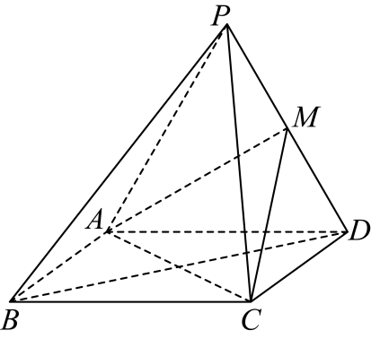
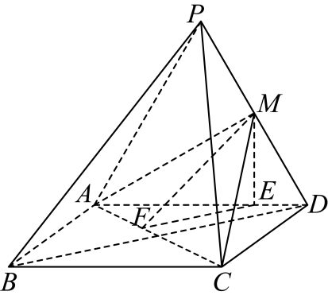
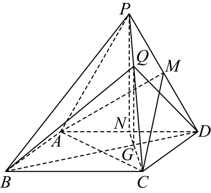

## 讲解

### 判据与流程

已有一组面面垂直条件时，先找交线，再在其中一面内找垂交线的线，把面面条件转成具体线面垂直。探究一个活动点是否存在时，用这个具体垂直方向构造候选。

1. 明确活动点范围（棱、线段或延长线）及两个待证平面不退化；可用线段比例或垂足位置描述候选。
2. 从目标需要的面垂线或平行方向找构造路径，解出候选位置，或选一个有根据的特殊比例。
3. 对每个候选，从题给条件出发重新证明双线垂直、线在面内及面面垂直判定。代入比例只证明长度关系，不能自动证明目标面角。
4. 问存在时构造并验证一个合法点即可；问全部解或唯一性时，还需反推必要条件、排除退化和面外位置。不给仅验证一个位置的原解加上“已穷尽”的结论。

## 易错

性质中的面内条件和垂交线条件应同时出现；“两面垂直”不能凭空定位任何一条高。原图用于辨清点线归属，平行垂直关系仍须逐项证明。

## 例题

### 原例：面面垂直中的二面角与活动点完整三问

来源：`HSMA-B2-C8-De11de002464c-P0641-P0688`；原件《专题8.7 空间直线、平面的垂直（二）（举一反三讲义）高一数学人教A版必修第二册（解析版）.docx》。题号、学年及地区按讲义原标注，未另作来源核验。

以下完整保留原题、原答案与原详解（仅统一等价排版及配图路径）：

【变式7-2】（24-25高一下·辽宁沈阳·期末）如图，四棱锥$P-ABCD$的底$ABCD$是正方形，$\triangle PAD$是正三角形，平面$PAD\perp $平面$ABCD$，$M$是$PD$的中点．

(1)求证：$AM\perp $平面$PCD$；

(2)求二面角$M-AC-D$的余弦值；

(3)在棱$PC$上是否存在点$Q$，使平面$BDQ\perp $平面$MAC$成立？如果存在，求出$\frac{PQ}{QC}$的值；如果不存在，请说明理由．

【答案】(1)证明见解析；

(2)$\frac{\sqrt{15}}{5}$；

(3)存在，$\frac{PQ}{QC}=\frac{1}{2}$.

【解题思路】（1）由面面垂直的性质定理可得$CD\perp $平面$PAD$，从而得$CD\perp AM$，再由$\triangle PAD$是正三角形，且$M$是$PD$的中点，可得$PD\perp AM$，最后由线面垂直的判断定理即可得证.

（2）由二面角的定义，找出二面角$M-AC-D$的平面角，在直角三角形中求解即可.

（3）当$\frac{PQ}{QC}=\frac{1}{2}$时，按面面垂直的判断定理进行证明即可.

【解答过程】（1）证明：因为平面$PAD\perp $平面$ABCD$，平面$PAD\cap $平面$ABCD=AD$，

$CD\subset $平面$ABCD$，$CD\perp AD$，

则$CD\perp $平面$PAD$，

又因为$AM\subset $平面$PAD$，所以$CD\perp AM$，

因为$\triangle PAD$是正三角形，且$M$是$PD$的中点，

则$PD\perp AM$，

又因为$CD\cap PD=D$，$CD,PD\subset $平面$PCD$，

所以$AM\perp $平面$PCD$；

（2）解：过点$M$作$ME\perp AD$，垂足为$E$，过点$E$作$EF\perp AC$，垂足为$F$，连接$MF$．

因为平面$PAD\perp $平面$ABCD$，平面$PAD\cap $平面$ABCD=AD$，

所以$ME\perp $平面$ABCD$，

因为$AC\subset $平面$ABCD$，所以$ME\perp AC$．

又$EF\perp AC$，$ME\cap EF=E$，$ME,EF\subset $平面$MEF$．

所以$AC\perp $平面$MEF$．

因为$MF\subset $平面$MEF$，所以$AC\perp MF$，

则$\angle MFE$即为平面$MAC$与底面$ABCD$所成二面角的平面角．

设$AB=2$，则$EF=\frac{3\sqrt{2}}{4}$，$ME=\frac{\sqrt{3}}{2}$，

故$MF=\sqrt{{\left( \frac{3\sqrt{2}}{4}\right)}^{2}+{\left( \frac{\sqrt{3}}{2}\right)}^{2}}=\frac{\sqrt{30}}{4}$，

所以$\cos \angle MFE=\frac{EF}{MF}=\frac{\sqrt{15}}{5}$，

即二面角$M-AC-D$的余弦值为$\frac{\sqrt{15}}{5}$．

（3）解：存在点Q，当$\frac{PQ}{QC}=\frac{1}{2}$时，平面$BDQ\perp $平面$MAC$．

证明如下：

如图，取$AD$中点$N$，连接$CN$交$BD$于点$G$，连接$GQ$，

因为$\triangle PAD$是正三角形，所以$PN\perp AD$．

因为平面$PAD\perp $平面$ABCD$，平面$PAD\cap $平面$ABCD=AD$，

所以$PN\perp $平面$ABCD$．

因为$\frac{GN}{CG}=\frac{ND}{BC}=\frac{1}{2}=\frac{PQ}{QC}$，

所以$QG//PN$，

所以$QG\perp $平面$ABCD$．

因为$AC\subset $平面$ABCD$，所以$QG\perp AC$．

因为底面$ABCD$是正方形，所以$AC\perp BD$．

又$QG\cap BD=G$，$QG,BD\subset $平面$BDQ$，

所以$AC\perp $平面$BDQ$，

又$AC\subset $平面$MAC$，所以平面$BDQ\perp $平面$MAC$，

所以棱$PC$上存在点$Q$，当$\frac{PQ}{QC}=\frac{1}{2}$时，平面$BDQ\perp $平面$MAC$．

#### 补充讲解

第一问CD在底面内且垂交线AD，面面垂直性质给CD⊥PAD，所以CD⊥AM；等边三角形中位于PD中点的AM⊥PD。两线CD、PD相交，得AM⊥PCD。

第二问ME在PAD内垂交线AD，所以ME垂直底面。EF是在底面内作出的AC垂线，ME、EF相交，故AC垂直MEF，也垂直MF。F在棱AC上，FM、FE分别进入M侧、D侧半平面，∠MFE是所求平面角。棱长取2只统一比例：等边三角形中M高ME=√3/2，E距A为3/2，在45°底面三角形中EF=3√2/4；由勾股MF=√30/4，余弦EF/MF=√15/5。

第三问先假设PQ/QC=1/2并验证：N为AD中点，PN在PAD内垂交线AD，因此PN垂直底面。CN与BD交于G，底面三角形比例给GN/CG=ND/BC=1/2。三角形CPN中Q、G分边比例相同，故QG∥PN，从而QG垂直底面并垂直AC。另有BD⊥AC；QG、BD在BDQ内交于G，故AC垂直BDQ。AC包含于MAC，得两面垂直，验证了存在。

该候选比值为正且给Q在棱内部，两个待讨论平面均不退化。原解给出存在位置及其证明；探究题要把“猜一个位置”与“证该位置符合全部条件”分开。若另问所有位置，还需从面面垂直反推必要条件，不能只凭这段充分性构造宣称已穷尽。
