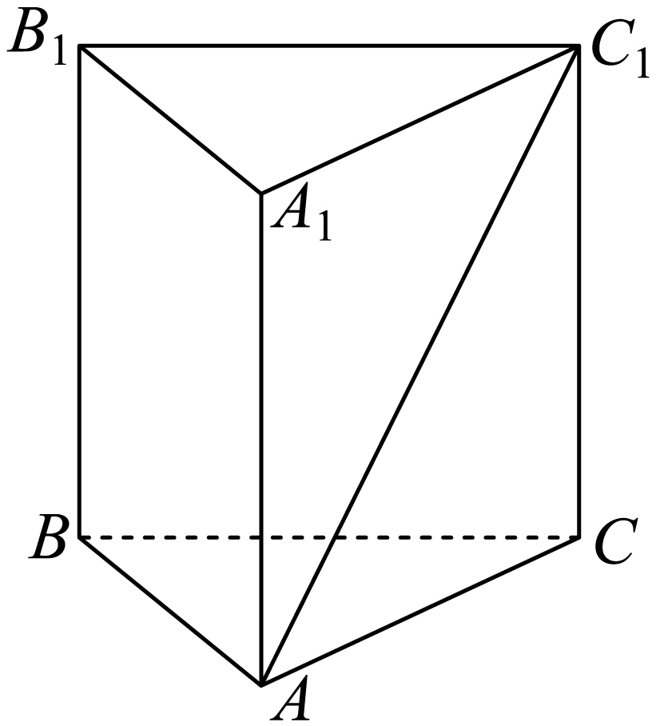
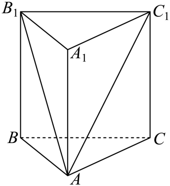

## 讲解

### 判据与流程

题目问异面角而两线没有交点，先改成过一点的平行方向。优先选已有棱的平行线；没有时用中位线或平行四边形补线，写清平行理由。

1. 选平移落点，使两条新线相交并进入能求边的三角形；平移一条足够，不必每题平移两条。
2. 用棱柱定义、等腰三角形中线、勾股等求三角形边长；不能从透视图直接量长度或角。
3. 求作出角γ，可用余弦定理。若γ钝，所求θ为π−γ；若γ锐或直，θ=γ。故所求余弦应非负，异面角0<θ≤90°。
4. 回看两条作线分别平行原线，确认没有把其他角代替目标；报题问的角或余弦。

## 易错

正棱柱含底面正多边形与侧棱垂直底面，普通棱柱没有这些直角、等边条件。用高求斜棱或对角线时必须说明直角三角形的来源。

## 例题

### 原例：正三棱柱中将底边平移到顶面求角

来源：`HSMA-B2-C8-D847cdf96960d-P0043-P0054`；原件《专题8.6 空间直线、平面的垂直（一）（举一反三讲义）高一数学人教A版必修第二册（解析版）.docx》。题号、学年及地区按讲义原标注，未另作来源核验。

以下完整保留原题、原答案与原详解（仅统一等价排版及配图路径）：

【变式1-2】（24-25高一下·山西吕梁·期末）如图，在正三棱柱$ABC-{A}_{1}{B}_{1}{C}_{1}$中，$AB=B{B}_{1}=2$，则异面直线BC与$A{C}_{1}$所成角的余弦值为（   ）

A．$\frac{\sqrt{2}}{4}$  B．$-\frac{\sqrt{2}}{4}$  C．$\frac{\sqrt{2}}{2}$  D．$-\frac{\sqrt{2}}{2}$

【答案】A

【解题思路】连接$A{B}_{1}$，利用异面直线的定义确定夹角，进而求出其余弦值.

【解答过程】在正三棱柱$ABC-{A}_{1}{B}_{1}{C}_{1}$中，连接$A{B}_{1}$，

由$BC//{B}_{1}{C}_{1}$，得$\angle A{C}_{1}{B}_{1}$为异面直线BC与$A{C}_{1}$所成角或其补角，

$Rt\triangle A{A}_{1}{B}_{1}$中，$A{B}_{1}=2\sqrt{2}$，同理$A{C}_{1}=2\sqrt{2}$，

在等腰$\triangle A{B}_{1}{C}_{1}$中，$\cos \angle A{C}_{1}{B}_{1}=\frac{\frac{1}{2}{B}_{1}{C}_{1}}{A{C}_{1}}=\frac{1}{2\sqrt{2}}=\frac{\sqrt{2}}{4}$，

所以异面直线BC与$A{C}_{1}$所成角的余弦值为$\frac{\sqrt{2}}{4}$.

故选：A.

#### 补充讲解

正三棱柱的底面是边长2的等边三角形，侧棱垂直底面且长2；顶面对应边平行底面边。把BC平移为B₁C₁，考察三角形AB₁C₁。在直角三角形AA₁B₁中，两直角边都是2，故AB₁=2√2；AC₁同理。又B₁C₁=2，等腰三角形底角的邻边半底为1，因此余弦1/(2√2)=√2/4，A正确。

原作出的角是锐角，可直接取；若作到钝角，应取其补角。B、D的负余弦不可能对应异面直线所成角，C则把半底1误成整底2。
