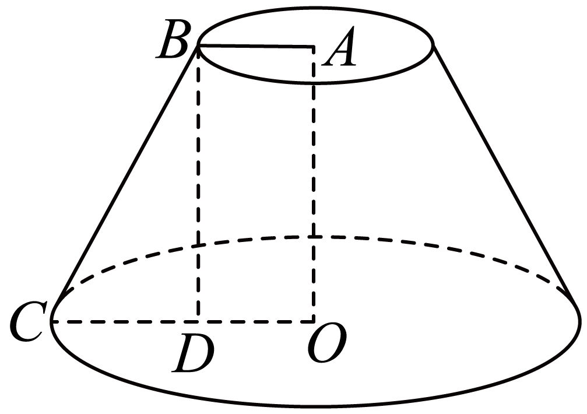

## 错法

看到侧棱或母线标了长度就代入V=Sh/3或台体积公式；或者把体高放进πrl算圆锥侧面积。成因是图里某条斜线看起来承担“上下连接”，误以为连接上下的长度都叫高。

## 正解

体高是到平面的垂直距离，用来算体积；母线、侧棱是表面上两点之间的线段；斜高是侧面三角形或梯形的高，用来算侧面面积。圆柱母线等于高，直棱柱侧棱等于高，都要有相应结构条件，不能推广到锥台。

圆锥h²=l²−r²；圆台h²=l²−(R−r)²；正棱台用对应底顶点的水平距离差ρ₂−ρ₁，再由侧棱²减这个差的平方。算的是体高时，底面中心到顶点的距离不能换成中心到边中点的距离，后者与斜高有关。

## 例题
### 原例：侧棱与高不同的正四棱台

来源：HSMA-B2-C8-D49027dc70113-P0119—P0128，原件《专题8.3 简单几何体的表面积与体积（举一反三讲义）高一数学人教A版必修第二册（解析版）.docx》。完整保留题干、全部选项与小问、原答案、原思路及详解；补讲另列。

【例2】（24-25高一下·黑龙江哈尔滨·期末）已知一个正四棱台的上、下底面边长分别为2，8，侧棱长为$3\sqrt{5}$，则该正四棱台的体积为（   ）

A．$68\sqrt{3}$  B．$68\sqrt{2}$  C．$84\sqrt{3}$  D．$84\sqrt{2}$

【答案】C

【解题思路】先求出正四棱台的高，再利用正四棱台的体积公式计算求解即可.

【解答过程】作出如图所示正四棱台，其中$O{O}_{1}$为正四棱台的高，$E{E}_{1}$为其斜高，

因为正四棱台的上、下底面边长分别为2，8，侧棱长为$3\sqrt{5}$，

则${B}_{1}{O}_{1}=\sqrt{2}$，$BO=4\sqrt{2}$，$O{O}_{1}=\sqrt{{\left( 3\sqrt{5}\right)}^{2}-{\left( 4\sqrt{2}-\sqrt{2}\right)}^{2}}=3\sqrt{3}$，

则该正四棱台的体积为$V=\frac{1}{3}\left( 4+64+16\right)\times 3\sqrt{3}=84\sqrt{3}$.

故选：C.

**补讲**

3√5是侧棱，两底对应顶点的水平错位是4√2−√2=3√2，因此h²=45−18=27，高3√3。V=(4+16+64)h/3=84√3，选C。直接h=3√5会把斜边当直角边；直接减半边长差3的平方又会把侧棱三角形与斜高三角形混淆。

### 原例：圆台母线须先换成高

来源：HSMA-B2-C8-D49027dc70113-P0194—P0203，原件《专题8.3 简单几何体的表面积与体积（举一反三讲义）高一数学人教A版必修第二册（解析版）.docx》。完整保留题干、全部选项与小问、原答案、原思路及详解；补讲另列。

【例4】（24-25高一下·四川泸州·期末）已知圆台上、下底面面积分别是$\pi $、$9\pi $，其侧面积是$12\pi $，则该圆台的体积是（    ）

A．$\frac{13\sqrt{5}}{3}\pi $  B．$\frac{13\sqrt{3}}{3}\pi $  C．$4\sqrt{5}\pi $  D．$13\sqrt{3}\pi $

【答案】A

【解题思路】先由侧面积得母线长，再由母线得到高，进而圆台的体积公式可得出.

【解答过程】如图，由圆台上、下底面面积分别是$\pi $、$9\pi $，得上底面半径$AB=1$，下底面半径$OC=3$.

侧面积是$12\pi $，得$\pi (AB+OC)\cdot BC=12\pi $，得$BC=3$，在直角三角形$BCD$中，

$CD=OC-AB=2$，高$BD=\sqrt{B{C}^{2}-C{D}^{2}}=\sqrt{5}$，

所以$V=\frac{1}{3}(\pi +\sqrt{\pi \cdot 9\pi }+9\pi )\times \sqrt{5}=\frac{13\sqrt{5}}{3}\pi $.

故选：A.

**补讲**

两底面积给半径1、3。侧面积12π=π(1+3)l，求得母线l=3；半径差2是轴截面中水平直角边，h=√(9−4)=√5。体积=(π+3π+9π)√5/3=13√5π/3，选A。母线3用于侧面积，高√5用于体积，二者在同一题中用途不同，不能共用一个数。

## 识别信号

给侧棱/母线却问体积，通常要先找垂足及水平投影。给体高却问锥侧面积，通常还要求斜高/母线；根号内应为正，等于0只是退化边界。

## 来源定位

- 知识与分类：HSMA-B2-C8-Daee9a1a18c4b-P0025—P0092，原件《专题8.1 基本立体图形（举一反三讲义）高一数学人教A版必修第二册（解析版）.docx》。定义、条件和理由按原知识主线补足。
- 知识与分类：HSMA-B2-C8-D49027dc70113-P0025—P0056；P0119—P0128；P0194—P0203，原件《专题8.3 简单几何体的表面积与体积（举一反三讲义）高一数学人教A版必修第二册（解析版）.docx》。定义、条件和理由按原知识主线补足。
- 原例年份与校次沿用原件，未另作外部认证；原题原解与补讲、勘误分别保留。
