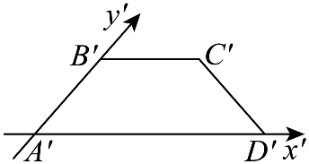

## 错法

把图中的直角、等腰、等长直接搬回原图，或把直观图面积当原面积；又或者看到线条倾斜就乘2。成因是把“画出了对应位置”误当成“按真实比例拍照”。

## 正解

斜二测保共线、平行、同线比例及中点；只对规定轴向保长度：x向不变、y向半长，空间z向不变。原x与y垂直，图中x′与y′夹45°或135°。一般斜边由两轴向分量共同决定，角度和总长度不会按单一比例改变。

水平平面面积缩放来自y向减半和夹角改变两个因素：S直=(1/2)sin45°×S原=√2S原/4。因此图中沿y′的边长还不是对x′底边的垂直高，要再乘sin45°。反求原面积乘2√2，只用于规定的水平平面画法。

## 例题
### 原例：直观图保持与改变的性质

来源：HSMA-B2-C8-D6260fd311857-P0031—P0040，原件《专题8.2 立体图形的直观图（举一反三讲义）高一数学人教A版必修第二册（解析版）.docx》。完整保留题干、全部选项与小问、原答案、原思路及详解；补讲另列。

【例1】（24-25高一下·福建三明·期末）用斜二测画法画水平放置的平面图形的直观图时，下列结论正确的是（    ）

A．矩形的直观图是矩形  B．三角形的直观图是三角形

C．相等的角在直观图中仍然相等  D．长度相等的线段在直观图中仍然相等

【答案】B

【解题思路】由斜二测画法逐一判断即可.

【解答过程】解：对于A，由斜二测画法可知，矩形的直观图为平行四边形，故A错误；

对于B，由斜二测画法可知，三角形的直观图是三角形，故B正确；

对于C，由A可知，矩形的四个角都为直角，但其直观图是平行四边形，只有对角才相等，故C错误；

对于D，正方形的四条边相等，但其直观图是平行四边形，只有对边才相等，故D错误.

故选：B.

**补讲**

原矩形的两组垂直边映成夹45°的方向，所以A、C不能成立；原正方形相等边分别保持或减半，D不能成立。非共线三点在这个二维可逆变换下仍非共线，所以三角形仍是三角形，B正确。保持形状类别的一部分性质，与保持边长和角度不是同一件事。

### 原例：由直观图面积还原

来源：HSMA-B2-C8-D6260fd311857-P0295—P0304，原件《专题8.2 立体图形的直观图（举一反三讲义）高一数学人教A版必修第二册（解析版）.docx》。完整保留题干、全部选项与小问、原答案、原思路及详解；补讲另列。

【例6】（24-25高一下·江苏扬州·月考）如图所示，梯形${A}^{\prime}{B}^{\prime}{C}^{\prime}{D}^{\prime}$是平面图形$ABCD$用斜二测画法得到的直观图，${A}^{\prime}{D}^{\prime}=4,{A}^{\prime}{B}^{\prime}={B}^{\prime}{C}^{\prime}=2$，则平面图形$ABCD$的面积为（     ）

A．12  B．8  C．6  D．3

【答案】A

【解题思路】根据给定条件，求出梯形${A}^{\prime}{B}^{\prime}{C}^{\prime}{D}^{\prime}$的面积，再利用原平面图形面积与直观图面积的关系求出平面图形$ABCD$的面积.

【解答过程】在梯形${A}^{\prime}{B}^{\prime}{C}^{\prime}{D}^{\prime}$中，$\angle {B}^{\prime}{A}^{\prime}{D}^{\prime}={45}^{∘}$，则该梯形的高为${A}^{\prime}{B}^{\prime}\sin {45}^{∘}=\sqrt{2}$，

梯形${A}^{\prime}{B}^{\prime}{C}^{\prime}{D}^{\prime}$的面积为${S}^{\prime}=\frac{{A}^{\prime}{D}^{\prime}+{B}^{\prime}{C}^{\prime}}{2}\cdot \sqrt{2}=3\sqrt{2}$，

在斜二测画法中，原图形的面积是对应直观图面积的$2\sqrt{2}$倍，

所以平面图形$ABCD$的面积$S=2\sqrt{2}{S}^{\prime}=2\sqrt{2}\times 3\sqrt{2}=12$.

故选：A.

**补讲**

图中腰2与底夹45°，实际图高√2，面积3√2；原面积再乘2√2，得12。只给图中两底与腰代成梯形高，会错用腰2；只把y向乘2但漏掉图中高度的sin45°，也会混淆两个坐标系。直接还原原AB=4，原两底4、2，可核验面积12，选A。

## 识别信号

图上角度只用于计算图自身的高度；原角需要还原后再判断。证明空间垂直要用定义或定理条件，不能用纸面直角。

## 来源定位

- 知识与分类：HSMA-B2-C8-D6260fd311857-P0013—P0029；P0031—P0040；P0295—P0304，原件《专题8.2 立体图形的直观图（举一反三讲义）高一数学人教A版必修第二册（解析版）.docx》。定义、条件和理由按原知识主线补足。
- 原例年份与校次沿用原件，未另作外部认证；原题原解与补讲、勘误分别保留。
