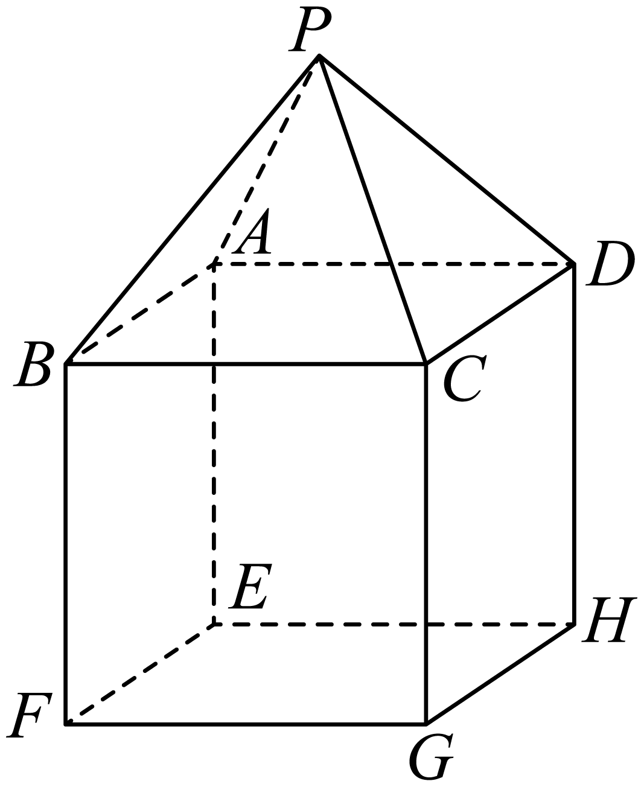
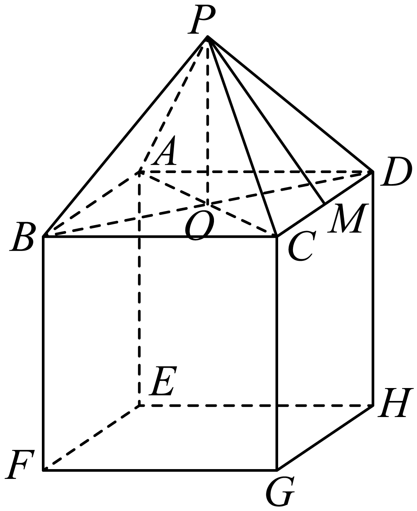
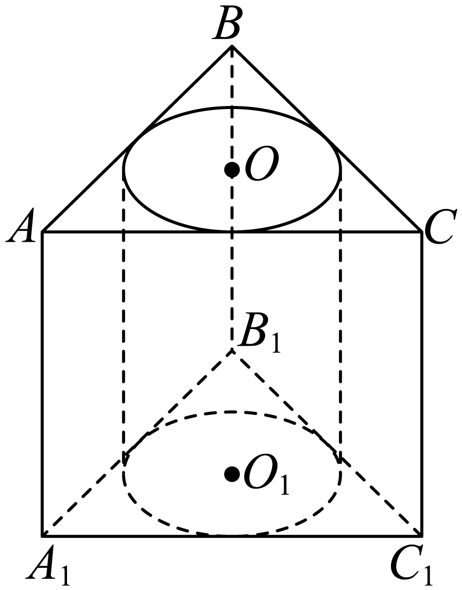

## 错法

将两基本体总表面积直接相加，把内部接触面算成外表面；或只扣一次公共面。挖去体时又机械地用原表面积减去整个被挖体的表面积，漏掉新露出的孔壁。

## 正解

表面积统计体与外部空气（包括孔内空区）的边界，先逐面判断还露不露。两体沿面积A的一片面拼接，原两表面积各有一份该面，因此和中须扣2A；接触仅为点或线时，扣面积0。两体内部若重叠，不能只靠公共面公式，要重新列剩余边界。

挖贯通圆柱孔时，从上、下原面各扣一个圆面，但孔的圆柱侧面成为新的边界，要加入2πrh；该圆柱上下底是开口，没有新增的底盖。体积则只减被挖圆柱体积πr²h。内侧曲面与“内部接触面”不同：孔壁暴露于空区，接触面夹在实心体内。

## 例题
### 原例：拼接体外表面与体积

来源：HSMA-B2-C8-D49027dc70113-P0288—P0305，原件《专题8.3 简单几何体的表面积与体积（举一反三讲义）高一数学人教A版必修第二册（解析版）.docx》。完整保留题干、全部选项与小问、原答案、原思路及详解；补讲另列。

【变式6-2】（24-25高一下·重庆万州·期中）如图所示，几何体的上部是一个正四棱锥$P-ABCD$，下部是一个正方体，其中正四棱锥$P-ABCD$的高为$3\sqrt{2}$，$\triangle PCD$是等边三角形,$CD=6$.．

(1)求该几何体的表面积；

(2)求该几何体的体积．

【答案】(1)$36\sqrt{3}+180$

(2)$V=36\sqrt{2}+216$

【解题思路】（1）设$M$是$CD$的中点，连接$PM$，进而可证明$PM\perp CD$，从而可计算正四棱锥的侧面积与正方体的五个面积；

（2）根据锥体与正方体体积求解即可.

【解答过程】（1）设$M$是$CD$的中点，连接$PM$.

因为$\triangle PCD$是边长为6的正三角形，

所以$PM\perp CD$，且$PM=\sqrt{{6}^{2}-{3}^{2}}=3\sqrt{3}$，

所以该几何体的表面积$S=\left( \frac{1}{2}\times 6\times 3\sqrt{3}\right)\times 4+{6}^{2}\times 4+{6}^{2}=36\sqrt{3}+180$.

（2）连接$AC,BD$，设交点为$O$，连接$PO$，则$PO$是四棱锥$P-ABCD$的高，

则$PO=3\sqrt{2}$，所以${V}_{P-ABCD}=\frac{1}{3}\times {6}^{2}\times 3\sqrt{2}=36\sqrt{2}$.

又正方体的体积为$6\times 6\times 6=216$，

所以该几何体的体积$V=36\sqrt{2}+216$.

**补讲**

两块总面积若相加，正方体6×36和锥底36都包含同一个ABCD，所以重复两份36。正确只计正方体5个面180与锥4个侧三角形36√3，总180+36√3；体积两块相加216+36√2。扣接触面的动作只改表面积，不改变体积。

### 原例：挖孔后增加的内侧曲面

来源：HSMA-B2-C8-D49027dc70113-P0306—P0319，原件《专题8.3 简单几何体的表面积与体积（举一反三讲义）高一数学人教A版必修第二册（解析版）.docx》。完整保留题干、全部选项与小问、原答案、原思路及详解；补讲另列。

【变式6-3】（24-25高二上·海南省直辖县级单位·期中）如图，在直三棱柱$ABC-{A}_{1}{B}_{1}{C}_{1}$中，底面是边长为$2\sqrt{3}$的正三角形，以上、下底面的内切圆为底面，挖去一个圆柱，若圆柱的体积为$2\pi $，求：

(1)剩余部分几何体的体积；

(2)剩余部分几何体的表面积.

【答案】(1)$6\sqrt{3}-2\pi $；

(2)$18\sqrt{3}+2\pi $.

【解题思路】（1）先由题意求出棱柱底面圆的半径，进而由圆柱体积求出棱柱的高h，再结合柱体体积公式用棱柱体积减去圆柱体积即可得解.

（2）根据几何体的特征确定表面的组成部分即可求解.

【解答过程】（1）因为直三棱柱$ABC-{A}_{1}{B}_{1}{C}_{1}$底面是边长为$2\sqrt{3}$的正三角形，

所以底面圆的半径为$\sqrt{3}\tan {30}^{∘}=1$，

设圆柱高为$h$，则圆柱体积为$\pi \times {1}^{2}\times h=2\pi $，解得$h=2$，

所以剩余几何体的体积为$\frac{\sqrt{3}}{4}\times {\left( 2\sqrt{3}\right)}^{2}\times 2-2\pi =6\sqrt{3}-2\pi $.

（2）剩余部分几何体的表面积为

$2\sqrt{3}\times 2\times 3+2\times \left( \frac{\sqrt{3}}{4}\times {\left( 2\sqrt{3}\right)}^{2}-\pi \times {1}^{2}\right)+2\pi \times 1\times 2=18\sqrt{3}+2\pi $.

**补讲**

等边底边2√3的内切圆半径1，圆柱体积2π给高2。原三棱柱侧面积3×2√3×2=12√3，两底原合6√3；两底各挖去π，合减2π；孔壁面积2π×1×2=4π要加回来，所以余表面积18√3−2π+4π=18√3+2π。余体积原柱6√3减圆柱2π，为6√3−2π。原题两个小问分别这样计算，不能将面积的加孔壁规则用于体积。

## 识别信号

题目出现“组合”“拼接”“挖去”“无下底面”等词，先列边界表再用公式。开孔处圆周线不贡献面面积，孔壁则必须计入。

## 来源定位

- 知识与分类：HSMA-B2-C8-D49027dc70113-P0070—P0073；P0288—P0319，原件《专题8.3 简单几何体的表面积与体积（举一反三讲义）高一数学人教A版必修第二册（解析版）.docx》。定义、条件和理由按原知识主线补足。
- 原例年份与校次沿用原件，未另作外部认证；原题原解与补讲、勘误分别保留。
