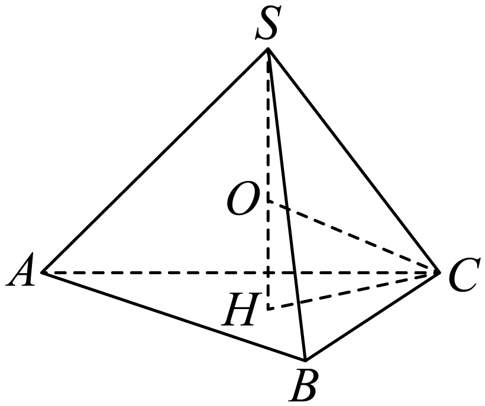
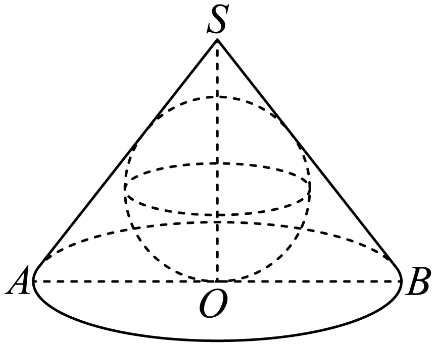

## 讲解

### 是什么

外接球经过多面体的全部顶点，即各顶点到同一球心距离R相等；多面体称为球的内接多面体。内切球在几何体内部，与各面都相切；对凸多面体，球心到各面所在平面的距离都等于球半径r，且切点落在相应面内。不能把“经过几个顶点”当作外接全体顶点，也不能把“到几个棱等距离”当作与面相切。

并非任意多面体都有外接球或内切球。普通长方体有外接球R=√(a²+b²+c²)/2；只有a=b=c时才有同时与六个面相切的球，其r=a/2。底面三角形的外接圆与空间外接球仍是两个对象，半径通常不同。

### 怎么来的

等距于两点的球心在连线中垂面上；同时等距于底面三个不共线顶点的球心，位于经过底面外心且垂直底面的直线上。正棱锥的底面中心就是外心，顶点也在这条垂线上，所以外接球心在轴线上。但球心可在锥体外，不能只凭图把它放在锥高内部。

设正棱锥底面外接圆半径ρ、锥高h>0，底中心H，球心在轴线上到H的有向距离t。对底顶点A有$R^2=t^2+\rho^2$，对锥顶S有$R^2=(h-t)^2$。两式相减：t²+ρ²=h²−2ht+t²，故$t=(h^2-\rho^2)/(2h)$；进而$R=h-t=(h^2+\rho^2)/(2h)>0$。若t<0，球心在底面下方，关系仍成立；这比先假设R<h更可靠。

凸多面体若确有内切球，连接球心与各顶点可把原体分成以各面为底、球心为顶点的小锥。各高都为r，体积相加得V=Σ(S面r/3)=Sr/3，S为全部面面积，所以r=3V/S。使用之前先有“球在内部且与所有面相切”的条件，这个式子自身不证明球存在。

圆锥的内切球球心在轴上，过轴平面截球为大圆，圆半径等于球半径；圆又与轴截面等腰三角形三边相切，所以球半径可在此二维三角形中用r=三角形面积/半周长求出。任意不经过球心的截面则不能这样认半径。

### 什么时候能用

外接看“到顶点等距”，内切看“到面垂距相同且位置合法”。求出候选中心、半径后，检查每一个顶点或每一个面与切点，不将图示对称当作证明。一般非正锥体须另证中心所在直线或平面，不套正棱锥轴心公式。

## 例题
### 原例：正三棱锥的外接球

来源：HSMA-B2-C8-D49027dc70113-P0400—P0412，原件《专题8.3 简单几何体的表面积与体积（举一反三讲义）高一数学人教A版必修第二册（解析版）.docx》。完整保留题干、全部选项与小问、原答案、原思路及详解；补讲另列。

【例8】（24-25高一下·山西太原·月考）已知正三棱锥$S-ABC$的底面是边长为$2\sqrt{3}$的正三角形，侧棱长为$2\sqrt{5}$，则该正三棱锥$S-ABC$的外接球$O$的表面积为（    ）

A．$10\pi $  B．$25\pi $  C．$100\pi $  D．$125\pi $

【答案】B

【解题思路】先判断球心在三棱锥的高线$SH$上，由正弦定理求得$CH=2$，设球$O$的半径为$R$，结合题意列方程求出外接球半径即得.

【解答过程】如图，设点$S$在底面的射影为点$H$，

因底面边长均为$2\sqrt{3}$，侧棱长均为$2\sqrt{5}$，故球心$O$在$SH$上，

连接$CH$，设球$O$的半径为$R$，则$SO=OC=R$，

由正弦定理$\frac{2\sqrt{3}}{\sin {60}^{∘}}=2CH$，解得$CH=2$，

在$Rt\triangle SHC$中，$SH=\sqrt{{(2\sqrt{5})}^{2}-{2}^{2}}=4$，则$OH=|4-R|$，

在$Rt\triangle OHC$中，由$|4-R{|}^{2}+4={R}^{2}$，解得$R=\frac{5}{2}$，

则球$O$的表面积为$S=4\pi {R}^{2}=4\pi \times {(\frac{5}{2})}^{2}=25\pi $．

故选：B．

**补讲**

底面边2√3的正三角形外接圆半径ρ=边/√3=2；由侧棱²=20减ρ²=4得h²=16，h=4。球心轴向位置t=(16−4)/8=3/2，R=h−t=5/2；球表面积4π×25/4=25π，选B。球心在轴线的理由来自三个底顶点等距的中垂面交线，不是图中的O画在那里就成立。

### 原例：圆锥轴截面的内切圆

来源：HSMA-B2-C8-D49027dc70113-P0478—P0487，原件《专题8.3 简单几何体的表面积与体积（举一反三讲义）高一数学人教A版必修第二册（解析版）.docx》。完整保留题干、全部选项与小问、原答案、原思路及详解；补讲另列。

【例9】（24-25高一下·山西·月考）已知经过圆锥的高的平面截该圆锥所得的截面是边长为6的等边三角形，则该圆锥的内切球的表面积为（    ）

A．$4\sqrt{3}\pi $  B．$6\sqrt{3}\pi $  C．$12\pi $  D．$36\pi $

【答案】C

【解题思路】由圆锥的内切球半径即轴截面内切圆半径，在轴截面中利用等面积法求出内切圆半径，再求内切球表面积即可.

【解答过程】根据题意圆锥的内切球半径即轴截面内切圆半径，

设截面$SAB$的内切圆半径为$r$，由题意可得截面的高$h=SO=3\sqrt{3}$，

${S}_{\triangle SAB}=\frac{1}{2}\times 6\times 3\sqrt{3}=\frac{1}{2}\times \left( 6+6+6\right)r$，所以$r=\sqrt{3}$，

即圆锥的内切球$r=\sqrt{3}$，则该圆锥的内切球的表面积为$4\pi {r}^{2}=12\pi $．

故选：C．

**补讲**

轴截面边6的等边三角形高3√3，面积9√3，半周长9，故内切圆半径r=√3。由于这个平面经过圆锥轴，也经过内切球心，所得圆是球的大圆，圆半径等于球半径；球表面积4πr²=12π，选C。把轴截面三角形外接圆半径用于内切球，会混淆“过顶点”与“切边”。

## 易错

- 外接球中心未必是几何体重心，也未必在几何体内部。
- 内切半径是球心到面的垂距，不是到面某顶点的距离。
- r=3V/S使用总表面积；若只用侧面积，就漏掉底面小锥体积。

## 来源定位

- 知识与分类：HSMA-B2-C8-D49027dc70113-P0324—P0326；P0399—P0412；P0477—P0487；P0504—P0524，原件《专题8.3 简单几何体的表面积与体积（举一反三讲义）高一数学人教A版必修第二册（解析版）.docx》。定义、条件和理由按原知识主线补足。
- 原例年份与校次沿用原件，未另作外部认证；原题原解与补讲、勘误分别保留。
