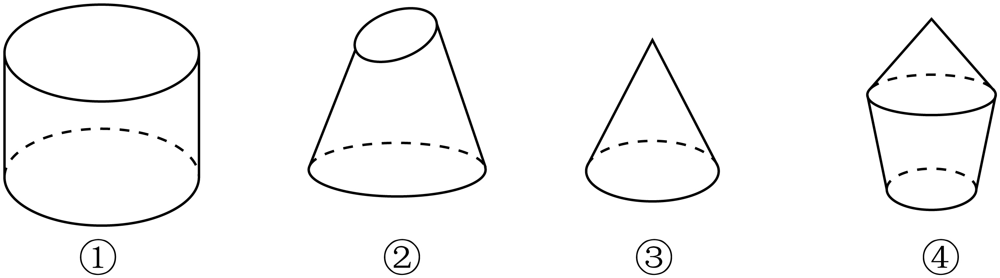

## 讲解

### 是什么

旋转体是平面图形绕其平面内固定直线旋转后形成的几何体，这条直线是轴。本章圆柱用矩形绕一边旋转生成；圆锥用直角三角形绕一直角边旋转生成；圆台是圆锥被平行于底面的平面截去顶部后，截面与原底面之间的部分。它们在本章均有垂直底面的轴，不能把歪斜的圆截体直接套作圆台。

圆柱两底面是平行等大的圆面，母线平行轴、互相平行且等长，母线长就是高h。圆锥底面是圆面，母线连接顶点与底面圆周，各母线等长l；体的高h是顶点到底面圆心的垂线段。圆台底面是平行、不等大的两个圆面；母线等长、延长后交于原锥顶点。

半圆绕直径旋转，弧形成球面，整个半圆面形成球体。球面是到定点O距离等于R的点集，球体包括内部，是距离不大于R的点集。R>0为半径，过O的球面两点连线段为直径，长2R。圆面、球体是填满的区域；圆、球面是边界，不混称。

### 怎么来的

矩形中另一条平行轴的边始终与轴距离相同，故圆柱半径不随高度改变。圆锥过轴的截面是等腰三角形，半径r、体高h、母线l构成直角三角形，$l^2=h^2+r^2$。圆台轴截面为等腰梯形，两侧母线平行移位后，水平差是R−r，所以$l^2=h^2+(R-r)^2$，这里R、r为下、上底半径，R>r>0。

平行底面的内部截面，圆柱半径不变，圆锥半径按距锥顶点的比例变化，圆台截面半径介于两底之间。球过球心的截面是大圆面，其半径R；其他穿过内部的截面为小圆面，半径小于R。

### 什么时候能用

柱、锥、台的结构都要检查旋转轴、生成图形和截平面方向。一般三角形绕某条直线旋转可能得到组合体，不能看到“三角形”就判断一定为一个圆锥。圆柱中任取上、下圆周点相连，连线未必平行轴，因此未必是母线。

非退化体要求半径与高为正。圆台r=0的极限为圆锥，R=r时为圆柱；这些是公式的边界形式，按严格圆台定义分别不是非退化圆台。球R=0退成点。

**资料边界补注：**8.1 P0090原知识写“球的截面都是圆面”。准确范围是平面穿过球体内部；平面到球心距离d=R时仅相切于一点，d>R时无交，不能仍说是有半径的圆面。原句与补注分别记录。

## 例题
### 原例：旋转体概念须带足条件

来源：HSMA-B2-C8-Daee9a1a18c4b-P0193—P0204，原件《专题8.1 基本立体图形（举一反三讲义）高一数学人教A版必修第二册（解析版）.docx》。完整保留题干、全部选项与小问、原答案、原思路及详解；补讲另列。

【例3】（25-26高二·上海·假期作业）下列命题中正确的是（   ）

A．连接圆柱上、下底面圆周上两点的线段是圆柱的母线

B．夹在圆柱的两个平行截面间的几何体还是一个圆柱体

C．直线绕定直线旋转形成柱面

D．以矩形的一边为旋转轴，将矩形旋转一周形成圆柱

【答案】D

【解题思路】根据母线的性质判断A，通过举反例判断B、C，通过圆柱的概念即可判断D.

【解答过程】对于A，根据圆柱的定义和性质，圆柱的母线与底面垂直，A错误；

对于B，当两个截面与底面不平行时，截得的平面不是一个圆柱体，B错误；

对于C，直线绕定直线旋转有也可能形成一个锥面，C错误；

对于D，以矩形的一边为旋转轴，将矩形旋转一周形成圆柱，D正确.

故选：D.

**补讲**

选D，因为矩形绕一边满足圆柱生成定义。A少了“连线平行轴”：任意两圆周点不一定在同一母线上。B只说两个截平面互相平行，未说它们平行圆柱底面；斜切会产生椭圆截面而非本章的圆形底面。C少了生成直线与轴平行且距离为正；与轴相交的直线可生成锥面，故不能一概说柱面。

### 原例：圆台不是上下都有圆面就成立

来源：HSMA-B2-C8-Daee9a1a18c4b-P0109—P0117，原件《专题8.1 基本立体图形（举一反三讲义）高一数学人教A版必修第二册（解析版）.docx》。完整保留题干、全部选项与小问、原答案、原思路及详解；补讲另列。

【变式1-1】（24-25高二上·宁夏石嘴山·月考）如图所示，观察下面四个几何体，其中判断正确的是（    ）

A．①是圆台  B．②是圆台  C．③是圆锥  D．④是圆台

【答案】C

【解题思路】根据圆锥，圆台的概念可得选项.

【解答过程】图①不是由圆锥截得的,所以①不是圆台;

图②上下两个面不平行，所以②不是圆台;

图④不是由圆锥截得的，所以④不是圆台;很明显③是圆锥，

故选：C.

**补讲**

图①是圆柱，两底等大，侧面母线没有有限公共锥顶点；②上、下截面不平行；④由圆锥与圆台拼成，存在转折，整体侧面不能由同一组圆台母线形成。③底面圆、母线共顶点，符合圆锥结构，所以选C。判断时用条件解释每图，不能只凭“上窄下宽”外观。

## 易错

- l²=h²+r²只用于本章直圆锥；圆台需改成半径差R−r。
- 过轴截面中的底边是直径2r，不能把它当半径。
- 球面上的三点所成圆通常只是小圆，其圆心未必为球心。

## 来源定位

- 知识与分类：HSMA-B2-C8-Daee9a1a18c4b-P0059—P0095，原件《专题8.1 基本立体图形（举一反三讲义）高一数学人教A版必修第二册（解析版）.docx》。定义、条件和理由按原知识主线补足。
- 原例年份与校次沿用原件，未另作外部认证；原题原解与补讲、勘误分别保留。
