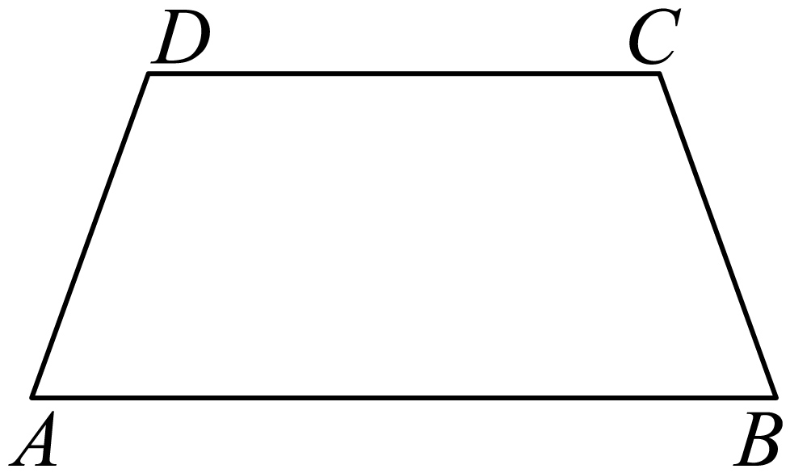
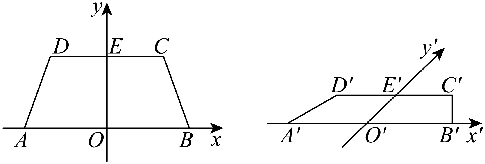

## 讲解

### 是什么

斜二测画法按指定坐标轴，把水平平面或空间几何体画在纸面上。原水平平面x、y轴互相垂直；图上的对应轴x′、y′夹角取45°或135°，常将x′画水平。原图平行x轴的长度画时不变，原图平行y轴的长度减半；不是所有“看起来斜”的线段都减半。

画空间图再添加原来垂直水平面的z轴，图上常把z′画竖直。平行z轴的线段保原长。x′、y′、z′仅是纸面方向，不表示它们在纸面仍两两垂直；三条空间轴互相垂直不能靠直观图角度体现。遮挡边画虚线，轮廓和可见边画实线。

### 怎么来的

先把每个点记录为沿x、y方向的有向位移，再把x位移照原长沿x′移动，把y位移的一半沿y′移动。若原图中点P的坐标是(x,y)，图中向量可写$\overrightarrow{O'P'}=x\mathbf e_{x'}+\frac y2\mathbf e_{y'}$，两单位方向夹角45°或135°。负坐标沿对应负方向画，不能把负号抹掉。这个规则由“平行、轴向缩放”定义，保持共线、平行、同一直线上的比例与中点；不保持一般长度、角度和垂直。

以水平矩形为例，x向底边长a不变，y向另一边长b变成b/2，但图中对底的垂直高度为(b/2)sin45°，不是b/2。因此：

$$S_{\text{直}}=\frac12\sin45^\circ\,S_{\text{原}}=\frac{\sqrt2}{4}S_{\text{原}},\qquad S_{\text{原}}=2\sqrt2S_{\text{直}}.$$

对任意三角形，过纵坐标居中的顶点作平行x轴的线，交对边后分成两个三角形；两小三角形共有水平底边，底长不缩放，对应垂直高度都变成原来的sin45°/2，所以面积也都缩为√2/4，相加仍是同一比例。若有一边本来就水平，直接用该边作底即可。把水平多边形分成三角形，逐块相加便推广到多边形。135°时sin135°=sin45°，面积比例相同。此式只用于这种水平平面图形的斜二测；空间面若不是这个水平面，不能给它也统一乘√2/4。

### 什么时候能用

画图顺序是选便于定位的原轴→明确45°或135°与缩放→沿轴确定关键点→按原图对应关系连线→补空间竖向点与边→标可见性。还原时先认出哪条图线对应哪条原轴，再把y′方向长度乘2。一般斜边须先拆成轴向分量或还原点坐标，不能直接乘2。

## 例题
### 原例：按轴方向画等腰梯形

来源：HSMA-B2-C8-D6260fd311857-P0079—P0086，原件《专题8.2 立体图形的直观图（举一反三讲义）高一数学人教A版必修第二册（解析版）.docx》。完整保留题干、全部选项与小问、原答案、原思路及详解；补讲另列。

【例2】（24-25高一下·全国·课堂例题）画出如图所示水平放置的等腰梯形的直观图．

【答案】答案见解析

【解题思路】运用斜二测画法画图即可.

【解答过程】画法：（1）如图所示，取AB所在直线为x轴，AB的中点O为原点，建立直角坐标系，画对应的坐标系${x}^{\prime}{O}^{\prime}{y}^{\prime}$，使$\angle {x}^{\prime}{O}^{\prime}{y}^{\prime}=45^{\circ}$．

（2）以${O}^{\prime}$为中点在${x}^{\prime}$轴上取${A}^{\prime}{B}^{\prime}=AB$，在${y}^{\prime}$轴上取${O}^{\prime}{E}^{\prime}=\frac{1}{2}OE$，以${E}^{\prime}$为中点画${C}^{\prime}{D}^{\prime}//{x}^{\prime}$轴，并使${C}^{\prime}{D}^{\prime}=CD$．

（3）连接${B}^{\prime}{C}^{\prime}$，${D}^{\prime}{A}^{\prime}$，所得的四边形${A}^{\prime}{B}^{\prime}{C}^{\prime}{D}^{\prime}$就是水平放置的等腰梯形$ABCD$的直观图．

**补讲**

AB、CD都平行原x轴，所以长度分别保持；OE平行原y轴，所以O′E′=OE/2。E′是上底中点的像，先把整条上底放在E′处再连腰。两腰不是平行y轴的线段，不能把每条腰机械减半。图上原梯形的左右对称、等腰外观可能改变；保留的是原轴定位后的对应关系。

### 原例：直观图保持与改变的性质

来源：HSMA-B2-C8-D6260fd311857-P0031—P0040，原件《专题8.2 立体图形的直观图（举一反三讲义）高一数学人教A版必修第二册（解析版）.docx》。完整保留题干、全部选项与小问、原答案、原思路及详解；补讲另列。

【例1】（24-25高一下·福建三明·期末）用斜二测画法画水平放置的平面图形的直观图时，下列结论正确的是（    ）

A．矩形的直观图是矩形  B．三角形的直观图是三角形

C．相等的角在直观图中仍然相等  D．长度相等的线段在直观图中仍然相等

【答案】B

【解题思路】由斜二测画法逐一判断即可.

【解答过程】解：对于A，由斜二测画法可知，矩形的直观图为平行四边形，故A错误；

对于B，由斜二测画法可知，三角形的直观图是三角形，故B正确；

对于C，由A可知，矩形的四个角都为直角，但其直观图是平行四边形，只有对角才相等，故C错误；

对于D，正方形的四条边相等，但其直观图是平行四边形，只有对边才相等，故D错误.

故选：B.

**补讲**

非退化的三角形在这一二维变换下仍为三角形，故B正确。矩形的两垂直轴向边变为夹45°的边，通常为平行四边形；正方形两组等长边分别按1与1/2缩放，图中不再四边等长。A、C、D错误的共同原因是把真实图形的度量性质误当成投影规则保留的性质。

## 易错

- 直观图两条线画得垂直，不能作为空间垂直的证明。
- 原y向长度减半与其图中垂直高度要再乘sin45°是两个动作。
- 图中为正方形，原图未必正方形；原图为正方形，图中通常也不是正方形。

## 来源定位

- 知识与分类：HSMA-B2-C8-D6260fd311857-P0013—P0029，原件《专题8.2 立体图形的直观图（举一反三讲义）高一数学人教A版必修第二册（解析版）.docx》。定义、条件和理由按原知识主线补足。
- 原例年份与校次沿用原件，未另作外部认证；原题原解与补讲、勘误分别保留。
