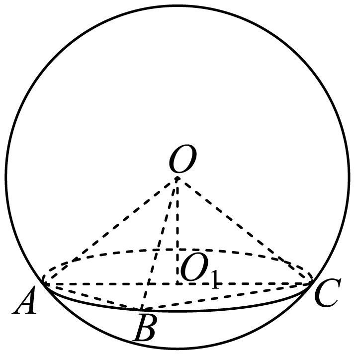
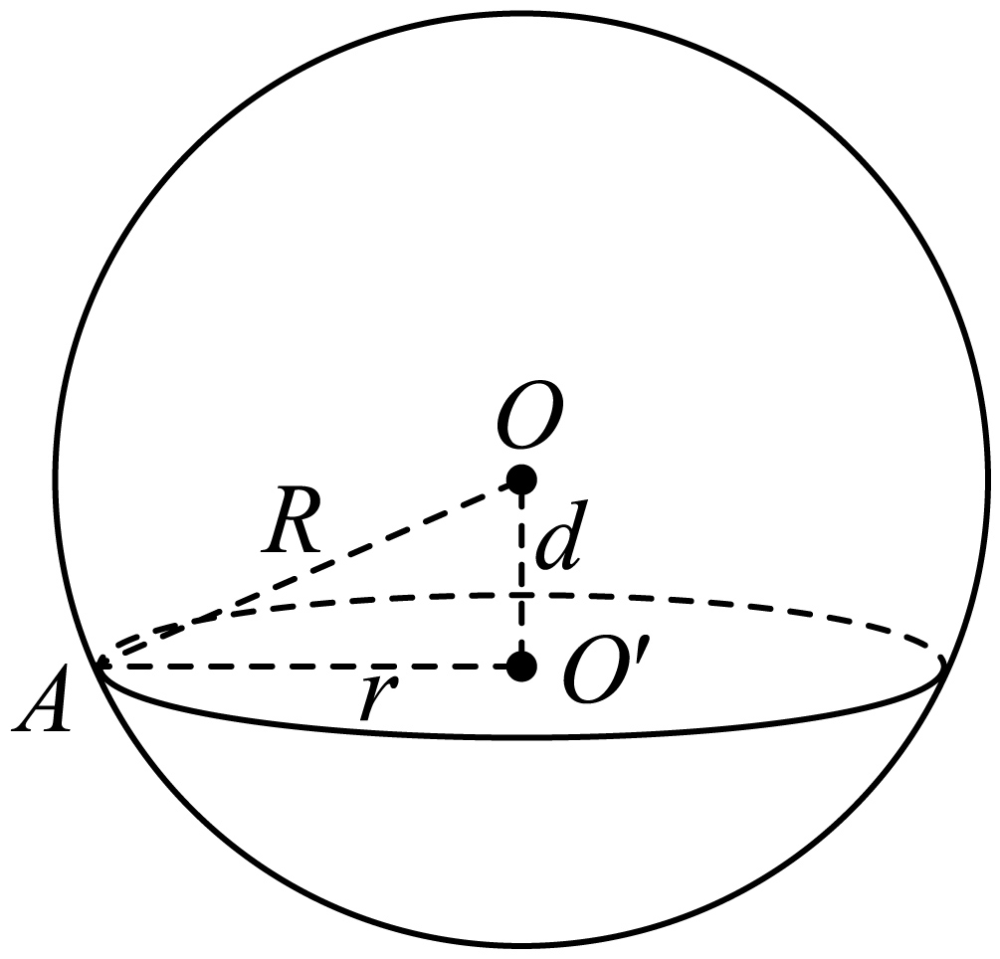

## 讲解

### 是什么

半径R>0的球表面积$S=4\pi R^2$，体积$V=4\pi R^3/3$。表面积算球面，体积算球体，不能把截面圆面积πr²当作整个球面积。半球曲面面积2πR²；封闭半球总表面积还含底面πR²，合计3πR²，体积为整球的一半。

平面到球心O的距离为d≥0。d<R时截面为圆面，圆心O′是O在该平面的垂足，截面半径r满足：

$$R^2=r^2+d^2,\qquad r=\sqrt{R^2-d^2}.$$

d=0时r=R，是大圆；0<d<R时r<R，是小圆；d=R退为一个切点，d>R没有截面。R=0只剩一点，是公式的退化边界，不是正常的球。

### 怎么来的

取球面与截平面的交线上的任一点A。OA=R，OO′=d；当d>0时，OO′垂直截平面，所以垂直O′A，勾股得到O′A²=R²−d²。右边与A选在哪无关，因此球面交线上的点到O′距离相同，交线为以O′为圆心的圆；球体与平面相交则包括圆内部，所得截面是圆面，其内部点到O′距离小于r。若d=0，O与O′重合，仍有r=R，但不存在有方向的非零线段OO′。

球体积可用资料所给祖暅原理说明来源：将球放在半径R、高2R的圆柱内，以球心所在中间平面为z=0。距中间平面|z|处，球截面积为π(R²−z²)。另从圆柱挖去两只以中点为共同顶点、上下底为底面的圆锥，每只锥高R、底半径R；同一高度处剩余面积也是πR²−πz²。由祖暅原理，同高截面总等面积的两体等体积，所以球体积等于圆柱体积减两锥体积，即$2\pi R^3-2\times\pi R^3/3=4\pi R^3/3$。该说明以祖暅原理和柱、锥公式为已知，不额外证明这些基本结论。

球面表面积4πR²在本章作为教材结论。把球面分为很小的小片，以O为顶点看作高近似R的小锥，可直观得到V≈SR/3，再结合体积公式看到S=4πR²；但小片是曲面、极限过程尚未证明，这只是直观来源，不是初等完整证明。不能将近似拼锥说成有限个精确平面棱锥。

### 什么时候能用

三个位于球面且不共线的点确定截平面，其三角形外接圆就是截面圆。先求它的圆心、半径r，再结合d求R。直角三角形的外接圆半径为斜边的一半；这个“半径”只属于截面圆，除非已知平面过球心，否则不能当R。

**资料边界补注：**8.3 P0322写“球心和截面圆心的连线垂直于截面”，在0<d<R时可作非零连线；过球心时两圆心重合，应说O′是垂足并使用d=0，而不能给零线段指定垂直方向。原知识的勾股关系在d=0仍成立。

## 例题
### 原例：三点截面圆与球半径

来源：HSMA-B2-C8-D49027dc70113-P0229—P0240，原件《专题8.3 简单几何体的表面积与体积（举一反三讲义）高一数学人教A版必修第二册（解析版）.docx》。完整保留题干、全部选项与小问、原答案、原思路及详解；补讲另列。

【例5】（24-25高一下·贵州·月考）球面上有A，B，C三点，$\angle ABC=90^{\circ}$，$BA=BC=2\sqrt{2}$，球心O到平面ABC的距离是$2\sqrt{2}$，则球O的体积是（   ）

A．$32\pi $  B．$48\pi $  C．$32\sqrt{3}\pi $  D．$96\sqrt{3}\pi $

【答案】C

【解题思路】取AC的中点${O}_{1}$，连接${O}_{1}O$，根据球的性质可得${O}_{1}O\perp $面ABC，利用勾股定理得球的半径，从而求得球O的体积.

【解答过程】取AC的中点${O}_{1}$，连接${O}_{1}O$，

因为$\angle ABC=90^{\circ}$，$BA=BC=2\sqrt{2}$，所以$AC=\sqrt{B{A}^{2}+B{C}^{2}}=\sqrt{{\left( 2\sqrt{2}\right)}^{2}+{\left( 2\sqrt{2}\right)}^{2}}=4$，

又点${O}_{1}$为AC的中点，则${O}_{1}$是直角三角形ABC外接圆的圆心，

所以${O}_{1}O\perp $面ABC，

所以球半径$R=OC=\sqrt{{O}_{1}{O}^{2}+{\left( \frac{AC}{2}\right)}^{2}}=\sqrt{{\left( 2\sqrt{2}\right)}^{2}+{2}^{2}}=2\sqrt{3}$，

故球的体积$V=\frac{4}{3}\pi {R}^{3}=32\sqrt{3}\pi $.

故选：C.

**补讲**

ABC是直角三角形，AC=√(8+8)=4，截面圆心为AC中点，截面半径r=2。球心离截面d=2√2，所以R²=2²+(2√2)²=12，R=2√3。球体积为(4/3)π(2√3)³=32√3π，选C。若直接R=AC/2，只使用了三角形截面信息，漏掉球心距离。

### 原例：由截面面积及球心距离求球

来源：HSMA-B2-C8-D49027dc70113-P0362—P0373，原件《专题8.3 简单几何体的表面积与体积（举一反三讲义）高一数学人教A版必修第二册（解析版）.docx》。完整保留题干、全部选项与小问、原答案、原思路及详解；补讲另列。

【变式7-2】（24-25高一下·安徽阜阳·期中）如图所示，球$O$的一个截面圆的面积是$36\pi c{m}^{2}$，球心$O$到该截面圆圆心$O'$的距离是$8cm$，求该球的表面积及体积．

【答案】$S=400\pi $，$V=\frac{4000\pi }{3}$．

【解题思路】由题意求出球的半径，再求其表面积与体积即可．

【解答过程】由题意，球$O$的一个截面圆的面积是$36{\pi cm}^{2}$．

则$\pi {O}^{\prime}{A}^{2}=36\pi $，

则$r={O}^{\prime}A=6$，

在$Rt\triangle OA{O}^{'}$中，${R}^{2}={r}^{2}+{d}^{2}$，

则${R}^{2}={6}^{2}+{8}^{2}=100$，

解得$R=10$，

所以球的表面积为$S=4\pi {R}^{2}=400\pi $，

$V=\frac{4}{3}\pi {R}^{3}=\frac{4000\pi }{3}$．

**补讲**

πr²=36π推出r²=36、r=6cm，取正根是长度的要求；再用R²=6²+8²=100得R=10cm。表面积4π×100=400πcm²，体积(4/3)π×1000=4000π/3cm³。原答案省略了单位，补讲将单位补全而不修改原答案。

## 易错

- R²=r²+d²的直角点是截面圆心O′，不能把三个量任意互换。
- 球表面积随R²缩放，体积随R³缩放；半径倍数不是两者共同倍数。
- 截面越靠近球心半径越大，最大R；截面面积不能超过πR²。

## 来源定位

- 知识与分类：HSMA-B2-C8-D49027dc70113-P0065—P0068；P0320—P0326；P0374，原件《专题8.3 简单几何体的表面积与体积（举一反三讲义）高一数学人教A版必修第二册（解析版）.docx》。定义、条件和理由按原知识主线补足。
- 原例年份与校次沿用原件，未另作外部认证；原题原解与补讲、勘误分别保留。
