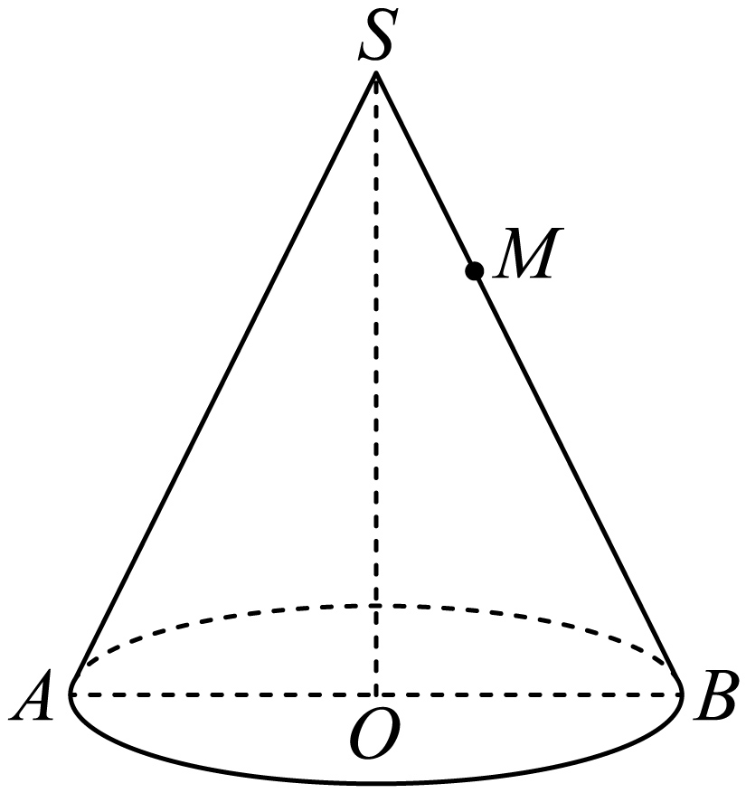
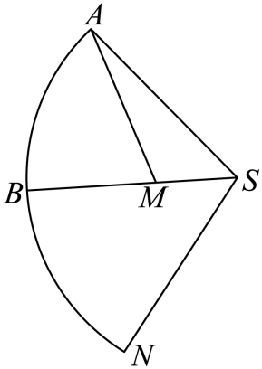
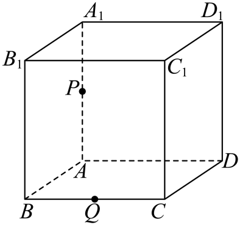
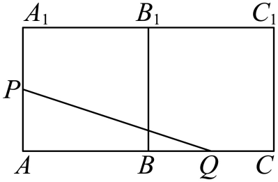
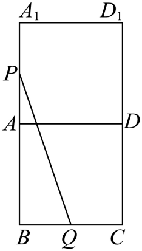
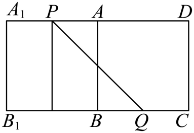

## 讲解

### 判据

题目限定沿表面、侧面或绕行，空间中两点直线距离通常穿过体内，不能直接作答案。将允许经过的面展开后，路径长度保持，用平面线段最短处理；再检查这条线能否折回原允许表面。

### 流程

1. **确认可走区域。** “沿侧面”不能经过底面内部；“沿表面”可含底面。端点在棱上时，可从相邻面的不同展开法出发比较。
2. **求真正展开参数。** 圆柱展开矩形宽2πr、高h；圆锥扇形半径母线l、角2πr/l。底圆弧占总周长的几分之几，在扇形中对应同样角比例。
3. **定位端点的像。** 母线上距离保留；绕圆柱一周须选择相邻周长周期的同一端点像；圆锥绕方向不同须考虑对应扇形或邻接副本。
4. **算线段并查可行性。** 用勾股或余弦定理，但线段应留在允许区域，并按指定顺序跨相邻面。若穿过展开扇形外部、洞口或不允许底面，不能作为候选；顶点或边界路线需另外检查。
5. **比较所有有机会较短的面序列。** 重复绕行或折返不必穷尽计算，可由新增长度或展开像更远排除；多面体不能只算一个展开图就称全局最短。

## 例题
### 原例：圆锥侧面上的最短路径

来源：HSMA-B2-C8-Daee9a1a18c4b-P0295—P0308，原件《专题8.1 基本立体图形（举一反三讲义）高一数学人教A版必修第二册（解析版）.docx》。完整保留题干、全部选项与小问、原答案、原思路及详解；补讲另列。

【例5】（24-25高一下·黑龙江哈尔滨·月考）已知在圆锥SO中，底面圆O的直径$AB=2$，圆锥SO的体积为$\frac{2\sqrt{2}}{3}\pi $，点M在母线SB上，且$\vec{SM}=\frac{1}{3}\vec{SB}$，一只蚂蚁若从A点出发，沿圆锥侧面爬行到达M点，则它爬行的最短距离为（   ）

A．$\sqrt{7}$  B．$\sqrt{13}$  C．$\sqrt{19}$  D．$3\sqrt{3}$

【答案】A

【解题思路】先根据体积公式得出$OS=2\sqrt{2}$，将圆锥沿母线展开，结合圆心角的大小，利用余弦定理求解即可.

【解答过程】设圆锥$SO$的母线长为$l$，底面的半径为$r$，圆锥SO的体积为$\frac{1}{3}\pi \times {1}^{2}\times SO=\frac{2\sqrt{2}}{3}\pi $，解得$OS=2\sqrt{2}$.

由勾股定理，可得母线$l=\sqrt{{1}^{2}+{(2\sqrt{2})}^{2}}=3$，

如图，圆锥的侧面展开图为扇形$SAN$，

因为扇形$SAN$的弧长为$2\pi r=2\pi $，所以扇形$SAN$的圆心角$\alpha =\frac{2\pi }{3}$，所以$\angle ASM=\frac{\pi }{3}$，

在$\triangle SAM$中，由余弦定理是可得$A{M}^{2}=S{A}^{2}+S{M}^{2}-2SA\cdot SM\cos \angle ASM=9+1-3=7$，

所以$AM=\sqrt{7}$，因为$SA+SM=4>\sqrt{7}$，

所以蚂蚁爬行的最短距离为$AM$的长度，即蚂蚁爬行的最短距离为$\sqrt{7}$.

故选：A.

**补讲**

r=1，体积(1/3)πr²h=(2√2/3)π给h=2√2，再得l=√(1+8)=3。扇形全角2π/3；A、B是底面直径两端，底圆周上两方向各半周，映到扇形的夹角均为π/3。SM=SB/3=1，SA=3，余弦定理给AM²=9+1−2×3×1×1/2=7。角π/3的扇形凸，连接A、M的线段在其中，可折回侧面；经顶点长SA+SM=4更长。额外绕周使累计展开角至少π；若路径经过顶点，长度至少3+1=4；若不经过顶点，连续转角必经过与SA反向的射线。设交点距S为ρ≥0，前段长度至少3+ρ，余段至少|1−ρ|，总长至少3+ρ+|1−ρ|≥4>√7。因此额外绕行不能改善近邻π/3路线，最短为√7，选A。

### 原例：比较正方体的不同展开路线

来源：HSMA-B2-C8-Daee9a1a18c4b-P0309—P0322，原件《专题8.1 基本立体图形（举一反三讲义）高一数学人教A版必修第二册（解析版）.docx》。完整保留题干、全部选项与小问、原答案、原思路及详解；补讲另列。

【变式5-1】（24-25高一下·四川成都·期末）在正方体$ABCD-{A}_{1}{B}_{1}{C}_{1}{D}_{1}$中，$AB=2$，P、Q分别为棱$A{A}_{1}$，BC的中点，则从点P出发，沿正方体表面到达点Q的最短路径的长度为（    ）

A．$\sqrt{11}$  B．$\sqrt{10}$  C．3  D．$2\sqrt{2}$

【答案】D

【解题思路】将正方体沿着不同的方向展开，得到展开图，化曲（折）为直，再利用勾股定理计算可得.

【解答过程】如图，在正方体$ABCD-{A}_{1}{B}_{1}{C}_{1}{D}_{1}$中，P、Q分别为棱$A{A}_{1}$，BC的中点，

按照下列方式展开，$PQ=\sqrt{{1}^{2}+{\left( 2+1\right)}^{2}}=\sqrt{10}$；

按照下列方式展开，$PQ=\sqrt{{1}^{2}+{\left( 2+1\right)}^{2}}=\sqrt{10}$；

按照下列方式展开，$PQ=\sqrt{{2}^{2}+{2}^{2}}=2\sqrt{2}$.

综上所述，最短路径$PQ=2\sqrt{2}$.

故选：D.

**补讲**

两种沿两个面展开的轴向位移为1、3，长度√10；第三种把一个侧面与底面展开，位移为2、2，长度2√2。第三条线跨两面公共棱且保持在两个矩形内，折回合法。为什么只需比较这三种邻近路线：P属于两个侧面，Q属于一个侧面与底面；若先后经过两个含P的面，可直接从P在后一个面出发，若先后经过两个含Q的面，可在前一个面直接连到Q，面内直线不会比绕行长。剩下的相邻面组合就是原解三图。另两个远面是顶面与CDD₁C₁：P、Q到顶面的距离分别1、2，到CDD₁C₁的距离分别2、1；任何经过其中一面的路线，去与回的长度至少为这两个垂距之和3，已大于2√2，可以排除。比较平方8<10，故D。不要将P、Q在空间中的直线距离当成表面路线。

## 易错

检查长度量纲和端点位置。非凸展开区域的直线可能越界；圆台扇环中直线还可能穿过被删去内圆，届时要处理切线与弧段，不能套“一展开必为直线”结论。

## 来源定位

- 知识与分类：HSMA-B2-C8-Daee9a1a18c4b-P0096—P0098；P0294—P0364，原件《专题8.1 基本立体图形（举一反三讲义）高一数学人教A版必修第二册（解析版）.docx》。定义、条件和理由按原知识主线补足。
- 原例年份与校次沿用原件，未另作外部认证；原题原解与补讲、勘误分别保留。
