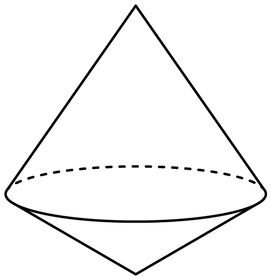
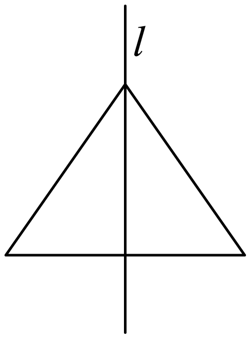
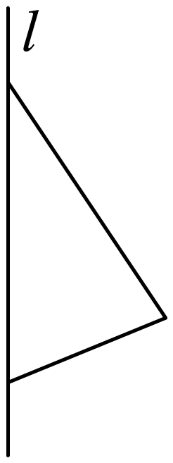
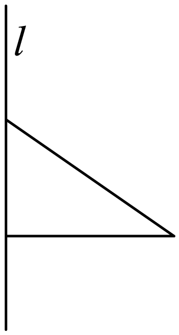
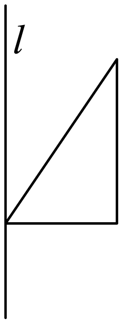

## 讲解

### 判据

看到体型名称，先查完整定义而非外观；看到旋转题，先查轴与生成图形各点到轴的距离怎样随高度变化。轴旁的边旋转成面，不能把图上的斜边视作体的高。

### 流程

1. **辨底面与对应侧面。** 平面多边形面是多面体条件；圆面与旋转曲面属于旋转体。柱须底面平行全等、侧棱平行；锥须所有侧面共一个顶点；台须可由同一锥平行截得。
2. **逐项补足限定。** 正棱柱须直且底面正多边形；圆台上下底须平行，母线延长共顶点。一个反例就能否定“必然”，但确认“必然”须用定义或全部条件。
3. **旋转按轴向分段。** 在每个轴向高度看截面圆半径：恒定对应柱，按距锥顶点线性变大对应锥或台；两段锥面共圆底对应拼接，挖空部分对应差体。
4. **核对题图与所有选项。** 将每个生成图形沿轴的内部区域也旋转，不能只旋转边界线后忽略实体内部；若图与文字不足以唯一判定，标明条件缺省。

## 例题
### 原例：正棱柱还须是直棱柱

来源：HSMA-B2-C8-Daee9a1a18c4b-P0137—P0148，原件《专题8.1 基本立体图形（举一反三讲义）高一数学人教A版必修第二册（解析版）.docx》。完整保留题干、全部选项与小问、原答案、原思路及详解；补讲另列。

【例2】（24-25高一下·北京延庆·期末）下列命题错误的是（    ）

A．侧棱垂直于底面的棱柱一定是直棱柱

B．底面是正多边形的棱柱一定是正棱柱

C．棱柱的侧面都是平行四边形

D．斜棱柱的侧面有可能是矩形

【答案】B

【解题思路】根据棱柱的概念逐一判断即可.

【解答过程】对A，侧棱垂直于底面的棱柱一定是直棱柱，正确；

对B，底面是正多边形的直棱柱定是正棱柱，故错误；

对C，棱柱的侧面都是平行四边形，正确；

对D，斜棱柱的侧面有可能是矩形，正确.

故选：B.

**补讲**

本题问“错误”，A、C来自直柱与一般棱柱性质；D只说可能，局部侧面为矩形不强制全柱为直。B漏直条件，底面正多边形的斜棱柱就是反例，选B。辨析时把“正底面”与“正棱柱”分开核查。

### 原例：旋转形成两个共底圆锥

来源：HSMA-B2-C8-Daee9a1a18c4b-P0413—P0422，原件《专题8.1 基本立体图形（举一反三讲义）高一数学人教A版必修第二册（解析版）.docx》。完整保留题干、全部选项与小问、原答案、原思路及详解；补讲另列。

【例7】（24-25高一下·全国·课前预习）如图所示的组合体，则由下列所示的哪个三角形绕直线l旋转一周可以得到（    ）

A．  B．  C．  D．

【答案】B

【解题思路】旋转后的几何体是由两个共底的圆锥组合而成的立体图形，再根据四个选项中三角形的特征及旋转轴即可作出判断．

【解答过程】A旋转一周是圆锥，不满足题意；

B旋转一周是两个圆锥，满足题意；

C旋转一周是圆锥，不满足题意；

D旋转一周是圆柱挖去一个圆锥的几何体，不满足题意.

故选：B.

**补讲**

目标在公共圆底的上、下各有一个锥顶点。B中旋转轴通过三角形的一条边，另一顶点投影落在轴边内部；从该投影处分开为两个直角三角形，分别旋转成共底的两个圆锥。A、C只有一个锥区；D旋转时外缘形成圆柱而一条斜边划出被挖去圆锥，整体不是共底双锥。故选B。

## 易错

半径为0、高为0或截面经过锥顶点的情形先排除非退化命名。原图仅提供题目模型，不能从画出的椭圆扁长比例推测真实半径。

## 来源定位

- 知识与分类：HSMA-B2-C8-Daee9a1a18c4b-P0016—P0095；P0365—P0373；P0412—P0452，原件《专题8.1 基本立体图形（举一反三讲义）高一数学人教A版必修第二册（解析版）.docx》。定义、条件和理由按原知识主线补足。
- 原例年份与校次沿用原件，未另作外部认证；原题原解与补讲、勘误分别保留。
