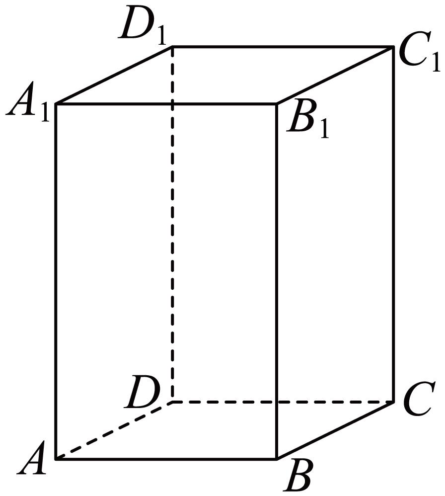
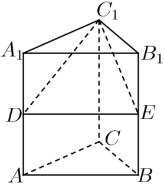
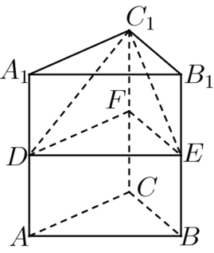

## 讲解

### 判据

先分清求面积还是体积。面积需要列实际边界面；体积需要找到底面积和垂直高。遇复杂截切体，可换底换顶点、分割、补成柱体，再用同底等高或底高比例进行等体积转化。

### 流程

1. **确定模型与边界。** 正、直、同底、平行、相似等条件决定能用哪条公式；组合体先列外表面，内部接触面不计。
2. **作合法垂线求高。** 母线、侧棱可与水平位移构成直角三角形，但须以垂直射影为依据，不用图上的竖线外观代替。
3. **写出基本体公式。** 柱Sh、锥Sh/3、同锥台h(S₁+√S₁S₂+S₂)/3；面积按面形或展开参数求。
4. **用比例降低计算。** 同底锥比体积就是高比，同高锥比体积就是底面积比；同底等高锥与柱体积比1:3。换一个底面时高会改变，须同时换，不能只替换底面积。
5. **核查加减与单位。** 分割各块内部不重叠才直接加体积；相加表面积时扣两次公共面。长度、面积、体积对应一次、二次、三次量纲。

## 例题
### 原例：直棱柱的六个外表面

来源：HSMA-B2-C8-D49027dc70113-P0075—P0082，原件《专题8.3 简单几何体的表面积与体积（举一反三讲义）高一数学人教A版必修第二册（解析版）.docx》。完整保留题干、全部选项与小问、原答案、原思路及详解；补讲另列。

【例1】（24-25高一下·北京房山·期末）在四棱柱$ABCD-{A}_{1}{B}_{1}{C}_{1}{D}_{1}$中，底面ABCD是正方形，${A}_{1}A\perp $底面ABCD，${A}_{1}A=2$，$AB=1$，则该四棱柱的表面积为（    ）

A．10  B．8  C．4  D．2

【答案】A

【解题思路】利用正四棱柱的表面积公式列式求解即可.

【解答过程】在四棱柱$ABCD-{A}_{1}{B}_{1}{C}_{1}{D}_{1}$中，底面$ABCD$是正方形，${A}_{1}A\perp $底面$ABCD$，

则四棱柱$ABCD-{A}_{1}{B}_{1}{C}_{1}{D}_{1}$为正四棱柱，其表面积为$S=4\times 1\times 2+2\times {1}^{2}=10$.

故选：A.

**补讲**

侧棱垂直底面，因此该柱是直棱柱，侧棱2就是高。正方形底周长4、底面积1，侧面积4×2=8，两个底合2，总10，选A。若只看高2而忘两个底，会得到B；若底面虽为正方形却没有垂直条件，不能直接拿侧棱作h。

### 原例：分割三棱柱进行体积转化

来源：HSMA-B2-C8-D49027dc70113-P0146—P0160，原件《专题8.3 简单几何体的表面积与体积（举一反三讲义）高一数学人教A版必修第二册（解析版）.docx》。完整保留题干、全部选项与小问、原答案、原思路及详解；补讲另列。

【变式2-3】（24-25高一下·辽宁葫芦岛·期末）如图，在三棱柱$ABC-{A}_{1}{B}_{1}{C}_{1}$中，$D$，$E$分别是$A{A}_{1}$和$B{B}_{1}$的中点，记${C}_{1}-{A}_{1}{B}_{1}ED$和$ABC-{A}_{1}{B}_{1}{C}_{1}$的体积分别为${V}_{1}$，${V}_{2}$，则（    ）

A．${V}_{1}=\frac{1}{3}{V}_{2}$  B．${V}_{1}=\frac{1}{6}{V}_{2}$

C．${V}_{1}=\frac{1}{4}{V}_{2}$  D．${V}_{1}=\frac{3}{8}{V}_{2}$

【答案】A

【解题思路】根据棱锥与棱柱的体积公式，结合图形，可得答案.

【解答过程】取$C{C}_{1}$的中点为$F$，连接$DF,EF$，如下图：

易知三棱柱${A}_{1}{B}_{1}{C}_{1}-DEF$的体积是三棱柱${A}_{1}{B}_{1}{C}_{1}-ABC$的一半，

由图可知三棱锥${C}_{1}-DEF$与三棱柱${A}_{1}{B}_{1}{C}_{1}-DEF$同底等高，

则三棱锥${C}_{1}-DEF$的体积是三棱柱${A}_{1}{B}_{1}{C}_{1}-DEF$体积的三分之一，

即四棱锥${C}_{1}-{A}_{1}DE{B}_{1}$的体积是三棱柱${A}_{1}{B}_{1}{C}_{1}-DEF$体积的三分之二，

综上可得四棱锥${C}_{1}-{A}_{1}DE{B}_{1}$的体积是是三棱柱${A}_{1}{B}_{1}{C}_{1}-ABC$的三分之一，

即${V}_{1}=\frac{1}{3}{V}_{2}$.

故选：A.

**补讲**

由于D、E、F分别为三条平行等长侧棱的中点，DEF是把底面ABC平移到半高处所得，与上底A₁B₁C₁平行全等；上半三棱柱体积V₂/2，斜柱也按垂直高减半。C₁−DEF与这个上半柱同底等高，所以体积是上半柱的1/3。上半柱除去这只三棱锥后，余下恰为题目四棱锥C₁−A₁B₁ED，所以V₁=(1−1/3)×V₂/2=V₂/3，选A。此处无需先求三棱柱是不是直棱柱，也无需编造侧棱长。

## 易错

等体积转化来自同底等高等条件；“画着差不多大”不是依据。台体上底退化时按锥处理，任意截切多面体不能直接套台体积公式。

## 来源定位

- 知识与分类：HSMA-B2-C8-D49027dc70113-P0017—P0073；P0118—P0160，原件《专题8.3 简单几何体的表面积与体积（举一反三讲义）高一数学人教A版必修第二册（解析版）.docx》。定义、条件和理由按原知识主线补足。
- 原例年份与校次沿用原件，未另作外部认证；原题原解与补讲、勘误分别保留。
