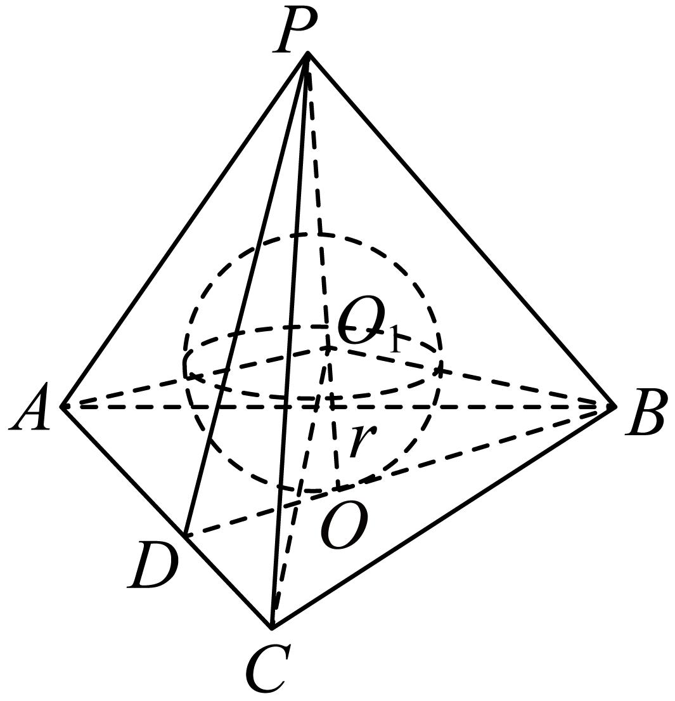

## 讲解

### 判据

“各顶点在球面”建立球心到各顶点等距方程；“球与各面相切”建立到各面的垂距相同。先判断是外接还是内切，别将底面三角形的外接圆半径直接搬作球半径。

### 流程

1. **证明球心的位置。** 外接用线段中垂面、底面外心垂线或已知对称结构；内切用等距平面条件与对称轴。不能只说“由图可知”。
2. **将空间条件降到经过球心的截面。** 用包含轴与某顶点的平面列勾股；求内切球时选过轴截面，使截得圆为大圆。
3. **外接列等距方程。** 正棱锥可设H到球心有向位置t，R²=t²+ρ²=(h−t)²。h>0可除，解t与R并检查全部顶点。
4. **内切用等体积分割。** 若球确在凸多面体内部并切全部面，原体分成同高r的小锥，3V=Sr，S是总表面积；或过轴三角形用面积=半周长×r。
5. **代入球公式并检查。** 外接球心允许在体外，内切球必须在体内且每个切点属于实际面。半径取正值后求4πR²或4πR³/3，负根与错误中心舍去。

## 例题
### 原例：正三棱锥的外接球

来源：HSMA-B2-C8-D49027dc70113-P0400—P0412，原件《专题8.3 简单几何体的表面积与体积（举一反三讲义）高一数学人教A版必修第二册（解析版）.docx》。完整保留题干、全部选项与小问、原答案、原思路及详解；补讲另列。

【例8】（24-25高一下·山西太原·月考）已知正三棱锥$S-ABC$的底面是边长为$2\sqrt{3}$的正三角形，侧棱长为$2\sqrt{5}$，则该正三棱锥$S-ABC$的外接球$O$的表面积为（    ）

A．$10\pi $  B．$25\pi $  C．$100\pi $  D．$125\pi $

【答案】B

【解题思路】先判断球心在三棱锥的高线$SH$上，由正弦定理求得$CH=2$，设球$O$的半径为$R$，结合题意列方程求出外接球半径即得.

【解答过程】如图，设点$S$在底面的射影为点$H$，

因底面边长均为$2\sqrt{3}$，侧棱长均为$2\sqrt{5}$，故球心$O$在$SH$上，

连接$CH$，设球$O$的半径为$R$，则$SO=OC=R$，

由正弦定理$\frac{2\sqrt{3}}{\sin {60}^{∘}}=2CH$，解得$CH=2$，

在$Rt\triangle SHC$中，$SH=\sqrt{{(2\sqrt{5})}^{2}-{2}^{2}}=4$，则$OH=|4-R|$，

在$Rt\triangle OHC$中，由$|4-R{|}^{2}+4={R}^{2}$，解得$R=\frac{5}{2}$，

则球$O$的表面积为$S=4\pi {R}^{2}=4\pi \times {(\frac{5}{2})}^{2}=25\pi $．

故选：B．

**补讲**

球心等距于三个底顶点，故在正三角形外心H的垂线上；正锥顶S也在这条线上。底外接圆半径ρ=2、高h=4。令OH有向量为t，有t²+4=(4−t)²，展开t²+4=16−8t+t²，得8t=12，t=3/2，所以R=4−3/2=5/2。代回R²=9/4+4=25/4，同时覆盖底面三点与S。面积25π，选B。

### 原例：等体积分割求内切球半径

来源：HSMA-B2-C8-D49027dc70113-P0504—P0524，原件《专题8.3 简单几何体的表面积与体积（举一反三讲义）高一数学人教A版必修第二册（解析版）.docx》。完整保留题干、全部选项与小问、原答案、原思路及详解；补讲另列。

【变式9-2】（2025高三·全国·专题练习）已知正三棱锥$P-ABC$的高为2，$AB=4\sqrt{6}$，其内部有一个球与它的四个面都相切，求：

(1)正三棱锥$P-ABC$的表面积；

(2)正三棱锥$P-ABC$内切球的表面积与体积．

【答案】(1)$36\sqrt{2}+24\sqrt{3}$；

(2)${S}_{\text{内切球}}=32\left( 5-2\sqrt{6}\right)\pi $，${V}_{\text{内切球}}=\frac{64}{3}\left( 9\sqrt{6}-22\right)\pi $．

【解题思路】（1）根据正三棱锥棱长与锥体的高关系求出锥体的表面积；

（2）根据等体积法求出内切球的半径，即可求出内切球的表面积和体积.

【解答过程】（1）由题意，如图所示．

底面三角形中心$O$到AC的距离$DO=\frac{1}{3}\times \frac{\sqrt{3}}{2}\times 4\sqrt{6}=2\sqrt{2}$，

则正棱锥侧面的斜高为$PD=\sqrt{{2}^{2}+{(2\sqrt{2})}^{2}}=2\sqrt{3}$．

$\therefore {S}_{\text{侧}}=3\times \frac{1}{2}\times 4\sqrt{6}\times 2\sqrt{3}=36\sqrt{2}$．

故${S}_{\text{全}}={S}_{\text{侧}}+{S}_{\text{底}}=36\sqrt{2}+\frac{1}{2}\times \frac{\sqrt{3}}{2}\times {(4\sqrt{6})}^{2}=36\sqrt{2}+24\sqrt{3}$．

（2）设正三棱锥$P-ABC$的内切球球心为${O}_{1}$，

联结${O}_{1}P$、${O}_{1}A$、${O}_{1}B$、${O}_{1}C$，

而点${O}_{1}$到三棱锥的四个面的距离都为球的半径$r$，

$\therefore {V}_{P-ABC}={V}_{{O}_{1}-PAB}+{V}_{{O}_{1}-PBC}+{V}_{{O}_{1}-PAC}+{V}_{{O}_{1}-ABC}=\frac{1}{3}{S}_{\text{侧}}\cdot r+\frac{1}{3}{S}_{\triangle ABC}\cdot r=\frac{1}{3}{S}_{\text{全}}\cdot r$ $=\frac{1}{3}(36\sqrt{2}+24\sqrt{3})r=(12\sqrt{2}+8\sqrt{3})r$．

又${V}_{P-ABC}=\frac{1}{3}\times \frac{1}{2}\times \frac{\sqrt{3}}{2}\times {(4\sqrt{6})}^{2}\times 2=16\sqrt{3}$，

$\therefore \left( 12\sqrt{2}+8\sqrt{3}\right)r=16\sqrt{3}$，解得$r=\frac{4\sqrt{3}}{3\sqrt{2}+2\sqrt{3}}=2(\sqrt{6}-2)$．

$\therefore {S}_{\text{内切球}}=4\pi {\left[ 2\left( \sqrt{6}-2\right)\right]}^{2}=32\left( 5-2\sqrt{6}\right)\pi $，

${V}_{\text{内切球}}=\frac{4}{3}\pi {\left[ 2\left( \sqrt{6}-2\right)\right]}^{3}=\frac{64}{3}\left( 9\sqrt{6}-22\right)\pi $．

**补讲**

先算全部面面积：底等边三角形面积24√3，底中心到边的距离2√2，锥高2，所以侧面斜高√(4+8)=2√3，三个侧面共36√2，总S=36√2+24√3。原体V=(1/3)×24√3×2=16√3。题目已保证球在内部切四面，连接球心和顶点分成四只小锥，每个高r，所以r=3V/S=4√3/(3√2+2√3)。乘分母的共轭式可化为2(√6−2)>0。平方为r²=40−16√6，立方为r³=144√6−352；分别代4πr²与(4/3)πr³，得到原答案。这里内切球公式用的是全部四面，不仅侧面。

## 易错

不规则多面体若未保证可切接，求出的等距候选还须验证存在性。圆锥内切球的截面需过轴及球心，否则截圆半径小于球半径。

## 来源定位

- 知识与分类：HSMA-B2-C8-D49027dc70113-P0324—P0326；P0399—P0412；P0477—P0524，原件《专题8.3 简单几何体的表面积与体积（举一反三讲义）高一数学人教A版必修第二册（解析版）.docx》。定义、条件和理由按原知识主线补足。
- 原例年份与校次沿用原件，未另作外部认证；原题原解与补讲、勘误分别保留。
