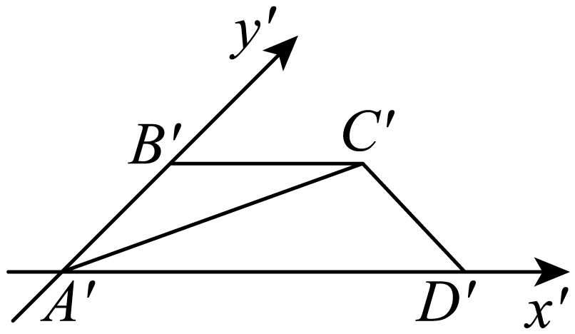
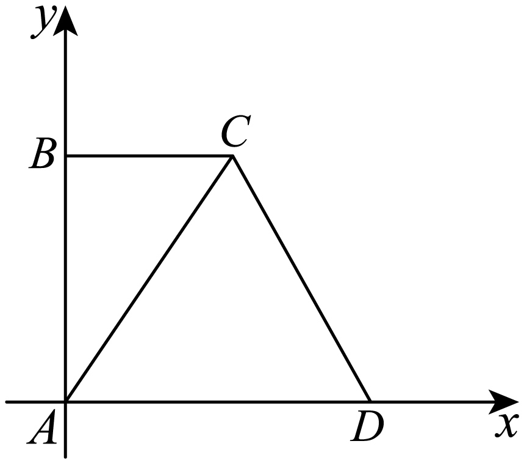

## 讲解

### 判据

图上有x′、y′或说明斜二测，就先还原轴向分量。原图x、y互相垂直，图中两轴夹45°或135°；图中y′方向长度只有原长一半。直观图中非轴向斜边不能直接乘2。

### 流程

1. **找到轴与平行线。** 标每条已知图线是x′向、y′向还是普通斜线；沿x′的长度还原不变，沿y′的长度还原乘2。
2. **还原关键点坐标。** 在原x、y垂直坐标系定位，再连接原图点；一般斜边用还原后的直角三角形或余弦定理求长，不把图角当原角。
3. **面积择一条路线。** 可先还原原底边和原高度；也可求图中实际垂直高度，得S直后乘2√2。图中沿y′的长度本身不是图中对x′底边的高，还要乘sin45°。
4. **核对方向与范围。** 135°只是倾斜朝向不同，面积缩放相同；空间非水平面不能统一用平面面积倍率。

## 例题
### 原例：还原方向后求对角线

来源：HSMA-B2-C8-D6260fd311857-P0236—P0245，原件《专题8.2 立体图形的直观图（举一反三讲义）高一数学人教A版必修第二册（解析版）.docx》。完整保留题干、全部选项与小问、原答案、原思路及详解；补讲另列。

【例5】（24-25高一下·新疆乌鲁木齐·期末）如图所示，梯形${A}^{\prime}{B}^{\prime}{C}^{\prime}{D}^{\prime}$是平面图形$ABCD$用斜二测画法得到的直观图， ${A}^{\prime}{D}^{\prime}=2{B}^{\prime}{C}^{\prime}=2,{A}^{\prime}{B}^{\prime}=1$，则平面图形$ABCD$中对角线$AC$的长度为（    ）

A．$\sqrt{2}$  B．$\sqrt{3}$  C．$\sqrt{5}$  D．5

【答案】C

【解题思路】根据直观图特征，作出其平面图形直角梯形$ABCD$，求出相关边长再求$AC$长即可．

【解答过程】由直观图知原几何图形是直角梯形$ABCD$，如图，

由斜二测画法可知$AB=2{A}^{\prime}{B}^{\prime}=2,BC={B}^{\prime}{C}^{\prime}=1$，

所以$AC=\sqrt{A{B}^{2}+B{C}^{2}}=\sqrt{4+1}=\sqrt{5}$，

故选：C．

**补讲**

A′B′沿y′，所以原AB=2×1=2；B′C′平行x′，所以原BC=1。原AB⊥BC，因为两者分别沿原来的垂直坐标轴。于是AC²=2²+1²=5，选C。A′D′=2给原AD=2，有助确认直角梯形；图中的A′C′是斜边，没有统一“乘2”规则。

### 原例：由直观图面积还原

来源：HSMA-B2-C8-D6260fd311857-P0295—P0304，原件《专题8.2 立体图形的直观图（举一反三讲义）高一数学人教A版必修第二册（解析版）.docx》。完整保留题干、全部选项与小问、原答案、原思路及详解；补讲另列。

【例6】（24-25高一下·江苏扬州·月考）如图所示，梯形${A}^{\prime}{B}^{\prime}{C}^{\prime}{D}^{\prime}$是平面图形$ABCD$用斜二测画法得到的直观图，${A}^{\prime}{D}^{\prime}=4,{A}^{\prime}{B}^{\prime}={B}^{\prime}{C}^{\prime}=2$，则平面图形$ABCD$的面积为（     ）

A．12  B．8  C．6  D．3

【答案】A

【解题思路】根据给定条件，求出梯形${A}^{\prime}{B}^{\prime}{C}^{\prime}{D}^{\prime}$的面积，再利用原平面图形面积与直观图面积的关系求出平面图形$ABCD$的面积.

【解答过程】在梯形${A}^{\prime}{B}^{\prime}{C}^{\prime}{D}^{\prime}$中，$\angle {B}^{\prime}{A}^{\prime}{D}^{\prime}={45}^{∘}$，则该梯形的高为${A}^{\prime}{B}^{\prime}\sin {45}^{∘}=\sqrt{2}$，

梯形${A}^{\prime}{B}^{\prime}{C}^{\prime}{D}^{\prime}$的面积为${S}^{\prime}=\frac{{A}^{\prime}{D}^{\prime}+{B}^{\prime}{C}^{\prime}}{2}\cdot \sqrt{2}=3\sqrt{2}$，

在斜二测画法中，原图形的面积是对应直观图面积的$2\sqrt{2}$倍，

所以平面图形$ABCD$的面积$S=2\sqrt{2}{S}^{\prime}=2\sqrt{2}\times 3\sqrt{2}=12$.

故选：A.

**补讲**

两底A′D′=4、B′C′=2都沿x′，图腰A′B′=2沿y′且与底成45°。图中梯形垂直高是2sin45°=√2，故S直=(4+2)√2/2=3√2，再乘2√2得S原=12。也可还原AB=4、AD=4、BC=2，原图为直角梯形，面积(4+2)×4/2=12，两条路线互相核对，选A。

## 易错

等长、等角、垂直不是一般保留性质；平行、共线、同线比例与中点可以保留。面积倍率只在规定水平平面画法中成立。

## 来源定位

- 知识与分类：HSMA-B2-C8-D6260fd311857-P0016—P0029；P0174—P0349，原件《专题8.2 立体图形的直观图（举一反三讲义）高一数学人教A版必修第二册（解析版）.docx》。定义、条件和理由按原知识主线补足。
- 原例年份与校次沿用原件，未另作外部认证；原题原解与补讲、勘误分别保留。
