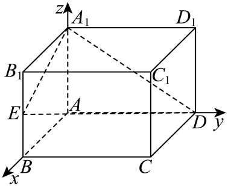

## 错法

背住异面线角和较小面角要取绝对值，就把任意法向量点积也一律取绝对值，宣布所有二面角都锐或直；或者因所取法向量夹角钝，就认定原指定二面角也钝。成因是把平面无向信息、法向量任意朝向、题给半平面方向三者混成一个对象。

## 正解

先辨题目：两直线的较小角、线面角和两平面较小夹角在0到90°；指定P-l-Q的二面角可以钝到180°以内。只问锐二面角/较小面角时，法向量余弦绝对值正确；指定角时须保存朝向P、Q的垂棱射线。

取棱点O、非零棱方向k，P、Q不在棱上。OP、OQ分别去掉沿k分量，所得rP、rQ仍朝原半平面；用cosθ=(rP·rQ)/(|rP||rQ|)保留符号。点积负就钝，不能改为正。法向量可以任意反向，但把平面角射线反向等于换了半平面；两种反向的几何意义不同。

原资料P0268–0291给的是较小两平面夹角范围，不是指定二面角的一律绝对值公式。若指定θ与较小φ互补，它们正弦相等、余弦相反；只算正弦或模糊说“面面角”可能掩盖错判。用图看起来锐代替半平面射线点积也没有依据。

知识与分类依据：`HSMA-B3-C1-D906811c3e3b1-P0266-P0291`（《专题1.6 空间向量的应用（二）：用空间向量研究距离、夹角问题（举一反三讲义）数学人教A版2019选择性必修第一册（解析版）.docx》）；`HSMA-B3-C1-D906811c3e3b1-P0424-P0424`（《专题1.6 空间向量的应用（二）：用空间向量研究距离、夹角问题（举一反三讲义）数学人教A版2019选择性必修第一册（解析版）.docx》）。原文、补条件与勘误分别说明。

## 例题

### 原例：题已指定锐角时绝对值有依据

来源：`HSMA-B3-C1-D906811c3e3b1-P0425-P0436`；原件《专题1.6 空间向量的应用（二）：用空间向量研究距离、夹角问题（举一反三讲义）数学人教A版2019选择性必修第一册（解析版）.docx》。题号、学年及地区按讲义原标注，未另作来源核验。

以下完整保留原题、原答案与原详解（仅统一等价公式排版及配图路径）：

【例7】（24-25高二上·辽宁沈阳·期末）在长方体$ABCD-{A}_{1}{B}_{1}{C}_{1}{D}_{1}$中，$AB=2$，$BC=6$，$A{A}_{1}=4$，点$E$为$B{B}_{1}$的中点，则平面${A}_{1}ED$与平面$ABCD$所成的锐二面角的余弦值为（   ）

A．$\frac{\sqrt{22}}{22}$  B．$\frac{2}{3}$  C．$\frac{\sqrt{3}}{3}$  D．$\frac{3\sqrt{22}}{22}$

【答案】D

【解题思路】以$A$为坐标原点建立如图所示的空间直角坐标系$A-xyz$，求平面${A}_{1}ED$与平面$ABCD$的法向量，利用面面角的向量法即可求解.

【解答过程】以$A$为坐标原点建立如图所示的空间直角坐标系$A-xyz$，

则${A}_{1}\left( 0,0,4\right)$，$E\left( 2,0,2\right)$，$D\left( 0,6,0\right)$，故$\vec{{A}_{1}D}=\left( 0,6,-4\right)$，$\vec{{A}_{1}E}=\left( 2,0,-2\right)$，

设平面${A}_{1}ED$的一个法向量为${\vec{n}}_{1}=\left( x,y,z\right)$，

所以有$\left\{ \begin{aligned}\vec{{A}_{1}D}\cdot {\vec{n}}_{1}=0\\\vec{{A}_{1}E}\cdot {\vec{n}}_{1}=0\end{aligned}\right.$，即$\left\{ \begin{aligned}6y-4z=0\\2x-2z=0\end{aligned}\right.$，取$\left\{ \begin{aligned}x=1\\y=\frac{2}{3},\\z=1\end{aligned}\right.$故${\vec{n}}_{1}=\left( 1,\frac{2}{3},1\right)$，

$\because $平面$ABCD$的一个法向量为${\vec{n}}_{2}=\left( 0,0,1\right)$，$\therefore \cos \left\langle  {\vec{n}}_{1},{\vec{n}}_{2}\right\rangle =\frac{1}{\sqrt{1+\frac{4}{9}+1}}=\frac{3\sqrt{22}}{22}$，

故平面${A}_{1}ED$与平面$ABCD$所成的锐二面角的余弦值为$\frac{3\sqrt{22}}{22}$.

故选：D.

#### 补充讲解

题干明确求“锐二面角”，因此这里是两平面的较小夹角，不是另给P-l-Q的指定半平面角。原n₁=(1,2/3,1)、n₂=(0,0,1)都非零，n₁与A₁D、A₁E点积分别4−4=0、2−2=0，平面内两方向不共线，法向量有效。

n₁²=1+4/9+1=22/9，n₂²=1，点积1；锐角余弦=|1|/√(22/9)=3/√22=3√22/22，选D。若n₁反向，点积负而锐角不改，这里可取绝对值，依据正是题给角的范围。不能把这个流程不加区分推广到所有指定二面角；指定半平面若形成钝角，余弦应负。

### 原例：指定两侧直接求有符号余弦

来源：`HSMA-B3-C1-D906811c3e3b1-P0602-P0642`；原件《专题1.6 空间向量的应用（二）：用空间向量研究距离、夹角问题（举一反三讲义）数学人教A版2019选择性必修第一册（解析版）.docx》。题号、学年及地区按讲义原标注，未另作来源核验。

以下完整保留原题、原答案与原详解（仅统一等价公式排版及配图路径）：

【变式8-3】（24-25高二上·河南·期中）如图，在四棱锥$P-ABCD$中，平面$PDC\perp $平面$ABCD,AD\perp DC,AB$ $\parallel $ $DC,AB=\frac{1}{2}CD=AD=1,M$为棱$PC$的中点.

(1)证明：$BM$ $//$平面$PAD$；

(2)若$PC=\sqrt{5},PD=1$，

（i）求二面角$P-BM-D$的余弦值；

（ii）在棱$PA$上是否存在点$Q$，使得点$Q$到平面$BDM$的距离是$\frac{5\sqrt{6}}{18}$？若存在，求出$PQ$的长；若不存在，说明理由.

【答案】(1)证明见解析

(2)（i）$\frac{2}{3}$,（ii）存在，$PQ=\frac{\sqrt{2}}{3}$

【解题思路】（1）先证明四边形$ABMN$是平行四边形，可得$BM//AN$，即可根据线面平行的判定定理证明结论；

（2）（i）建立空间直角坐标系，求出平面的法向量，利用向量的夹角公式即可求解；

（ii）设$\vec{PQ}=\lambda \vec{PA}$，$0<\lambda <1$，根据点面距离的向量法即可求出$\lambda $，进而求出$PQ$的值．

【解答过程】（1）取$PD$的中点$N$，连接$AN$，$MN$，如图所示：

$\because M$为棱$PC$的中点，

$\therefore MN//CD$，$MN=\frac{1}{2}CD$，$\because AB//CD$，$AB=\frac{1}{2}CD$，$\therefore AB//MN$，$AB=MN$，

$\therefore $四边形$ABMN$是平行四边形，$\therefore BM//AN$，

又$BM\subset $平面$PAD$，$MN\subset $平面$PAD$，

$\therefore BM//$平面$PAD$；

（2）$\because $ $PC=\sqrt{5}$，$PD=1$，$CD=2$，

$\therefore P{C}^{2}=P{D}^{2}+C{D}^{2}$，$\therefore PD\perp DC$，

$\because $平面$PDC\perp $平面$ABCD$，平面$PDC\cap $平面$ABCD=DC$，

$PD\subset $平面$PDC$，

$\therefore PD\perp $平面$ABCD$，

又$AD$，$CD\subset $平面$ABCD$，$\therefore PD\perp AD$，$PD\perp CD$，由$AD\perp DC$，

$\therefore $以点$D$为坐标原点，$DA$，$DC$，$DP$所在直线分别为$x$，$y$，$z$轴建立空间直角坐标系，如图：

则$P\left( 0,0,1\right)$，$D\left( 0,0,0\right)$，$A\left( 1,0,0\right)$，$C\left( 0,2,0\right)$，$M\left( 0,1,\frac{1}{2}\right)$，$B\left( 1,1,0\right)$，

（i）故$\vec{DM}=\left( 0,1,\frac{1}{2}\right)$，$\vec{DB}=\left( 1,1,0\right)$

设平面$BDM$的一个法向量为$\vec{n}=\left( x,y,z\right)$，

则$\left\{ \begin{aligned}\vec{n}\cdot \vec{DM}=y+\frac{1}{2}z=0\\\vec{n}\cdot \vec{DB}=x+y=0\end{aligned}\right.$，令$z=2$，则$y=-1$，$x=1$，$\therefore $ $\vec{n}=\left( 1,-1,2\right)$，

平面$PBM$的一个法向量为$\vec{m}=\left( a,b,c\right)$,

$\vec{PM}=\left( 0,1,-\frac{1}{2}\right),\vec{PB}=\left( 1,1,-1\right)$

则$\left\{ \begin{aligned}\vec{m}\cdot \vec{PM}=b-\frac{1}{2}c=0\\\vec{m}\cdot \vec{PB}=a+b-c=0\end{aligned}\right.$，令$c=2$，则$b=1$，$a=1$，故$\vec{m}=\left( 1,1,2\right)$，

,$\therefore \cos \left\langle  \vec{n},\vec{m}\right\rangle =\frac{\vec{n}\cdot \vec{m}}{\left| \vec{n}\right|\left| \vec{m}\right|}=\frac{4}{\sqrt{6}\times \sqrt{6}}=\frac{2}{3}$，

由于二面角$P-BM-D$的平面角为锐角，故二面角$P-BM-D$的余弦值为$\frac{2}{3}$；

（ii）假设在线段$PA$上是存在点$Q$，使得点$Q$到平面$BDM$的距离是$\frac{5\sqrt{6}}{18}$，

设$\vec{PQ}=\lambda \vec{PA}$，$0\le \lambda \le 1$，则$Q(\lambda $,0,$1-\lambda )$，$\vec{DQ}=(\lambda ,$0,$1-\lambda )$，

由（2）知平面$BDM$的一个法向量为$\vec{n}=(1$,$-1$,$2)$，

$\vec{DQ}\cdot \vec{n}=\lambda +0+2(1-\lambda )=2-\lambda $，

$\therefore $点$Q$到平面$BDM$的距离是$\frac{\left| \vec{DQ}\cdot \vec{n}\right|}{\left| \vec{n}\right|}=\frac{2-\lambda }{\sqrt{6}}=\frac{5\sqrt{6}}{18}$，

$\therefore \lambda =\frac{1}{3}$，$\therefore PQ=\frac{1}{3}PA=\frac{\sqrt{2}}{3}$．

#### 补充讲解

先把原图的几何条件落实为坐标，不能用图看起来锐来决定符号。原（1）中N为PD中点，MN∥CD且MN=AB，由平行四边形得BM∥AN；AN在平面PAD内，B不在PAD内，所以BM∥平面PAD。

**原解勘误：**P0618把BM及MN都写在PAD内，与题意和上一行不符。应使用BM不包含于PAD、AN包含于PAD及BM∥AN。原文保留，（1）的最终结论成立。

（2）由PC²=PD²+DC²知PD⊥DC；PD在面PDC内且垂直两平面的交线DC，面PDC⊥底面，所以PD⊥底面。再结合AD⊥DC，三轴两两垂直有依据。原坐标为D(0,0,0)、P(0,0,1)、B(1,1,0)、M(0,1,1/2)；所用棱方向及两个法向量均非零。

指定角P-BM-D的两个半平面分别朝P与D。取棱点M、棱方向k=MB=(1,0,−1/2)，k²=5/4；MP=(0,−1,1/2)、MD=(0,−1,−1/2)。去掉沿棱分量：

$$r_P=\overrightarrow{MP}-\frac{\overrightarrow{MP}\cdot k}{k\cdot k}k=(1/5,-1,2/5),\qquad r_D=\overrightarrow{MD}-\frac{\overrightarrow{MD}\cdot k}{k\cdot k}k=(-1/5,-1,-2/5).$$

因MP·k=−1/4、MD·k=1/4，上式分别减去−k/5和k/5。rP与rD都垂直棱，指向相应半平面，不能任意翻转。点积rP·rD=−1/25+1−4/25=4/5；各自模平方1/25+1+4/25=6/5，所以指定二面角余弦(4/5)/(6/5)=2/3>0，原“锐角”现在有计算依据。若任意把原法向量m换成−m，法向量余弦会变−2/3，而几何角不变，这说明不能直接把任意法向量夹角当指定角。

距离存在性中，Q=P+λ(A−P)=(λ,0,1−λ)，取闭线段时0≤λ≤1，端点也须纳入。原思路P0612写开区间、P0638写闭区间，两处原文保留；本题解1/3在两者内。n=(1,−1,2)的模√6，D在BDM内，因此距离|2−λ|/√6。若不限范围，|2−λ|=5/3有λ=1/3或11/3；11/3超过线段上界，必须舍去。原范围内2−λ≥1可直接去绝对值，得λ=1/3；回代距离(5/3)/√6=5√6/18，Q确在线段内且PA=√2，所以PQ=√2/3。B、D、M不共线，BDM不是退化平面。
