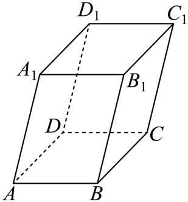

## 错法

选了空间三条不共面的棱作基底，写出向量三系数，就直接把系数平方和开方当成模。还有一种错法是三基向量都长1，便称“单位正交基底”，认为所有交叉数量积为0。单位只说明长度1，正交另外要求两两垂直。

## 正解

先给基底检查两个条件：长度都用同一单位且基向量模为1；三个方向两两垂直。只有两项同时成立，坐标度量才是普通三项式。线性加减、数乘、共线比例则不依赖正交，不能从这些运算可用推断长度公式也可用。

一般基底u、v、w表示x=p u+q v+r w时，用已经成立的数量积分配律逐项展开：
$$|\vec x|^2=p^2|\vec u|^2+q^2|\vec v|^2+r^2|\vec w|^2+2pq\vec u\cdot\vec v+2pr\vec u\cdot\vec w+2qr\vec v\cdot\vec w.$$
交叉项只在相应基向量垂直时为0。即使两两垂直而模不同，前三项还带各自长度平方；未经单位换算仍不能直接取p²+q²+r²。右手或左手只是轴的朝向约定，不能决定交叉项是否0。

本条原题中三棱长都是1，但夹角是60°而非90°。表示A₁C时的系数(−1,1,1)是相对斜基底的系数；它的平方和3并非模平方。原题把三个非零交叉数量积按方向加进去得到2，才是合法的度量。

## 例题

### 原例：HSMA-B3-C1-D92586afa41d6-P0176–P0186

**原题、原答案、原思路与原详解**（原有次序保留，仅规范等价数学符号）：

【变式4-2】（24-25高二上·江苏南通·期末）已知平行六面体$ABCD-{A}_{1}{B}_{1}{C}_{1}{D}_{1}$的所有棱长均为$1$，$\angle {A}_{1}AB=\angle {A}_{1}AD=\angle BAD={60}^{\circ}$，则对角线${A}_{1}C$的长为（    ）

A．$\sqrt{6}$  B．$2$  C．$\sqrt{3}$  D．$\sqrt{2}$

【解题思路】根据向量的线性运算，可得$\vec{{A}_{1}C}$的表达式，两边平方即可求得.

【解答过程】由已知：平行六面体$ABCD-{A}_{1}{B}_{1}{C}_{1}{D}_{1}$所有棱长均为$1$，

$\angle {A}_{1}AB=\angle {A}_{1}AD=\angle BAD={60}^{\circ}$，则$\vec{{A}_{1}C}=\vec{{A}_{1}A}+\vec{AB}+\vec{BC}=-\vec{A{A}_{1}}+\vec{AB}+\vec{AD}$，

又因为：$\vec{A{A}_{1}}\cdot \vec{AB}=\left| \vec{A{A}_{1}}\right|\cdot \left| \vec{AB}\right|\cos \angle {A}_{1}AB=1\times 1\times \frac{1}{2}=\frac{1}{2}$，

同理可得：$\vec{A{A}_{1}}\cdot \vec{AD}=\vec{AB}\cdot \vec{AD}=\frac{1}{2}$，

则${\vec{{A}_{1}C}}^{2}={(-\vec{A{A}_{1}}+\vec{AB}+\vec{AD})}^{2}={\vec{A{A}_{1}}}^{2}+{\vec{AB}}^{2}+{\vec{AD}}^{2}-2\vec{A{A}_{1}}\cdot \vec{AB}-2\vec{A{A}_{1}}\cdot \vec{AD}+2\vec{AB}\cdot \vec{AD}$

$=1+1+1-2\times \frac{1}{2}-2\times \frac{1}{2}+2\times \frac{1}{2}=2$，则$\left| \vec{{A}_{1}C}\right|=\sqrt{2}$.

故选：$D$.

**补讲与核验**

令 $\vec u=\overrightarrow{AA_1}$、$\vec v=\overrightarrow{AB}$、$\vec w=\overrightarrow{AD}$。题给三模均为1，三对夹角均为60°，所以u·v=u·w=v·w=1/2。这三向量不正交，不能当单位直角坐标轴。

从A₁到C按A₁A、AB、BC首尾相接，且BC=AD同向，得 $\overrightarrow{A_1C}=-\vec u+\vec v+\vec w$。取数量积自身，用分配律列出3个平方项及3个双交叉项：
$$|\overrightarrow{A_1C}|^2=1+1+1-2\times\frac12-2\times\frac12+2\times\frac12=2.$$
两项负号来自−u，v与w交叉项为正。故模为√2，D正确。C的√3在本题漏掉了非零交叉项；直接把基底系数平方和当通用模平方，要求基底单位正交，本题不符合。A的√6把所有交叉项写成正号，那对应u+v+w，不是A₁C；B的2也不满足平方展开得到的2。

## 资料疑点与勘误

坐标知识表实际WMF image17–19还存在第三项指数/下标误植，须另依正交展开纠正为第三坐标平方；本坑讨论的是度量前提，不能用纠正后的公式掩盖基底未正交的问题。

## 来源

原件：专题1.2 空间向量的数量积运算（举一反三讲义）数学人教A版2019选择性必修第一册（解析版）.docx。

知识与题型口径：HSMA-B3-C1-D92586afa41d6-P0176–P0186；所选原例见例标题段落号。

原件：专题1.4 空间向量及其运算的坐标表示（举一反三讲义）数学人教A版2019选择性必修第一册（解析版）.docx。

知识与题型口径：HSMA-B3-C1-Ddc1290440c10-P0174–P0189；所选原例见例标题段落号。
