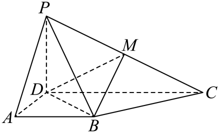
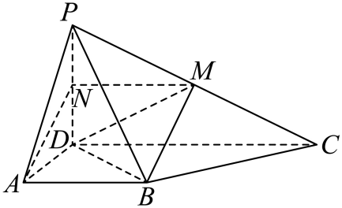
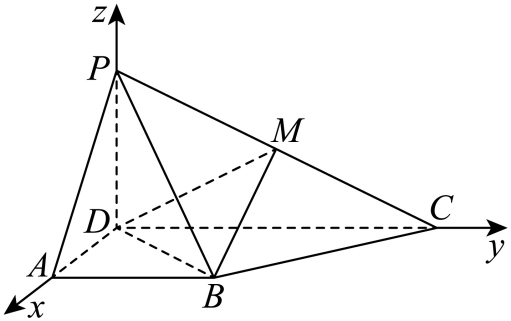

## 讲解

### 是什么

二面角由一条公共棱和两个指定半平面构成。二面角P-l-Q指定两个面中分别朝P、Q的一侧；在垂直棱的截面中，从棱上点朝这两个半平面的射线夹角就是二面角的平面角θ。通常相交的两个不同平面给0<θ<π；若讨论共面退化边界，两半平面同向或反向可为0或π。

同两个相交平面组成四个二面角，相邻者互补；“两平面夹角”按本讲义指其中较小的φ，0≤φ≤π/2，真实相交时φ>0。它与指定θ可能相等，也可能为π−θ。不能因两平面夹角不大于90°，便把所有指定二面角都当锐角。

### 怎么来的

取棱上点O、棱的非零方向k，以及各指定半平面内但不在棱上的P、Q。把OP、OQ沿棱的分量去掉：

$$r_P=\overrightarrow{OP}-\frac{\overrightarrow{OP}\cdot k}{k\cdot k}k,\qquad r_Q=\overrightarrow{OQ}-\frac{\overrightarrow{OQ}\cdot k}{k\cdot k}k.$$

点积rP·k、rQ·k都为0，所以两向量垂棱；它们仍在各自平面方向内，因为只减去了沿棱的向量。在同一半平面内减去沿棱分量不会改到另一侧，且P、Q不在棱上保证rP、rQ非零。因此这两个有方向的向量就是指定平面角的两条射线方向：

$$\cos\theta=\frac{r_P\cdot r_Q}{|r_P||r_Q|}.$$

这里保留正负号。点积正、零、负分别判定指定角锐、直、钝。换棱点或把k反向不改变对应射线的夹角，但把rP反向会换半平面，故不能为了好算任意反向。

若只求两平面的较小夹角，非零法向量n₁、n₂可用cosφ=|n₁·n₂|/(|n₁||n₂|)。在垂棱截面中，每个法向量与其所在平面射线垂直；任意选择的法向量夹角可能是θ或π−θ，绝对值仅保留较小者。求指定θ时若用法向量，必须另用半平面方向确认该取原夹角还是补角；使用上面的rP、rQ可以直接保留指定信息。

### 什么时候能用

先看题问“锐二面角/两平面较小夹角”还是“P-l-Q”。前者可取法向量余弦绝对值，后者须确定半平面。方向、法向量及两条平面角射线全须非零；截面须垂棱，面内随便两条线的夹角不一定是二面角。

## 易错

本讲义知识P0268、P0280、P0291讲较小两平面夹角，不等于指定二面角的一律绝对值公式。不能从图看起来锐下结论；可检查有向垂棱射线点积的符号。若指定角与较小角互补，它们正弦相同而余弦相反，只报正弦不能分辨哪个半平面。

知识与分类依据：`HSMA-B3-C1-D906811c3e3b1-P0266-P0291`（《专题1.6 空间向量的应用（二）：用空间向量研究距离、夹角问题（举一反三讲义）数学人教A版2019选择性必修第一册（解析版）.docx》）；`HSMA-B3-C1-D906811c3e3b1-P0424-P0424`（《专题1.6 空间向量的应用（二）：用空间向量研究距离、夹角问题（举一反三讲义）数学人教A版2019选择性必修第一册（解析版）.docx》）。原文、补条件与勘误分别说明。

## 例题

### 原例：指定半平面的垂棱投影及距离条件

来源：`HSMA-B3-C1-D906811c3e3b1-P0602-P0642`；原件《专题1.6 空间向量的应用（二）：用空间向量研究距离、夹角问题（举一反三讲义）数学人教A版2019选择性必修第一册（解析版）.docx》。题号、学年及地区按讲义原标注，未另作来源核验。

以下完整保留原题、原答案与原详解（仅统一等价公式排版及配图路径）：

【变式8-3】（24-25高二上·河南·期中）如图，在四棱锥$P-ABCD$中，平面$PDC\perp $平面$ABCD,AD\perp DC,AB$ $\parallel $ $DC,AB=\frac{1}{2}CD=AD=1,M$为棱$PC$的中点.

(1)证明：$BM$ $//$平面$PAD$；

(2)若$PC=\sqrt{5},PD=1$，

（i）求二面角$P-BM-D$的余弦值；

（ii）在棱$PA$上是否存在点$Q$，使得点$Q$到平面$BDM$的距离是$\frac{5\sqrt{6}}{18}$？若存在，求出$PQ$的长；若不存在，说明理由.

【答案】(1)证明见解析

(2)（i）$\frac{2}{3}$,（ii）存在，$PQ=\frac{\sqrt{2}}{3}$

【解题思路】（1）先证明四边形$ABMN$是平行四边形，可得$BM//AN$，即可根据线面平行的判定定理证明结论；

（2）（i）建立空间直角坐标系，求出平面的法向量，利用向量的夹角公式即可求解；

（ii）设$\vec{PQ}=\lambda \vec{PA}$，$0<\lambda <1$，根据点面距离的向量法即可求出$\lambda $，进而求出$PQ$的值．

【解答过程】（1）取$PD$的中点$N$，连接$AN$，$MN$，如图所示：

$\because M$为棱$PC$的中点，

$\therefore MN//CD$，$MN=\frac{1}{2}CD$，$\because AB//CD$，$AB=\frac{1}{2}CD$，$\therefore AB//MN$，$AB=MN$，

$\therefore $四边形$ABMN$是平行四边形，$\therefore BM//AN$，

又$BM\subset $平面$PAD$，$MN\subset $平面$PAD$，

$\therefore BM//$平面$PAD$；

（2）$\because $ $PC=\sqrt{5}$，$PD=1$，$CD=2$，

$\therefore P{C}^{2}=P{D}^{2}+C{D}^{2}$，$\therefore PD\perp DC$，

$\because $平面$PDC\perp $平面$ABCD$，平面$PDC\cap $平面$ABCD=DC$，

$PD\subset $平面$PDC$，

$\therefore PD\perp $平面$ABCD$，

又$AD$，$CD\subset $平面$ABCD$，$\therefore PD\perp AD$，$PD\perp CD$，由$AD\perp DC$，

$\therefore $以点$D$为坐标原点，$DA$，$DC$，$DP$所在直线分别为$x$，$y$，$z$轴建立空间直角坐标系，如图：

则$P\left( 0,0,1\right)$，$D\left( 0,0,0\right)$，$A\left( 1,0,0\right)$，$C\left( 0,2,0\right)$，$M\left( 0,1,\frac{1}{2}\right)$，$B\left( 1,1,0\right)$，

（i）故$\vec{DM}=\left( 0,1,\frac{1}{2}\right)$，$\vec{DB}=\left( 1,1,0\right)$

设平面$BDM$的一个法向量为$\vec{n}=\left( x,y,z\right)$，

则$\left\{ \begin{aligned}\vec{n}\cdot \vec{DM}=y+\frac{1}{2}z=0\\\vec{n}\cdot \vec{DB}=x+y=0\end{aligned}\right.$，令$z=2$，则$y=-1$，$x=1$，$\therefore $ $\vec{n}=\left( 1,-1,2\right)$，

平面$PBM$的一个法向量为$\vec{m}=\left( a,b,c\right)$,

$\vec{PM}=\left( 0,1,-\frac{1}{2}\right),\vec{PB}=\left( 1,1,-1\right)$

则$\left\{ \begin{aligned}\vec{m}\cdot \vec{PM}=b-\frac{1}{2}c=0\\\vec{m}\cdot \vec{PB}=a+b-c=0\end{aligned}\right.$，令$c=2$，则$b=1$，$a=1$，故$\vec{m}=\left( 1,1,2\right)$，

,$\therefore \cos \left\langle  \vec{n},\vec{m}\right\rangle =\frac{\vec{n}\cdot \vec{m}}{\left| \vec{n}\right|\left| \vec{m}\right|}=\frac{4}{\sqrt{6}\times \sqrt{6}}=\frac{2}{3}$，

由于二面角$P-BM-D$的平面角为锐角，故二面角$P-BM-D$的余弦值为$\frac{2}{3}$；

（ii）假设在线段$PA$上是存在点$Q$，使得点$Q$到平面$BDM$的距离是$\frac{5\sqrt{6}}{18}$，

设$\vec{PQ}=\lambda \vec{PA}$，$0\le \lambda \le 1$，则$Q(\lambda $,0,$1-\lambda )$，$\vec{DQ}=(\lambda ,$0,$1-\lambda )$，

由（2）知平面$BDM$的一个法向量为$\vec{n}=(1$,$-1$,$2)$，

$\vec{DQ}\cdot \vec{n}=\lambda +0+2(1-\lambda )=2-\lambda $，

$\therefore $点$Q$到平面$BDM$的距离是$\frac{\left| \vec{DQ}\cdot \vec{n}\right|}{\left| \vec{n}\right|}=\frac{2-\lambda }{\sqrt{6}}=\frac{5\sqrt{6}}{18}$，

$\therefore \lambda =\frac{1}{3}$，$\therefore PQ=\frac{1}{3}PA=\frac{\sqrt{2}}{3}$．

#### 补充讲解

先把原图的几何条件落实为坐标，不能用图看起来锐来决定符号。原（1）中N为PD中点，MN∥CD且MN=AB，由平行四边形得BM∥AN；AN在平面PAD内，B不在PAD内，所以BM∥平面PAD。

**原解勘误：**P0618把BM及MN都写在PAD内，与题意和上一行不符。应使用BM不包含于PAD、AN包含于PAD及BM∥AN。原文保留，（1）的最终结论成立。

（2）由PC²=PD²+DC²知PD⊥DC；PD在面PDC内且垂直两平面的交线DC，面PDC⊥底面，所以PD⊥底面。再结合AD⊥DC，三轴两两垂直有依据。原坐标为D(0,0,0)、P(0,0,1)、B(1,1,0)、M(0,1,1/2)；所用棱方向及两个法向量均非零。

指定角P-BM-D的两个半平面分别朝P与D。取棱点M、棱方向k=MB=(1,0,−1/2)，k²=5/4；MP=(0,−1,1/2)、MD=(0,−1,−1/2)。去掉沿棱分量：

$$r_P=\overrightarrow{MP}-\frac{\overrightarrow{MP}\cdot k}{k\cdot k}k=(1/5,-1,2/5),\qquad r_D=\overrightarrow{MD}-\frac{\overrightarrow{MD}\cdot k}{k\cdot k}k=(-1/5,-1,-2/5).$$

因MP·k=−1/4、MD·k=1/4，上式分别减去−k/5和k/5。rP与rD都垂直棱，指向相应半平面，不能任意翻转。点积rP·rD=−1/25+1−4/25=4/5；各自模平方1/25+1+4/25=6/5，所以指定二面角余弦(4/5)/(6/5)=2/3>0，原“锐角”现在有计算依据。若任意把原法向量m换成−m，法向量余弦会变−2/3，而几何角不变，这说明不能直接把任意法向量夹角当指定角。

距离存在性中，Q=P+λ(A−P)=(λ,0,1−λ)，取闭线段时0≤λ≤1，端点也须纳入。原思路P0612写开区间、P0638写闭区间，两处原文保留；本题解1/3在两者内。n=(1,−1,2)的模√6，D在BDM内，因此距离|2−λ|/√6。若不限范围，|2−λ|=5/3有λ=1/3或11/3；11/3超过线段上界，必须舍去。原范围内2−λ≥1可直接去绝对值，得λ=1/3；回代距离(5/3)/√6=5√6/18，Q确在线段内且PA=√2，所以PQ=√2/3。B、D、M不共线，BDM不是退化平面。
