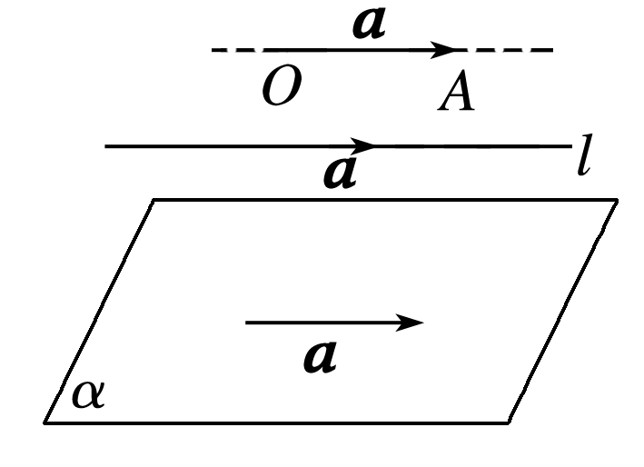

## 讲解

### 是什么

空间自由向量共线指非零向量的方向平行或反向；允许原有向线段所在直线平行或重合。约定零向量与任意向量共线。选定参照b≠0时，a、b共线当且仅当存在实数λ使a=λb；λ唯一，允许a=0时λ=0。

共面是方向能放入同一个平面：把向量平移到共同起点后，代表线段可落在同一平面内。原承载直线不必原本就在同一平面。两个向量总能共面；含零向量也不妨碍共面。若a、b不共线，p与它们共面当且仅当存在唯一实数对(x,y)使p=xa+yb。

### 怎么来的

共线时，以非零b的方向作参照，长度比|a|/|b|给倍率，同向取正、反向取负，a=0取0，所以a=λb；反向从数乘定义知λb始终在同一方向线上。若两个倍率表示相同a，则(λ−μ)b=0，由b≠0得λ=μ。

a、b不共线时，移到同一起点形成两条相交方向线。p终点在该平面内，通过终点分别作平行两方向的直线，得到平行四边形分解，故p=xa+yb。反向线性组合仍在两方向平面内。唯一性：若ra+sb=0而r≠0，则a=−(s/r)b，与不共线矛盾；故r=0，b非零再得s=0。

若a、b共线，三者可能仍共面，但a、b只能生成一条方向线，不能覆盖整个平面；零参照也不能表达一般非零向量。因此两个条件不是可以省掉的修饰词。

### 什么时候能用

共线可证明共顶点的三点共线，或证明两条直线方向相同；若结论要两条直线平行，还须排除重合。共面可表示第三方向或证明共同基点出发的点共面；若结论是线面平行，还须排除直线在面内。这些方向结论不自动决定原位置。

## 例题

### 原例（HSMA-B3-C1-D6ae06c103585-P0279—P0288）

**原题与原解析（保留）**

【例6】（24-25高二上·上海·课后作业）设${e}_{1}$，${e}_{2}$是空间两个不共线的非零向量，已知$\vec{AB}=2\vec{{e}_{1}}+k\vec{{e}_{2}}$，$\vec{BC}=\vec{{e}_{1}}+3\vec{{e}_{2}}$，$\vec{DC}=2\vec{{e}_{1}}-\vec{{e}_{2}}$，且$A$、$B$、$D$三点共线，则实数$k$的值为（    ）

A．$-2$  B．$-4$  C．$-8$  D．8

【解题思路】利用向量的线性运算表示$\vec{AD}$，根据$A$、$B$、$D$三点共线可得$\vec{AB}=\lambda \vec{AD}$，建立等量关系可得$k$的值.

【解答过程】∵$\vec{AB}=2\vec{{e}_{1}}+k\vec{{e}_{2}}$，$\vec{BC}=\vec{{e}_{1}}+3\vec{{e}_{2}}$，$\vec{DC}=2\vec{{e}_{1}}-\vec{{e}_{2}}$，

∴$\vec{AD}=\vec{AB}+\vec{BC}-\vec{DC}=\left( 2\vec{{e}_{1}}+k\vec{{e}_{2}}\right)+\left( \vec{{e}_{1}}+3\vec{{e}_{2}}\right)-\left( 2\vec{{e}_{1}}-\vec{{e}_{2}}\right)=\vec{{e}_{1}}+(k+4)\vec{{e}_{2}}$，

∵$A$、$B$、$D$三点共线，

∴$\exists \lambda \in R$，使得$\vec{AB}=\lambda \vec{AD}$，

即$2\vec{{e}_{1}}+k\vec{{e}_{2}}=$ $\lambda \left[ \vec{{e}_{1}}+(k+4)\vec{{e}_{2}}\right]=\lambda \vec{{e}_{1}}+\lambda (k+4)\vec{{e}_{2}}$，

∴$\lambda =2$，$\lambda (k+4)=k$，解得$k=-8$．

故选：C．

### 补讲

先统一起终点：AD=AB+BC+CD=AB+BC−DC。分别代入题给三向量，e₁系数2+1−2=1，e₂系数k+3+1=k+4，故AD=e₁+(k+4)e₂。

e₁、e₂不共线，AD的e₁系数1保证它非零。A、B、D共线，使AB=λAD。展开λAD后，比较同一不共线二向量的唯一系数：λ=2，k=λ(k+4)。代λ=2得k=2k+8，移项得k=−8，选C。回代AB=2e₁−8e₂、AD=e₁−4e₂，确有AB=2AD。

只有两方向不共线，才有比较系数的依据；若共线，不同系数组合可能表示同一向量。

### 原例（HSMA-B3-C1-D6ae06c103585-P0370—P0374）

**原题与原解析（保留）**

【变式8-3】（24-25高二下·江苏·阶段练习）已知向量$\vec{a},\vec{b},\vec{c}$不共面，则使向量$\vec{m}=2\vec{a}-\vec{b},\vec{n}=\vec{b}+\vec{c},\vec{p}=x\vec{a}+5\vec{b}+3\vec{c}$共面的实数x的值是（    ）

A．$-4$  B．$-3$  C．$-2$  D．4

【解题思路】利用向量共面得到线性表示，再化简求值即可.

【解答过程】因为$\vec{m},\vec{n},\vec{p}$共面，所以存在实数$s,t$，使得$\vec{p}=s\vec{m}+t\vec{n}=s(2\vec{a}-\vec{b})+t(\vec{b}+\vec{c})=2s\vec{a}+(t-s)\vec{b}+t\vec{c}=x\vec{a}+5\vec{b}+3\vec{c}$，所以$\left\{ \begin{aligned}2s=x\\-s+t=5\\t=3\end{aligned}\right.$，解得$t=3,s=-2,x=-4$.

故选：A.

### 补讲

先核m、n不共线：若m=rn，比较原不共面a、b、c的系数，a项会给2=0，矛盾。因此p与m、n共面时可写p=sm+tn。

代入m=2a−b、n=b+c并按分配律展开，得sm+tn=2sa+(−s+t)b+tc。与p=xa+5b+3c比较原基底唯一系数，t=3、−s+t=5、2s=x。代t得s=−2，故x=−4，选A。回代−2m+3n=−4a+5b+3c，满足条件。

先验证m、n不共线，再使用共面定理；仅因原a、b、c是基底，不能跳过新m、n可能退化的检查。

## 易错

- b=0时“a与b共线”仍按约定成立，但a=λb只能产生0，不能反向套定理。
- 不共线两方向可以比较系数；共线时同一向量可以有不同系数组合。
- 原图的一条有向线段可平移到方向平面，不等于原承载直线必在该平面内。
- 三点或四点结论要连起点、终点作位置分析，不能只说无关的三个自由向量共面。

## 来源

原件：专题1.1 空间向量及其线性运算（举一反三讲义）数学人教A版2019选择性必修第一册（解析版）.docx；来源 ID：D6ae06c103585。

知识与分类定位：HSMA-B3-C1-D6ae06c103585-P0213—P0235, HSMA-B3-C1-D6ae06c103585-P0278—P0278, HSMA-B3-C1-D6ae06c103585-P0349—P0349。

选用原例：HSMA-B3-C1-D6ae06c103585-P0279—P0288, HSMA-B3-C1-D6ae06c103585-P0370—P0374。
