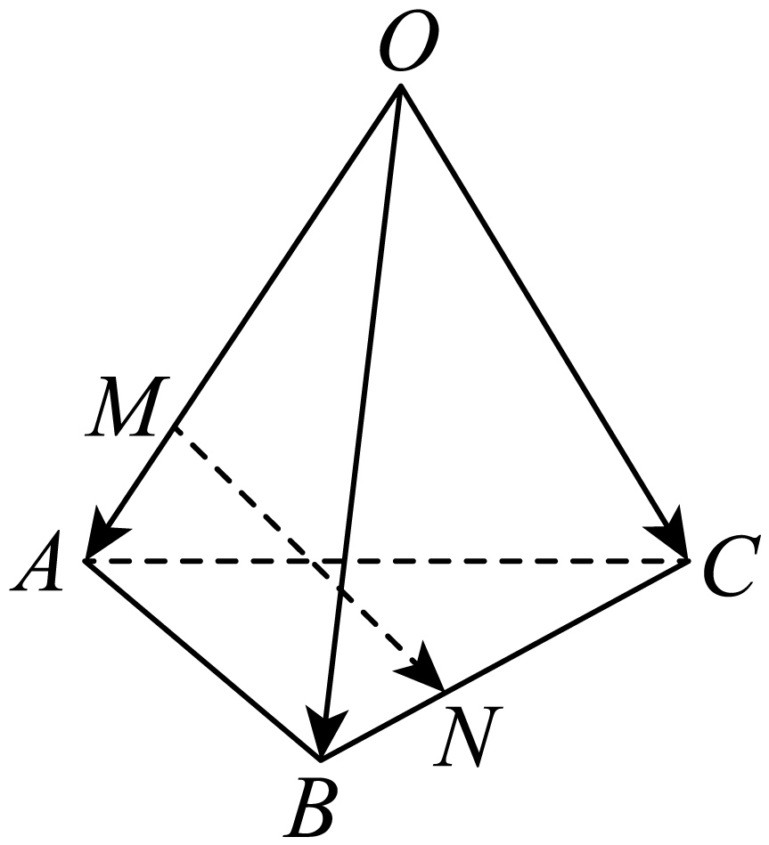

## 讲解

### 是什么

三个空间自由向量a、b、c不共面时，对任意空间向量p，存在唯一有序实数组(x,y,z)，使p=xa+yb+zc。这就是空间向量基本定理。{a,b,c}称空间的一个基底，三者是基向量；写出系数时须约定a、b、c顺序。

**基底只要求不共面。** 三者因此均非零，任意两者不共线；它们不必两两垂直，也不必长1。两两垂直且长1才是特别的单位正交基底。一般斜基底的系数同样可作线性表示，但不能直接拿系数平方和算模。

### 怎么来的

先把a、b、c移到共同起点O。a、b不共线，确定一个方向平面α；c不在α的方向内。设OP=p，过P作方向为c的直线，这条直线与α相交于唯一一点Q（c不是平面内方向，故不平行α）。于是QP=zc；OQ在α中，按平面两向量表示得OQ=xa+yb。首尾相接OP=OQ+QP，所以p=xa+yb+zc，给出了存在性的几何来源。

再证明唯一性。若两组系数表示同一p，令两组系数的差为r、s、t，相减得ra+sb+tc=0。若t≠0，可除以t得c=−(r/t)a−(s/t)b，这会使三者共面，矛盾；故t=0。此时ra+sb=0，若r≠0便使a成为b的倍数，违反不共线，故r=0；b非零，再得s=0。三项差都0，两组系数相同。

这个证明也给出判断办法：若有一组不全为0的系数使ra+sb+tc=0，三者不能构成基底。反过来，若三者共面，选其中两条不共线方向可表示第三；若没有两条不共线方向，三者共线或含零向量，更不可能成为空间基底。

### 什么时候能用

需把空间图形目标向量化成三条已知方向，或根据两个线性表示相等比较系数时使用。第一步先说明三向量不共面，例如非退化四面体同一顶点出发的三棱，或平行六面体同一顶点的三条棱。只给“三个不同向量”或“三个非零向量”仍不足。

表示全部展开到同一基底再比较系数；混着不同基底的系数不构成同一有序三元组。数量积和模另依赖基向量之间的角度与长度，不能因是基底就套单位正交公式。

## 例题

### 原例（HSMA-B3-C1-D6e974c7bcf1d-P0024—P0032）

**原题与原解析（保留）**

【例1】（24-25高二上·重庆北碚·期末）若$\left\{ \vec{a},\vec{b},\vec{c}\right\}$构成空间的一个基底，则下列选项可构成空间的另一个基底的是（   ）

A．$c+\vec{a},\vec{c},\vec{c}-\vec{a}$  B．$\vec{b},\vec{b}+\vec{c},\vec{b}-\vec{c}$

C．$\vec{b}+\vec{c},\vec{a}+\vec{b}+\vec{c},\vec{a}$  D．$\vec{b}+\vec{c},\vec{b}-\vec{c},\vec{a}$

【解题思路】根据空间向量基底的概念进行判断.

【解答过程】对A：因为$\left( \vec{c}+\vec{a}\right)+\left( \vec{c}-\vec{a}\right)=2\vec{c}$，所以向量$\vec{c}+\vec{a},\vec{c}-\vec{a},\vec{c}$共面，所以$\vec{c}+\vec{a},\vec{c}-\vec{a},\vec{c}$不能构成空间向量的基底；

对B：因为$\left( \vec{b}+\vec{c}\right)+\left( \vec{b}-\vec{c}\right)=2\vec{b}$，所以向量$\vec{b}+\vec{c},\vec{b}-\vec{c},\vec{b}$共面，所以$\vec{b}+\vec{c},\vec{b}-\vec{c},\vec{b}$不能构成空间向量的基底；

对C：因为$\left( \vec{b}+\vec{c}\right)+\vec{a}=\vec{a}+\vec{b}+\vec{c}$，所以$\vec{b}+\vec{c},\vec{a}+\vec{b}+\vec{c},\vec{a}$共面，所以$\vec{b}+\vec{c},\vec{a}+\vec{b}+\vec{c},\vec{a}$不能构成空间向量的基底；

对D：因为不存在$x,y\in R$，使得$\vec{a}=x\left( \vec{b}+\vec{c}\right)+y\left( \vec{b}-\vec{c}\right)$，所以$\vec{b}+\vec{c},\vec{b}-\vec{c},\vec{a}$不共面，所以$\vec{b}+\vec{c},\vec{b}-\vec{c},\vec{a}$可以作为空间的另一组基底.

故选：D.

### 补讲

A项三个向量都由a、c两方向组成，B项都由b、c两方向组成，均共面；C项第二个等于第一加第三，也共面。D项设u=b+c、v=b−c，则b=(u+v)/2、c=(u−v)/2。若u、v、a共面，原a、b、c也都在同一方向平面内，矛盾，所以D为基底。

也可直接核u、v不共线：若u=tv，比较原基底的b、c系数得到1=t及1=−t，不可能；随后a无法写成xu+yv，因为右边的a系数0而左边1。这个两步说明D不仅是“看起来三个不同向量”。原选项A开头c少向量箭头，按原解的向量c理解，不改变原区。

### 原例（HSMA-B3-C1-D6e974c7bcf1d-P0075—P0083）

**原题与原解析（保留）**

【例2】（24-25高二上·广东清远·期末）如图，在三棱锥$O-ABC$中，$\vec{OA}=\vec{a},\vec{OB}=\vec{b},\vec{OC}=\vec{c}$．若点$M,N$分别在棱$OA,BC$上，且$\vec{OM}+3\vec{AM}=2\vec{BN}+\vec{CN}=\vec{0}$，则$\vec{MN}=$（    ）

A．$-\frac{3}{4}\vec{a}+\frac{2}{3}\vec{b}-\frac{1}{3}\vec{c}$  B．$\frac{3}{4}\vec{a}-\frac{2}{3}\vec{b}-\frac{1}{3}\vec{c}$

C．$-\frac{3}{4}\vec{a}+\frac{2}{3}\vec{b}+\frac{1}{3}\vec{c}$  D．$\frac{3}{4}\vec{a}+\frac{2}{3}\vec{b}+\frac{1}{3}\vec{c}$

【解题思路】利用空间向量的基本定理及利用向量的加法表示出$\vec{MN}=\vec{MO}+\vec{OC}+\vec{CN}$即可求解．

【解答过程】由$\vec{OA}=\vec{a},\vec{OB}=\vec{b},\vec{OC}=\vec{c},\vec{OM}+3\vec{AM}=2\vec{BN}+\vec{CN}=\vec{0}$，

得$\vec{OM}=\frac{3}{4}\vec{OA}=\frac{3}{4}\vec{a},\vec{CN}=\frac{2}{3}\vec{CB}=\frac{2}{3}\left( \vec{OB}-\vec{OC}\right)=\frac{2}{3}\left( \vec{b}-\vec{c}\right)$，

所以$\vec{MN}=\vec{MO}+\vec{OC}+\vec{CN}=-\frac{3}{4}\vec{a}+\vec{c}+\frac{2}{3}\left( \vec{b}-\vec{c}\right)=-\frac{3}{4}\vec{a}+\frac{2}{3}\vec{b}+\frac{1}{3}\vec{c}$，

故选：C．

### 补讲

M在OA上，从OM+3AM=0出发，把AM写OM−OA，得到OM+3(OM−OA)=0，所以4OM=3OA、OM=3a/4。N在BC上，把BN写ON−OB、CN写ON−OC；2BN+CN=0成为3ON−2OB−OC=0，故ON=2b/3+c/3。

MN=ON−OM，代入两位置向量得到−3a/4+2b/3+c/3，选C。起点M到终点N要用“终点减起点”，B、D把a方向写反，A把c系数写反。三棱锥保证OA、OB、OC不共面，所得三个系数也唯一。

## 易错

- 零向量、共线的一对或第三向量落在前两者方向平面内，都不能构成空间基底。
- 系数唯一由不共面推出，不能先随意比较系数，再用结果“证明”基底成立。
- 更换基底顺序会更换有序系数顺序；原向量本身并未变化。

## 来源

原件：专题1.3 空间向量基本定理（举一反三讲义）数学人教A版2019选择性必修第一册（解析版）.docx；来源 ID：D6e974c7bcf1d。

知识与分类定位：HSMA-B3-C1-D6e974c7bcf1d-P0015—P0022, HSMA-B3-C1-D6e974c7bcf1d-P0156—P0161, HSMA-B3-C1-D6e974c7bcf1d-P0023—P0023, HSMA-B3-C1-D6e974c7bcf1d-P0074—P0074。

选用原例：HSMA-B3-C1-D6e974c7bcf1d-P0024—P0032, HSMA-B3-C1-D6e974c7bcf1d-P0075—P0083。
