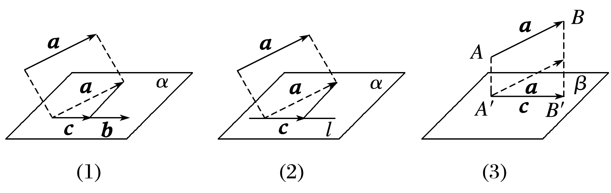

## 讲解

### 是什么

投影到一个方向，必须指定非零向量b。把a、b平移到同一起点O，从a终点A向b所在直线作垂线，垂足H，$\overrightarrow{OH}$ 就是投影向量。直线方向取反，H及投影向量不变，但沿新正方向记录的有向分量会变号。

设a也非零，夹角为θ。三个量必须分清：有向分量q是可正可负的实数；投影向量c有方向；投影长度是c的模，非负。
$$q=|\vec a|\cos\theta=\frac{\vec a\cdot\vec b}{|\vec b|},\qquad \vec c=q\frac{\vec b}{|\vec b|}=\frac{\vec a\cdot\vec b}{|\vec b|^2}\vec b,\qquad |\vec c|=|q|.$$
a为零时q=0、c=0，后两种数量积公式仍成立，但不定义a与b的夹角。b为零时没有投影方向，以上除法不能用。

原图(1)(2)示投影到向量方向、直线；(3)从a的起点A和终点B分别作平面β的垂足A′、B′，$\overrightarrow{A^{\prime}B^{\prime}}$ 是平面投影向量。自由向量换起点后该投影向量保持不变。

### 怎么来的

当0<θ<π/2，直角三角形给OH的长度 $|\vec a|\cos\theta$；钝角时H在b负方向，给有向OH加负号，仍是同一表达式。θ=0时投影为a，θ=π/2时投影为零，θ=π时有向分量为−|a|，均符合该式。c应当“有向分量乘单位方向”，所以必须有b/|b|，不能把向量c等同实数q。代入数量积定义消去cosθ，就得到投影向量的数量积公式。

令 $\vec r=\vec a-\vec c$。沿折线OH、HA相加得a=c+r。因为H是垂足，r若非零，其方向与b垂直；包含r=0的情形统一用r·b=0表示。也可核代数式：$\vec r\cdot\vec b=\vec a\cdot\vec b-(\vec a\cdot\vec b)|\vec b|^2/|\vec b|^2=0$。c是b的实数倍，r满足r·b=0，这叫相对于b的正交分解，允许某一分量为零。若另有a=t b+r且r·b=0，两边与b作数量积，得到 $t=(\vec a\cdot\vec b)/|\vec b|^2$，因此分解唯一。

投影到平面β时，取任一非零法向量n，即方向垂直于平面内每个方向的向量。先分出法向部分r，再取平面内方向部分c：
$$\vec r=\frac{\vec a\cdot\vec n}{|\vec n|^2}\vec n,\qquad \vec c=\vec a-\vec r.$$
c·n=0说明c平行于平面方向或为零；r是n的实数倍，c·r=0，允许c或r为零。端点作垂足的折线分解中，AA′与B′B均为法向的实数倍，余下A′B′在平面内，所以正是上述唯一分解。

若有单位正交基底i、j、k，先由空间向量基本定理写a=x i+y j+z k，再与i作数量积：a·i=x(i·i)+y(j·i)+z(k·i)=x，因为同轴为1、异轴为0。同理y=a·j、z=a·k。将三系数代回原表示，得到 $\vec a=(\vec a\cdot\vec i)\vec i+(\vec a\cdot\vec j)\vec j+(\vec a\cdot\vec k)\vec k$。

### 什么时候能用

到直线或向量方向的投影，方向向量必须非零；到平面的公式，法向量必须非零。投影向量可为零，正交分解仍有效，不能强行给零投影方向。

a与其非零平面投影c的夹角等于a所在直线与该平面的夹角：因为a=c+r且r·c=0，故a·c=|c|²，余弦为|c|/|a|，取0至90°。a平行面时c=a，角0；a垂直面时c=0，线面角仍定义为90°，但a与零投影的向量夹角不存在。若a自身为零，也没有其所在直线或线面角。

## 易错

- 钝角投影写成负长度：负的是有向分量，长度须取绝对值。
- 把投影向量写成q：还必须乘单位方向；除以|b|得到分量，除以|b|²再乘b得到向量。
- 从投影图直接叫两向量垂直而漏起终点：先明确a为AB、c为A′B′，法向差为a−c；不是随意任选两条垂线的向量差。

## 例题

### 原例：HSMA-B3-C1-D92586afa41d6-P0347–P0353

**原题、原答案、原思路与原详解**（原有次序保留，仅规范等价数学符号）：

【变式7-2】（24-25高二上·宁夏银川·阶段练习）已知$\left| \vec{a}\right|=4$，空间向量$\vec{e}$为单位向量，$\left\langle  \vec{a},\vec{e}\right\rangle =\frac{2\pi }{3}$，则空间向量$\vec{a}$在向量$\vec{e}$方向上的投影向量的模长为（    ）

A．2  B．$-2$  C．$-\frac{1}{2}$  D．$\frac{1}{2}$

【解题思路】由空间向量$\vec{a}$在向量$\vec{e}$方向上的投影数量为$\frac{\vec{a}\cdot \vec{e}}{\left| \vec{e}\right|}$，运算即可得解.

【解答过程】由题意，$\left| \vec{a}\right|=4$，$\left| \vec{e}\right|=1$，$\left\langle  \vec{a},\vec{e}\right\rangle =\frac{2\pi }{3}$，

则空间向量$\vec{a}$在向量$\vec{e}$方向上的投影数量为$\frac{\vec{a}\cdot \vec{e}}{\left| \vec{e}\right|}=\frac{\left| \vec{a}\right|\cdot \left| \vec{e}\right|\cos \frac{2\pi }{3}}{\left| \vec{e}\right|}=4\times \left( -\frac{1}{2}\right)=-2$.

所以所求投影向量的模长为2.

故选：A.

**补讲与核验**

题中e为单位向量，因此有向分量为 $\vec a\cdot\vec e=4\cos(2\pi/3)=-2$。投影向量为 $-2\vec e$，其模是 $|-2|\,|\vec e|=2$。负号说明投影朝e的反方向，不说明长度为负。

A正确。B给的是有向分量而非模长；C仅给出cosθ，漏了a的模4；D把cosθ取正后仍漏模4。角度和非零条件都在题干成立，不能把“投影数量”“投影向量”“投影长度”三个答案混成一个。

### 原例：HSMA-B3-C1-D92586afa41d6-P0332–P0338

**原题、原答案、原思路与原详解**（原有次序保留，仅规范等价数学符号）：

【例7】（24-25高一下·山西大同·期末）已知向量$\vec{a},\vec{b},\vec{c}$满足$\left| \vec{a}\right|=4$，$\left| \vec{b}\right|=\left| \vec{c}\right|=5$，且$\vec{a}+\vec{b}+\vec{c}=\vec{0}$，则向量$\vec{a}-\vec{b}$在向量$\vec{c}$上的投影向量为（   ）

A．$-\frac{9}{25}\vec{c}$  B．$-\frac{9}{5}\vec{c}$  C．$\frac{9}{25}\vec{c}$  D．$\frac{9}{5}\vec{c}$

【解题思路】根据数量积的运算律可求得$\vec{a}\cdot \vec{c},\vec{b}\cdot \vec{c}$，根据投影向量定义直接求解即可.

【解答过程】$\because \vec{a}+\vec{b}+\vec{c}=\vec{0}$，$\therefore \vec{a}+\vec{c}=-\vec{b}$，$\vec{b}+\vec{c}=-\vec{a}$，

$\therefore {\left( \vec{a}+\vec{c}\right)}^{2}={\vec{a}}^{2}+2\vec{a}\cdot \vec{c}+{\vec{c}}^{2}=41+2\vec{a}\cdot \vec{c}=25$，${\left( \vec{b}+\vec{c}\right)}^{2}={\vec{b}}^{2}+2\vec{b}\cdot \vec{c}+{\vec{c}}^{2}=50+2\vec{b}\cdot \vec{c}=16$，

$\therefore \vec{a}\cdot \vec{c}=-8$，$\vec{b}\cdot \vec{c}=-17$，$\therefore \frac{\left( \vec{a}-\vec{b}\right)\cdot \vec{c}}{\left| \vec{c}\right|}\cdot \frac{\vec{c}}{\left| \vec{c}\right|}=\frac{\vec{a}\cdot \vec{c}-\vec{b}\cdot \vec{c}}{{\left| \vec{c}\right|}^{2}}\cdot \vec{c}=\frac{9}{25}\vec{c}$.

故选：C.

**补讲与核验**

要投影的是a−b，目标方向是c，公式的分母须用 $|\vec c|^2=25$。题中 $\vec a+\vec c=-\vec b$，两边取数量积自身，得 $16+25+2\vec a\cdot\vec c=25$，所以a·c=−8。同理由 $\vec b+\vec c=-\vec a$ 得 $25+25+2\vec b\cdot\vec c=16$，所以b·c=−17。

分配律给 $(\vec a-\vec b)\cdot\vec c=-8-(-17)=9$。有向分量是9/5，乘单位方向c/5才得到投影向量9c/25。C正确；A多了负号；D少除一次模5；B既负号错误，又把有向分量的分母直接当成投影向量系数。9>0说明投影与c同向；答案的实数系数9/25不是投影长度，实际长度为9/5。

## 资料疑点与勘误

P0328提取文字丢失 EQ 域中的 b/|b|；实际 document.xml 为“c＝|a|cos〈a,b〉 eq \f(b,|b|)”，故原件投影向量公式正确，本条按实际载体恢复。P0329实际载体含 A′B′ 箭头域，但“夹角就是线面角”缺非零投影条件，本条单列补足。

## 来源

原件：专题1.2 空间向量的数量积运算（举一反三讲义）数学人教A版2019选择性必修第一册（解析版）.docx。

知识与题型口径：HSMA-B3-C1-D92586afa41d6-P0326–P0353；所选原例见例标题段落号。
