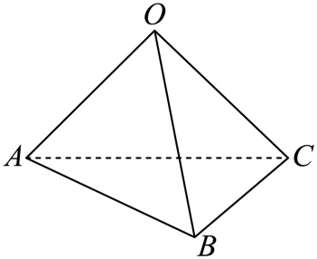
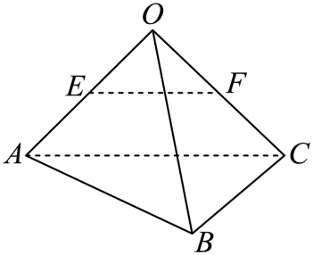

## 讲解

### 判据

题给棱长、边间角度、正方体或正四面体等结构，求两条有向线段数量积或一个合成向量的模。若目标向量的模和夹角易读，就用定义；若目标边难直接读角，先沿边拆为已知向量的和，再用分配律展开。

### 流程

1. 先确认向量方向。将两向量平移到同一起点，只允许平移；若用相反向量替代，数量积须变号，夹角须改为补角。图中边所成的锐角不一定是所求向量夹角。
2. 读出基础模与数量积。正方体同顶点三棱两两垂直，因此交叉数量积0；正四面体每个面等边，但有向边可能反向，先对方向再取60°或120°。
3. 若需要拆向量，沿连接起终点的折线首尾相加；中点给1/2系数，对边相等平行给同向的向量等式，反向走边写负号。每个系数应对应明确的几何关系。
4. 数量积用分配律把目标拆成已知项。求模时先写 $|\vec x|^2=\vec x\cdot\vec x$，同一项平方取模平方，交叉项加倍；它们仅在相应两向量垂直时才可消去。
5. 模平方须非负，最后取非负平方根。负的数量积是合法结果，不能因模长非负就改正号；若模平方为负，回查方向、角度及漏掉的项。

## 易错

- 有正方体的画法就认三边垂直：题给一般平行六面体时仍须按实际角度计算。
- 反向向量漏负号：先列折线路径，避免从图形远近猜符号。
- 把|u+v|当|u|+|v|：一般需平方展开，模的相加只有同向时成立。

## 例题

### 原例：HSMA-B3-C1-D92586afa41d6-P0098–P0108

**原题、原答案、原思路与原详解**（原有次序保留，仅规范等价数学符号）：

【变式2-2】（24-25高二上·全国·课后作业）已知正四面体$OABC$的棱长为1，如图所示.若E，F分别是$OA$，$OC$的中点，求：

(1)$\vec{EF}\cdot \vec{AO}$；

(2)$\vec{EF}\cdot \vec{AC}$；

(3)$\vec{EF}\cdot \vec{CB}$.

【解题思路】根据空间向量的数量积的定义求解各小题即可.

【解答过程】（1）由题意，E，F分别是$OA$，$OC$的中点，

则$\vec{EF}\cdot \vec{AO}=\frac{1}{2}\vec{AC}\cdot \vec{AO}$ $=\frac{1}{2}|\vec{AC}||\vec{AO}|\cos \langle \vec{AC},\vec{AO}\rangle $ $=\frac{1}{2}\times 1\times 1\times \cos 60^{\circ}=\frac{1}{4}$.

（2）$\vec{EF}\cdot \vec{AC}=\frac{1}{2}\vec{AC}\cdot \vec{AC}=\frac{1}{2}|\vec{AC}{|}^{2}=\frac{1}{2}$.

（3）$\vec{EF}\cdot \vec{CB}=\frac{1}{2}\vec{AC}\cdot \vec{CB}=\frac{1}{2}|\vec{AC}||\vec{CB}|\cos \langle \vec{AC},\vec{CB}\rangle $ $=\frac{1}{2}\times 1\times 1\times \cos 120^{\circ}=-\frac{1}{4}$.

**补讲与核验**

E、F是三角形OAC两边中点，中位线平行且等于AC的一半，方向也从E至F对应A至C，所以 $\overrightarrow{EF}=\frac12\overrightarrow{AC}$，先把三个小问转成同一边AC的数量积。

(1)AC、AO同以A为起点，正四面体的每个面为等边三角形，所以夹角为60°，数量积为(1/2)×1×1×cos60°=1/4。(2)同一个向量与自身的数量积是模平方，故为(1/2)×1²=1/2。(3)CA、CB同以C为起点，夹角60°；但题目是AC、CB，AC与CA反向，因此夹角120°，得到(1/2)×1×1×cos120°=−1/4。这里负号来自方向，不是棱长为负。

三问刻意区分“同起点的几何角”“同向量平方”“反向后补角”。看到正四面体不能把任意有向边夹角都写60°。

### 原例：HSMA-B3-C1-D92586afa41d6-P0176–P0186

**原题、原答案、原思路与原详解**（原有次序保留，仅规范等价数学符号）：

【变式4-2】（24-25高二上·江苏南通·期末）已知平行六面体$ABCD-{A}_{1}{B}_{1}{C}_{1}{D}_{1}$的所有棱长均为$1$，$\angle {A}_{1}AB=\angle {A}_{1}AD=\angle BAD={60}^{\circ}$，则对角线${A}_{1}C$的长为（    ）

A．$\sqrt{6}$  B．$2$  C．$\sqrt{3}$  D．$\sqrt{2}$

【解题思路】根据向量的线性运算，可得$\vec{{A}_{1}C}$的表达式，两边平方即可求得.

【解答过程】由已知：平行六面体$ABCD-{A}_{1}{B}_{1}{C}_{1}{D}_{1}$所有棱长均为$1$，

$\angle {A}_{1}AB=\angle {A}_{1}AD=\angle BAD={60}^{\circ}$，则$\vec{{A}_{1}C}=\vec{{A}_{1}A}+\vec{AB}+\vec{BC}=-\vec{A{A}_{1}}+\vec{AB}+\vec{AD}$，

又因为：$\vec{A{A}_{1}}\cdot \vec{AB}=\left| \vec{A{A}_{1}}\right|\cdot \left| \vec{AB}\right|\cos \angle {A}_{1}AB=1\times 1\times \frac{1}{2}=\frac{1}{2}$，

同理可得：$\vec{A{A}_{1}}\cdot \vec{AD}=\vec{AB}\cdot \vec{AD}=\frac{1}{2}$，

则${\vec{{A}_{1}C}}^{2}={(-\vec{A{A}_{1}}+\vec{AB}+\vec{AD})}^{2}={\vec{A{A}_{1}}}^{2}+{\vec{AB}}^{2}+{\vec{AD}}^{2}-2\vec{A{A}_{1}}\cdot \vec{AB}-2\vec{A{A}_{1}}\cdot \vec{AD}+2\vec{AB}\cdot \vec{AD}$

$=1+1+1-2\times \frac{1}{2}-2\times \frac{1}{2}+2\times \frac{1}{2}=2$，则$\left| \vec{{A}_{1}C}\right|=\sqrt{2}$.

故选：$D$.

**补讲与核验**

令 $\vec u=\overrightarrow{AA_1}$、$\vec v=\overrightarrow{AB}$、$\vec w=\overrightarrow{AD}$。题给三模均为1，三对夹角均为60°，所以u·v=u·w=v·w=1/2。这三向量不正交，不能当单位直角坐标轴。

从A₁到C按A₁A、AB、BC首尾相接，且BC=AD同向，得 $\overrightarrow{A_1C}=-\vec u+\vec v+\vec w$。取数量积自身，用分配律列出3个平方项及3个双交叉项：
$$|\overrightarrow{A_1C}|^2=1+1+1-2\times\frac12-2\times\frac12+2\times\frac12=2.$$
两项负号来自−u，v与w交叉项为正。故模为√2，D正确。C的√3在本题漏掉了非零交叉项；直接把基底系数平方和当通用模平方，要求基底单位正交，本题不符合。A的√6把所有交叉项写成正号，那对应u+v+w，不是A₁C；B的2也不满足平方展开得到的2。

## 来源

原件：专题1.2 空间向量的数量积运算（举一反三讲义）数学人教A版2019选择性必修第一册（解析版）.docx。

知识与题型口径：HSMA-B3-C1-D92586afa41d6-P0081–P0121；所选原例见例标题段落号。

原件：专题1.2 空间向量的数量积运算（举一反三讲义）数学人教A版2019选择性必修第一册（解析版）.docx。

知识与题型口径：HSMA-B3-C1-D92586afa41d6-P0158–P0199；所选原例见例标题段落号。
