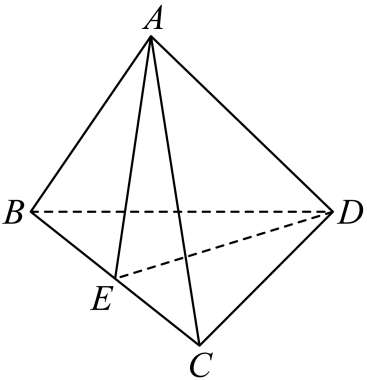

## 讲解

### 判据

题给几何图形并要求向量和差、线性组合时，寻找首尾路径、相等的平移方向和中点或分点关系。几何图形只提供这些有依据的关系，不按图上长短、投影方向直接认向量相等。

### 流程

1. **标起终点。** 目标PQ是从P到Q；减某向量先改成相反向量，防止路线反向。
2. **选路径或共同基点。** 首尾接成PQ，或取O写PQ=OQ−OP；先保持每一段确实可相接。
3. **代几何关系。** 平行四边形对边同向向量相等；中点E给OE=(OB+OC)/2；分点先明确比例从哪端给。
4. **按运算律展开。** 分配每个系数、合并同一向量，说明来自何处，不把不同方向的长度合并。
5. **读回几何意义。** 剩下起点到终点是否目标；若要三个基向量唯一系数，另说明它们不共面。

## 例题

### 原例（HSMA-B3-C1-D6ae06c103585-P0141—P0146）

**原题与原解析（保留）**

【例3】（24-25高二下·河南·阶段练习）在四面体$ABCD$中，$E$为棱$BC$的中点，则$\vec{DA}-\frac{1}{2}\left( \vec{DB}+\vec{DC}\right)=$（    ）

A．$-\vec{AE}$  B．$-\vec{AB}$  C．$\vec{AE}$  D．$\vec{AB}$

【解题思路】根据空间向量的线性运算即可求解.

【解答过程】$\vec{DA}-\frac{1}{2}\left( \vec{DB}+\vec{DC}\right)=\vec{DA}-\frac{1}{2}\left( 2\vec{DE}\right)=\vec{DA}-\vec{DE}=\vec{EA}=-\vec{AE}$,

故选:A.

### 补讲

E为BC中点，所以EB+EC=0。把DB写DE+EB、DC写DE+EC，相加得到DB+DC=2DE，再乘1/2得DE。于是DA−DE=EA=−AE，选A；C方向相反，B和D指向B而非中点E。

这一步只需中点和向量加法，四面体不必正、棱长不必相等。不能把两向量的平均任意替换成某条没有中点依据的线段。

### 原例（HSMA-B3-C1-D6ae06c103585-P0120—P0124）

**原题与原解析（保留）**

【变式2-1】（24-25高二上·陕西汉中·阶段练习）已知$H$，$I$，$J$，$K$是空间中互不相同的四个点，则$\vec{HI}+\vec{IJ}-\vec{HK}=$（   ）

A．$\vec{HK}$  B．$\vec{KJ}$  C．$\vec{KI}$  D．$\vec{IJ}$

【解题思路】根据空间向量线性运算的运算法则直接计算.

【解答过程】$\vec{HI}+\vec{IJ}-\vec{HK}=$ $\vec{HI}+\vec{IJ}+\vec{KH}=\vec{HJ}+\vec{KH}=\vec{KJ}$，

故选：B.

### 补讲

先按首尾相接法则把HI+IJ合为HJ。减HK等于加KH，因此HJ−HK=KH+HJ=KJ，得到B。A、C、D的起终点不符合这条路径。四点是否共面不影响向量加法：首尾相接的平移合成在空间同样成立。

## 易错

- 中点平均是两个同起点位置向量，不是随便两条边的均值。
- 换负号同时换向量方向，不能只有一项改变。
- 空间首尾合成不要求整张图在一个平面内，不能因空间图就弃用三角形法则。

## 来源

原件：专题1.1 空间向量及其线性运算（举一反三讲义）数学人教A版2019选择性必修第一册（解析版）.docx；来源 ID：D6ae06c103585。

知识与分类定位：HSMA-B3-C1-D6ae06c103585-P0088—P0113, HSMA-B3-C1-D6ae06c103585-P0140—P0140。

选用原例：HSMA-B3-C1-D6ae06c103585-P0141—P0146, HSMA-B3-C1-D6ae06c103585-P0120—P0124。
