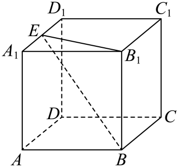

## 讲解

### 判据

几何体中存在同顶点的三条两两垂直方向，或题目已给空间直角坐标系，要求点坐标、向量坐标、轴面对称或正交投影。三条不共面的边只保证可以作一般基底；建直角系还须正交。

### 流程

1. 选便于定位点的原点和正方向。把所选三轴的垂直依据说清，通常来自正方体、长方体或已有垂直证明。三轴用同一单位；可把棱长数值设为题给的长度，不能把不同长度的棱各自都当1而仍用普通度量。
2. 逐点读有向分量。位于某坐标面就相应一项为0，位于轴上另外两项为0；平行于轴的位移只改变对应分量。中点用端点坐标平均，比例点由明确的向量关系得到。
3. 求AB时终点B减起点A。若求数量积或长度，再核坐标系的单位正交条件，才用三项乘积和或平方和；点的坐标本身不能直接当另一出发点的位移。
4. 对称先找不动的垂足/中心。关于Oxy面，(x,y,z)变成(x,y,−z)；关于x轴，变成(x,−y,−z)；关于原点，变成(−x,−y,−z)。每个变号来自“垂足或中心为两点中点”，而非口诀猜测。
5. 投影到Oxy面时变成(x,y,0)，到x轴时变成(x,0,0)。检查投影点确在指定面/轴、连接方向确与其垂直；投影与反射结果不同。

## 易错

- 三棱能张成空间就直接建直角系：先说明两两垂直，否则只能称一般基底。
- 同时把不同棱长设成坐标1：破坏共同单位，后续距离、夹角会错。
- 关于面和投影到面同写z=0：对称保留距离并反向，投影消去垂直分量。

## 例题

### 原例：HSMA-B3-C1-D92586afa41d6-P0082–P0088

**原题、原答案、原思路与原详解**（原有次序保留，仅规范等价数学符号）：

【例2】（24-25高二上·新疆博尔塔拉·期末）如图，在棱长为2的正方体$ABCD-{A}_{1}{B}_{1}{C}_{1}{D}_{1}$中，E是棱${A}_{1}{D}_{1}$的中点，则$\vec{E{B}_{1}}\cdot \vec{EB}=$（   ）

A．4  B．5  C．6  D．$4\sqrt{2}$

【解题思路】根据$\vec{E{B}_{1}}\cdot \vec{EB}=\left( \vec{E{A}_{1}}+\vec{{A}_{1}{B}_{1}}\right)\cdot \left( \vec{E{A}_{1}}+\vec{A{A}_{1}}+\vec{AB}\right)$，计算可求数量积.

【解答过程】$\vec{E{B}_{1}}\cdot \vec{EB}=\left( \vec{E{A}_{1}}+\vec{{A}_{1}{B}_{1}}\right)\cdot \left( \vec{E{A}_{1}}+\vec{A{A}_{1}}+\vec{AB}\right)=\left( \vec{E{A}_{1}}+\vec{AB}\right)\cdot \left( \vec{E{A}_{1}}+\vec{A{A}_{1}}+\vec{AB}\right)$

$={\vec{E{A}_{1}}}^{2}+\vec{E{A}_{1}}\cdot \vec{A{A}_{1}}+2\vec{E{A}_{1}}\cdot \vec{AB}+\vec{AB}\cdot \vec{A{A}_{1}}+{\vec{AB}}^{2}={1}^{2}+{2}^{2}=5$.

故选：B.

**补讲与核验**

建系选A为原点，AB、AD、AA₁为x、y、z轴的正方向，用同一单位长度1。正方体同顶点三棱两两垂直，因此可建直角系；棱长为2，不是“每条棱自动为单位向量”。

逐点定位：A=(0,0,0)、B=(2,0,0)、A₁=(0,0,2)、D₁=(0,2,2)、B₁=(2,0,2)。E为A₁D₁中点，故E=(0,1,2)。两目标向量终点减起点：EB₁=(2,−1,0)、EB=(2,−1,−2)，数量积2×2+(−1)(−1)+0×(−2)=5，B正确。其余选项4、6、4√2均不等于三项和5。

原解P0085–0086在表示EB时把AA₁写成正号。实际折线应为EA₁+A₁A+AB=EA₁−AA₁+AB；该向量等式原文不成立。由于EB₁的竖直分量为0，漏负号的竖直项最后与EB₁数量积仍为0，所以原答案5恰未受影响；这不意味着错误表示可通用。

### 原例：HSMA-B3-C1-Ddc1290440c10-P0040–P0045

**原题、原答案、原思路与原详解**（原有次序保留，仅规范等价数学符号）：

【变式1-1】（24-25高二上·广东肇庆·期末）在空间直角坐标系中有一点$P\left( 2024, 2025, 2026\right)$，则该点关于$x$轴对称点${P}^{\prime}$的坐标为（   ）

A．$\left( 2024,-2025,-2026\right)$  B．$\left( -2024,2025,2026\right)$

C．$\left( -2024,-2025,-2026\right)$  D．$\left( -2024,-2025,2026\right)$

【解题思路】根据对称性即可求解.

【解答过程】$P\left( 2024, 2025, 2026\right)$关于$x$轴对称点${P}^{\prime}$的坐标$\left( 2024,-2025,-2026\right)$,

故选：A.

**补讲与核验**

P到x轴的垂足M=(2024,0,0)。关于x轴对称时，P、P′在过M且垂直x轴的直线上，M为中点，所以 $P^{\prime}=2M-P=(2024,-2025,-2026)$。A正确。B只翻x，表示关于yOz面对称；C全翻是关于原点；D翻x、y但保持z，是关于z轴。这里x轴是空间中的直线，另外两个分量需一起取反。

## 资料疑点与勘误

D92586afa41d6-P0085–P0086原解的 EB 表示应含 A₁A=−AA₁；原文正号保留，补讲写出正确折线并说明答案恰未改变的原因。

## 来源

原件：专题1.4 空间向量及其运算的坐标表示（举一反三讲义）数学人教A版2019选择性必修第一册（解析版）.docx。

知识与题型口径：HSMA-B3-C1-Ddc1290440c10-P0015–P0057；所选原例见例标题段落号。

原件：专题1.2 空间向量的数量积运算（举一反三讲义）数学人教A版2019选择性必修第一册（解析版）.docx。

知识与题型口径：HSMA-B3-C1-D92586afa41d6-P0081–P0088；所选原例见例标题段落号。
