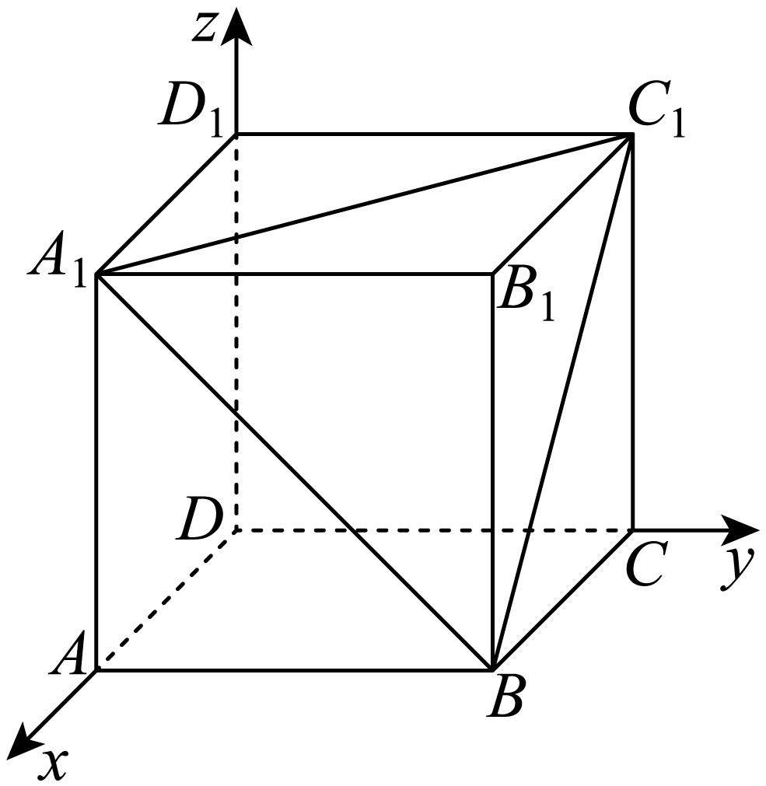

## 讲解

### 判据

直线方向取两不同点的位移；平面法方向解“与两个不共线面内方向数量积为0”，并剔除零向量。求一个方向通常无需单位化，题若要求单位向量再除以模。

### 流程

1. **读坐标系统。** 坐标数量积x₁x₂+y₁y₂+z₁z₂只在空间直角坐标系或单位正交基底下直接使用。
2. **取方向。** 直线AB取B坐标减A，核A≠B；平面取AB、AC或另两面内非平行方向，核不共线。
3. **设n=(x,y,z)建式。** 两个数量积为0，逐项代面内方向坐标，不能只看某个分量形似垂直。
4. **解并选非零。** 确认可作为自由分量的变量后取方便值，使n≠0；必要时换自由分量。
5. **代回两式。** 一式通过不足；两式均0且方向合法即可。其非零倍数等价，单位化只在需要时做。

## 例题

### 原例（HSMA-B3-C1-Df3c5c6c7abec-P0026—P0032）

**原题与原解析（保留）**

【例1】（24-25高二上·浙江杭州·期末）已知$A(0,4,0),B(3,0,0),C(0,0,2)$，则平面ABC的一个法向量可以为（   ）

A．$(4,3,6)$  B．$(-4,3,6)$  C．$(4,-3,6)$  D．$(4,3,-6)$

【解题思路】由题设$\vec{AB}=(3,-4,0)$，$\vec{AC}=(0,-4,2)$，根据平面的法向量性质及空间向量数量积的坐标运算求法向量即可.

【解答过程】由题设$\vec{AB}=(3,-4,0)$，$\vec{AC}=(0,-4,2)$，

若$\vec{m}=(x,y,z)$是平面ABC的一个法向量，则$\left\{ \begin{aligned}\vec{m}\cdot \vec{AB}=3x-4y=0\\\vec{m}\cdot \vec{AC}=-4y+2z=0\end{aligned}\right.$，

取$y=3$，则$\vec{m}=(4,3,6)$.

故选：A.

### 补讲

AB=(3,−4,0)、AC=(0,−4,2)，两者不共线：AB首坐标3，而AC首坐标0且非零。设n=(x,y,z)，要求n≠0且n·AB=0、n·AC=0，得到3x−4y=0、−4y+2z=0。

解第一式x=4y/3、第二式z=2y。取非零方便值y=3，得(4,3,6)，所以A。代回两数量积均0；B代AB得到−24，C代AB得到24，D代AC得到−24，均不满足。取y=0会使x=z=0，不能作法向量。

### 原例（HSMA-B3-C1-Df3c5c6c7abec-P0049—P0059）

**原题与原解析（保留）**

【变式1-3】（24-25高二上·陕西铜川·阶段练习）如图，已知正方体$ABCD-{A}_{1}{B}_{1}{C}_{1}{D}_{1}$的棱长为1，以D为原点，以$\left\{ \vec{DA},\vec{DC},\vec{D{D}_{1}}\right\}$为单位正交基底，建立空间直角坐标系，则平面${A}_{1}B{C}_{1}$的一个法向量是（    ）

A．$\left( 1,1,1\right)$  B．$\left( -1,1,1\right)$

C．$\left( 1,-1,1\right)$  D．$\left( 1,1,-1\right)$

【解题思路】根据法向量的求解方法求解即可.

【解答过程】由题意，${A}_{1}\left( 1,0,1\right)$，$B\left( 1,1,0\right)$，${C}_{1}\left( 0,1,1\right)$，

$\therefore \vec{{A}_{1}{C}_{1}}=\left( -1,1,0\right)$，$\vec{B{C}_{1}}=\left( -1,0,1\right)$，

设$\vec{n}=\left( x,y,z\right)$是平面${A}_{1}B{C}_{1}$的一个法向量，

则有$\left\{ \begin{aligned}\vec{{A}_{1}{C}_{1}}\cdot \vec{n}=-x+y=0\\\vec{B{C}_{1}}\cdot \vec{n}=-x+z=0\end{aligned}\right.$，令$x=1$，得$y=1$，$z=1$，

$\therefore \vec{n}=\left( 1,1,1\right)$.

故选：A.

### 补讲

D为原点、DA、DC、DD₁为单位正交基底，所以A₁=(1,0,1)、B=(1,1,0)、C₁=(0,1,1)。面内两个方向A₁C₁=(−1,1,0)、BC₁=(−1,0,1)不共线。

设n=(x,y,z)，垂直两方向得−x+y=0、−x+z=0，所以y=z=x，取x=1得(1,1,1)，A正确。B代第一个方向数量积2，C代第一个−2，D代第二个−2，都不合格。方向可以取反，不一定要两向量共同起点；只须方向确在同一平面且不共线，点的位置判断才另需共同基点。

## 易错

- 取同一直线的两个方向会给重复约束，不能据此认定法方向。
- n=0也满足线性方程，但没有法方向；每一步都保留非零要求。
- 面内方向可以反向或不共起点，求法方向不受影响；位置判断则另核点和连接。

## 来源

原件：专题1.5 空间向量的应用（一）：用空间向量研究直线、平面的位置关系（举一反三讲义）数学人教A版2019选择性必修第一册（解析版）.docx；来源 ID：Df3c5c6c7abec。

知识与分类定位：HSMA-B3-C1-Df3c5c6c7abec-P0016—P0025。

选用原例：HSMA-B3-C1-Df3c5c6c7abec-P0026—P0032, HSMA-B3-C1-Df3c5c6c7abec-P0049—P0059。
