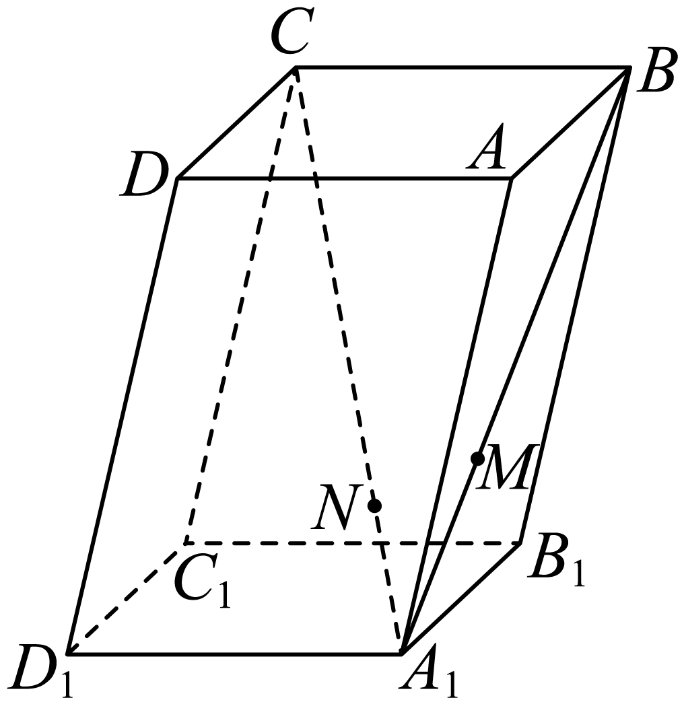
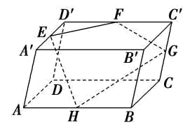

## 讲解

### 判据

三点共线常写同一顶点出发的两个向量为倍数；四点共面常写同一顶点出发的第三向量为两个不共线方向的组合。只核自由向量方向关系后，要补点的连接位置。

### 流程

1. **明确要证明的点。** 共线选其中一个作起点；共面选三个不共线点确定平面，再把第四点接到同一起点。
2. **由分点算位移。** 比如M在线段AB上且AM:MB=1:2，则向量AM=AB/3，不是AB/2；平行六面体对应棱可按同向平移代换。
3. **全部转同一基底。** 几何中非退化三棱可作空间基底，逐条表示所需向量。
4. **建立方向关系并补位置。** 倍数加共同起点给点共线；两方向组合加共同起点给点共面。若中途是HG、EF、EH，先用EG=EH+HG把HG接回E。
5. **核不退化。** 指定直线需两不同点，指定平面需三个不共线点；未满足时只说明能落在某条线或某个平面，不假称唯一指定平面。

## 例题

### 原例（HSMA-B3-C1-D6e974c7bcf1d-P0215—P0224）

**原题与原解析（保留）**

【例5】（24-25高二上·上海·课后作业）如图，在平行六面体$ABCD-{A}_{1}{B}_{1}{C}_{1}{D}_{1}$中，点$M$在对角线${A}_{1}B$上，且$\left| {A}_{1}M\right|=\frac{1}{2}\left| MB\right|$，点$N$在对角线${A}_{1}C$上，且$\left| {A}_{1}N\right|=\frac{1}{3}\left| NC\right|$．求证：$M$、$N$、${D}_{1}$三点共线．

【解题思路】取空间的一个基底$\{\vec{AB},\vec{AD},\vec{A{A}_{1}}\}$，结合图形，利用空间向量的线性运算推理作答.

【解答过程】在平行六面体$ABCD-{A}_{1}{B}_{1}{C}_{1}{D}_{1}$中，令$\vec{AB}=\vec{a}$，$\vec{AD}=\vec{b}$，$\vec{A{A}_{1}}=\vec{c}$，

则$\vec{{D}_{1}{A}_{1}}=\vec{DA}=-\vec{b}$，$\vec{{A}_{1}B}=\vec{AB}-\vec{A{A}_{1}}=\vec{a}-\vec{c}$，$\vec{{A}_{1}M}=\frac{1}{3}\vec{{A}_{1}B}=\frac{1}{3}\left( \vec{a}-\vec{c}\right)$，

因此$\vec{{D}_{1}M}=\vec{{D}_{1}{A}_{1}}+\vec{{A}_{1}M}=-\vec{b}+\frac{1}{3}\left( \vec{a}-\vec{c}\right)=\frac{1}{3}\left( \vec{a}-3\vec{b}-\vec{c}\right)$，

又$\vec{{A}_{1}C}=\vec{{A}_{1}B}+\vec{BC}=\vec{{A}_{1}B}+\vec{AD}=\vec{a}-\vec{c}+\vec{b}$，$\vec{{A}_{1}N}=\frac{1}{4}\vec{{A}_{1}C}=\frac{1}{4}\left( \vec{a}-\vec{c}+\vec{b}\right)$，

因此$\vec{{D}_{1}N}=\vec{{D}_{1}{A}_{1}}+\vec{{A}_{1}N}=-\vec{b}+\frac{1}{4}\left( \vec{a}-\vec{c}+\vec{b}\right)=\frac{1}{4}\left( \vec{a}-3\vec{b}-\vec{c}\right)$，

于是$\vec{{D}_{1}M}=\frac{4}{3}\vec{{D}_{1}N}$，即有$\vec{{D}_{1}M}//\vec{{D}_{1}N}$，而$\vec{{D}_{1}M}$与$\vec{{D}_{1}N}$有公共点${D}_{1}$，

所以$M$、$N$、${D}_{1}$三点共线．

### 补讲

取a=AB、b=AD、c=AA₁，三者不共面。由A₁M:MB=1:2，A₁M占完整A₁B的1/3；由A₁N:NC=1:3，A₁N占完整A₁C的1/4。

D₁A₁=−b，A₁B=a−c，故D₁M=−b+(a−c)/3=(a−3b−c)/3。另A₁C=a+b−c，故D₁N=−b+(a+b−c)/4=(a−3b−c)/4。因此D₁M=(4/3)D₁N，两向量有同一起点D₁，且共同组合含非零a系数，不是零退化，得M、N、D₁共线。

这证明的是点共线。若只得到两个没有公共关联点的自由向量平行，不能把四个端点一起称共线；本题公共D₁使位置条件落实。

### 原例（HSMA-B3-C1-D6e974c7bcf1d-P0225—P0235）

**原题与原解析（保留）**

【变式5-1】（24-25高二上·全国·课后作业）如图，已知平行六面体$ABCD-{A}^{\prime}{B}^{\prime}{C}^{\prime}{D}^{\prime}$，$E$，$F$，$G$，$H$分别是棱${A}^{\prime}{D}^{\prime}$，${D}^{\prime}{C}^{\prime}$，${C}^{\prime}C$和$AB$的中点，求证：$E$，$F$，$G$，$H$四点共面．

【解题思路】利用空间向量的共面定理证明即可.

【解答过程】证明取$\vec{E{D}^{\prime}}=\vec{a}$，$\vec{EF}=\vec{b}$，$\vec{EH}=\vec{c}$，

则$\vec{HG}=\vec{HB}+\vec{BC}+\vec{CG}$

$=\vec{{D}^{\prime}F}+2\vec{E{D}^{\prime}}+\frac{1}{2}\vec{A{A}^{\prime}}$

$=\vec{EF}-\vec{E{D}^{\prime}}+2\vec{E{D}^{\prime}}+\frac{1}{2}\left( \vec{AH}+\vec{HE}+\vec{E{A}^{\prime}}\right)$

$=\vec{b}-\vec{a}+2\vec{a}+\frac{1}{2}\left( \vec{AH}+\vec{HE}+\vec{E{A}^{\prime}}\right)$

$=\vec{b}+\vec{a}+\frac{1}{2}\left( \vec{b}-\vec{a}-\vec{c}-\vec{a}\right)=\frac{3}{2}\vec{b}-\frac{1}{2}\vec{c}$，

所以$\vec{HG}$与$\vec{b}$，$\vec{c}$共面,即$\vec{HG}$与$\vec{EF},\vec{EH}$共面，

即$E$，$F$，$G$，$H$四点共面．

### 补讲

原解得到HG=(3/2)EF−(1/2)EH，但HG起点H而其余起点E。先接回共同起点：EG=EH+HG=(3/2)EF+(1/2)EH。EF、EH不共线，所以G落在由E、F、H确定的平面内，四点共面。

还可用同顶点三棱a=AB、b=AD、c=AA′核算中点：AE=b/2+c，AF=a/2+b+c，AG=a+b+c/2，AH=a/2。因此EF=(a+b)/2、EH=a/2−b/2−c、EG=a+b/2−c/2；代入右式可直接核相等。

EF、EH不共线，因为前者在原a、b方向内，而后者c系数−1、不能成为其倍数。原解的E到D′、EF、EH是计算辅助向量，没有宣称三者是空间基底。这里EG用面内两方向表示的两个系数无需和1；只有将位置向量表示成E、F、H三个点的共同基点位置向量时，三点权重才和1。

## 易错

- A₁M:MB是子段比，转成完整A₁B的份额时分母要用1+2。
- 不同起点自由向量共面不能直接把全部端点称共面；先接回共同起点。
- 两面内位移组合的系数不必和1；三顶点位置向量的仿射权重才和1。

## 来源

原件：专题1.1 空间向量及其线性运算（举一反三讲义）数学人教A版2019选择性必修第一册（解析版）.docx；来源 ID：D6ae06c103585。

原件：专题1.3 空间向量基本定理（举一反三讲义）数学人教A版2019选择性必修第一册（解析版）.docx；来源 ID：D6e974c7bcf1d。

知识与分类定位：HSMA-B3-C1-D6ae06c103585-P0233—P0235, HSMA-B3-C1-D6e974c7bcf1d-P0197—P0200, HSMA-B3-C1-D6e974c7bcf1d-P0214—P0214。

选用原例：HSMA-B3-C1-D6e974c7bcf1d-P0215—P0224, HSMA-B3-C1-D6e974c7bcf1d-P0225—P0235。
