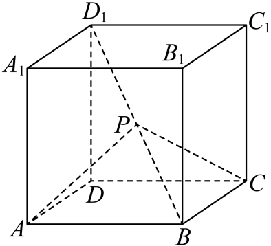

## 讲解

### 判据

出现“两个方向垂直”“某角为直角”或“参数取何值使垂直”，可将条件转为数量积0。若只有一个参数向量、另一个方向固定，通常先展开再解参数；若是几何中动点P的角，必须用从P发出的两向量PA、PC。

### 流程

1. 明确参与垂直的两个向量，并记录它们非零的条件、动点所在范围、分母限制。数量积0包括零向量，非零条件是把代数等式转回直角的桥梁。
2. 选择便于表示的基础向量。几何的边向量有已知模和夹角时，先表示目标方向；正方体的同顶点三棱两两垂直，可让交叉项为0，简化方程。
3. 将两个完整目标向量作数量积，按分配律展开。固定a时 $\vec a\cdot(\vec a-\lambda\vec b)=|\vec a|^2-\lambda\vec a\cdot\vec b$；只有已知a·b非零才能将其除到另一边。
4. 解实数方程，但此时得到的是候选。若二次式可因式分解，说明因子为何为0，不直接从图猜某个根。
5. 把每个候选代回原向量和几何范围。去掉使方向为零、动点取禁用端点或范围不符的值；余下解要能同时满足数量积0和所有原条件。

## 易错

- 方程有两个根就全收：范围及非零条件仍是题目的一部分。
- 图中两条直线垂直就任取反向边：数量积0本身不受反向影响，但表示关系中的负号会影响参数方程。
- a·b=0时仍除以a·b：此时回到原方程讨论，不能使用除法求参数。

## 例题

### 原例：HSMA-B3-C1-D92586afa41d6-P0201–P0212

**原题、原答案、原思路与原详解**（原有次序保留，仅规范等价数学符号）：

【例5】（24-25高二上·内蒙古赤峰·期末）如图，设动点$P$在棱长为$1$的正方体$ABCD-{A}_{1}{B}_{1}{C}_{1}{D}_{1}$的对角线$B{D}_{1}$上（不含端点），$\frac{{D}_{1}P}{{D}_{1}B}=\lambda $，当$\angle APC$为直角时，$\lambda $的值是（    ）

  

A．2  B．1  C．$\frac{1}{2}$  D．$\frac{1}{3}$

【解题思路】用$\vec{DA},\vec{DC},\vec{D{D}_{1}}$表示$\vec{PA},\vec{PC}$，再根据它们的数量积为零可求$\lambda $的值.

【解答过程】由题设有$\vec{{D}_{1}B}=\vec{{D}_{1}D}+\vec{DA}+\vec{DC}=-\vec{D{D}_{1}}+\vec{DA}+\vec{DC}$，

故$\vec{{D}_{1}P}=\lambda \vec{{D}_{1}B}=-\lambda \vec{D{D}_{1}}+\lambda \vec{DA}+\lambda \vec{DC}$，

而$\vec{PA}=\lambda \vec{D{D}_{1}}-\lambda \vec{DA}-\lambda \vec{DC}+\vec{DA}-\vec{D{D}_{1}}=\left( \lambda -1\right)\vec{D{D}_{1}}+\left( 1-\lambda \right)\vec{DA}-\lambda \vec{DC}$，

同理，$\vec{PC}=\left( \lambda -1\right)\vec{D{D}_{1}}+\left( 1-\lambda \right)\vec{DC}-\lambda \vec{DA}$，

因为$\angle APC$为直角，故$\vec{PC}\cdot \vec{PA}=0$，

故${\left( \lambda -1\right)}^{2}-2\lambda \left( 1-\lambda \right)=0$，故$3{\lambda }^{2}-4\lambda +1=0$，

故$\lambda =1$（舍）或$\lambda =\frac{1}{3}$，

故选：D.

**补讲与核验**

本题P在BD₁内部，所以0<λ<1，须在解方程以前记下。设u=DA、v=DC、w=DD₁，它们两两垂直且模为1。D₁B=u+v−w，所以D₁P=λ(u+v−w)。由 $\overrightarrow{DP}=\overrightarrow{DD_1}+\overrightarrow{D_1P}$ 得DP=λu+λv+(1−λ)w。

PA=DA−DP=(1−λ)u−λv+(λ−1)w；PC=DC−DP=−λu+(1−λ)v+(λ−1)w。因为P高度1−λ>0，而A、C在底面，PA、PC都非零，故∠APC为直角当且仅当PA·PC=0。

正交基向量交叉项全为0，三个同方向系数乘积依次为−λ(1−λ)、−λ(1−λ)、(λ−1)²。相加得
$$3\lambda^2-4\lambda+1=(\lambda-1)(3\lambda-1)=0.$$
候选λ=1或1/3。λ=1给P=B，违反“不含端点”，故舍去；λ=1/3在(0,1)内、PA及PC非零且数量积0，保留。D正确，B是未筛范围的端点根；A超出线段内部；C代入原方程得3/4−2+1=−1/4，不为0。

## 来源

原件：专题1.2 空间向量的数量积运算（举一反三讲义）数学人教A版2019选择性必修第一册（解析版）.docx。

知识与题型口径：HSMA-B3-C1-D92586afa41d6-P0200–P0251；所选原例见例标题段落号。
