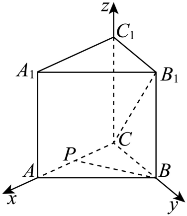
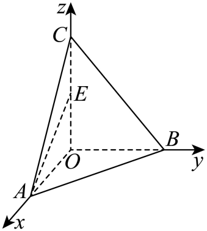

## 讲解

### 判据与流程

要求两直线所成角或直线与平面所成角时，用坐标数量积可以避免作辅助平行线或射影，但先决定对应角的范围和函数。

1. **定对象。**两线较小角θ在[0,π/2]，异面时不含0；线面角α在[0,π/2]，含平行与垂直端点。题要正弦就最终报正弦，不能算了另一个角的余弦便停止。
2. **建系取向量。**先证明三轴互垂，单位一致；线方向用终点减起点，面法向量由两个不共线面内方向求得。检查全非零，使夹角分母合法。
3. **选式。**两线用cosθ=|u·v|/(|u||v|)；线面用sinα=|u·n|/(|u||n|)。绝对值来自几何直线无向与锐直取值，任意方向反向不应改变所求角。
4. **按点积/模逐行算。**先算点积，再各算模平方，最后开根并相除；不能把模平方直接放在模的位置。若要换求另一三角函数，用sin²+cos²=1并按范围取非负根。
5. **检查端点与结果。**比值在[0,1]；线面比值0对应面内或平行，1对应垂直。垂直时投影向量为0，不另给它定义夹角。若要求实际角，因范围已定，反求唯一的0到90°角。

## 易错

法向量夹角β与线面角互余，且任取方向夹角可能钝；规范先取较小β再取余角。直线方向与法向量点积的负号是任意朝向造成，线面角仍非负。普通坐标公式不能用于未按度量处理的斜基底。

知识与分类依据：`HSMA-B3-C1-D906811c3e3b1-P0266-P0291`（《专题1.6 空间向量的应用（二）：用空间向量研究距离、夹角问题（举一反三讲义）数学人教A版2019选择性必修第一册（解析版）.docx》）；`HSMA-B3-C1-D906811c3e3b1-P0292-P0292`（《专题1.6 空间向量的应用（二）：用空间向量研究距离、夹角问题（举一反三讲义）数学人教A版2019选择性必修第一册（解析版）.docx》）；`HSMA-B3-C1-D906811c3e3b1-P0345-P0345`（《专题1.6 空间向量的应用（二）：用空间向量研究距离、夹角问题（举一反三讲义）数学人教A版2019选择性必修第一册（解析版）.docx》）。原文、补条件与勘误分别说明。

## 例题

### 原例：点积与模对应线线角余弦

来源：`HSMA-B3-C1-D906811c3e3b1-P0293-P0302`；原件《专题1.6 空间向量的应用（二）：用空间向量研究距离、夹角问题（举一反三讲义）数学人教A版2019选择性必修第一册（解析版）.docx》。题号、学年及地区按讲义原标注，未另作来源核验。

以下完整保留原题、原答案与原详解（仅统一等价公式排版及配图路径）：

【例5】（24-25高二上·贵州六盘水·期末）直三棱柱$ABC-{A}_{1}{B}_{1}{C}_{1}$中，$\angle ACB=90^{\circ}$，$AC=BC=A{A}_{1}=2$，点$P$是$AC$的中点，则直线${B}_{1}C$与$BP$所成角的余弦值为（    ）

A．$\frac{1}{5}$  B．$\frac{\sqrt{10}}{10}$  C．$\frac{\sqrt{10}}{5}$  D．$\frac{3\sqrt{10}}{10}$

【答案】C

【解题思路】根据条件，建立空间直角坐标系，求出$\vec{{B}_{1}C},\vec{BP}$，再利用线线角的向量法，即可求解.

【解答过程】由题可建立，以$C$为坐标原点的空间直角坐标系$C-xyz$，如图所示，

因为$AC=BC=A{A}_{1}=2$，点$P$是$AC$的中点，所以$P\left( 1,0,0\right),B\left( 0,2,0\right),{B}_{1}\left( 0,2,2\right)$，

则$\vec{{B}_{1}C}=\left( 0,-2,-2\right),\vec{BP}=\left( 1,-2,0\right)$，

设直线${B}_{1}C$与$BP$所成的角为$\theta $，则$\cos \theta =\left| \cos \left\langle  \vec{{B}_{1}C},\vec{BP}\right\rangle \right|=\frac{\left| \vec{{B}_{1}C}\cdot \vec{BP}\right|}{\left| \vec{{B}_{1}C}\right|\cdot \left| \vec{BP}\right|}=\frac{4}{2\sqrt{2}\times \sqrt{5}}=\frac{\sqrt{10}}{5}$，

故选：C.

#### 补充讲解

直三棱柱的侧棱垂底面，AC⊥BC，因此以C为原点、CA/CB/CC₁为三轴有两两垂直依据。P为AC中点，原坐标得到u=B₁C=(0,−2,−2)、v=BP=(1,−2,0)。u·v=4，u²=8、v²=5，所以cosθ=|4|/√(8×5)=4/√40=√10/5，选C。

方向u或v反向会使点积变负，但同一两条直线没有朝向，几何角不随任意方向选择改变；必须取绝对值。两方向不共线，故角大于0；余弦在[0,1]内，符合两线较小角的范围。A、B、D均不等于4/√40，不能把有向向量的钝角当所求线线角。

### 原例：方向与法向量对应线面角正弦

来源：`HSMA-B3-C1-D906811c3e3b1-P0346-P0360`；原件《专题1.6 空间向量的应用（二）：用空间向量研究距离、夹角问题（举一反三讲义）数学人教A版2019选择性必修第一册（解析版）.docx》。题号、学年及地区按讲义原标注，未另作来源核验。

以下完整保留原题、原答案与原详解（仅统一等价公式排版及配图路径）：

【例6】（24-25高二上·辽宁丹东·期末）在三棱锥$O-ABC$中，$OA,OB,OC$两两互相垂直，$E$为$OC$的中点，且$OB=OC=2OA$，则直线$AE$与平面$ABC$所成角的正弦值为（   ）

A．$\frac{\sqrt{3}}{6}$  B．$\frac{\sqrt{3}}{12}$  C．$\frac{\sqrt{6}}{6}$  D．$\frac{\sqrt{6}}{3}$

【答案】A

【解题思路】建立空间直角坐标系求出平面$ABC$的法向量，再由线面角的向量求法可得结果.

【解答过程】因为$OA,OB,OC$两两互相垂直，分别以$OA,OB,OC$所在直线为$x,y,z$轴建立空间直角坐标系，如下图所示：

由$OB=OC=2OA$可设$OA=1$，则$OB=OC=2$，

因此$O\left( 0,0,0\right),A\left( 1,0,0\right),B\left( 0,2,0\right),C\left( 0,0,2\right),E\left( 0,0,1\right)$，

显然$\vec{AE}=\left( -1,0,1\right)$，$\vec{AB}=\left( -1,2,0\right),\vec{AC}=\left( -1,0,2\right)$，

设平面$ABC$的一个法向量为$\vec{n}=\left( x,y,z\right)$，

则$\left\{ \begin{aligned}\vec{AB}\cdot \vec{n}=-x+2y=0\\\vec{AC}\cdot \vec{n}=-x+2z=0\end{aligned}\right.$，令$x=2$，则$y=1,z=1$；

所以$\vec{n}=\left( 2,1,1\right)$，

设直线$AE$与平面$ABC$所成的角为$\theta $，

所以$\sin \theta =\left| \cos \left\langle  \vec{AE},\vec{n}\right\rangle \right|=\frac{\left| \vec{AE}\cdot \vec{n}\right|}{\left| \vec{AE}\right|\left| \vec{n}\right|}=\frac{\left| -2+1\right|}{\sqrt{2}\times \sqrt{6}}=\frac{1}{2\sqrt{3}}=\frac{\sqrt{3}}{6}$.

故选：A.

#### 补充讲解

两两垂直的OA、OB、OC给建系依据。原缩放令OA=1，是将几何体统一按同一倍数缩放，不改角；若只改某一棱会改变结果。

u=AE=(−1,0,1)非零，平面内AB=(−1,2,0)、AC=(−1,0,2)不共线。n=(2,1,1)与AB、AC的点积都是−2+2=0，且n²=6，确为法向量。u·n=−2+1=−1，u²=2，所以sinθ=1/√(2×6)=1/(2√3)=√3/6，选A。

方向AE与法向量夹角为钝角，其余弦负；几何线面角在0到90°，须先取方向和法向量的较小角，再取余角，或直接用上式正弦绝对值。负点积不表示线面角负，也不能把法向量夹角的余弦当成线面角余弦。原sin值既不等于√3/12、√6/6，也不等于√6/3，其余选项不符。
