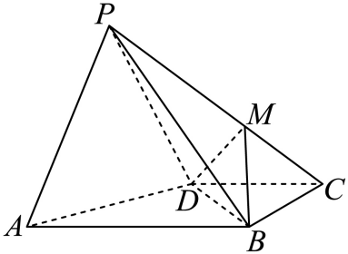
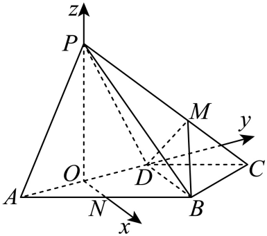

## 讲解

### 判据与流程

题问棱/线段上是否存在一点，使平行、垂直、角度或距离达到要求时，方程只给候选；完整存在性证明还要确认几何对象不退化且候选回代满足原条件。

1. **按位置参数化。**线段UV上点X=U+t(V−U)，0≤t≤1；若题限定内部则0<t<1，若射线则t≥0。参数起点决定UX/UV=t，不把不同起点的比例混用。
2. **先划出退化/非法值。**方向为0、三点共线、法向量为0的参数值会使直线或平面及其夹角式不存在，应先剔除或单独按原定义讨论。平行题还须排除包含/重合。
3. **把目标译成合适关系。**线面角用方向与法向量的正弦式；点面距离用法向分量；指定二面角先保存半平面方向。法向量含参数时要检验每个候选都非零，避免两边分母化简时丢条件。
4. **解方程但保留符号。**绝对值方程按分支或合法区间拆开。含根号可在两边非负、分母非零时平方；若目标有指定余弦正负，平方会丢符号，务必回原式检验。
5. **筛选并证明足够。**舍去区间外根与退化根；将剩余根代回未平方原角/距离式，给出相应点确在范围、方向及平面有效的理由。全部候选不合法时才判不存在，并说明为何没有其它解。
6. **回答原问题。**报点、长度或位置比例，明确端点是否可取、是否多个解。解出t不自动等于原题的某段比，须按参数方向转换。

## 易错

方程有实根不等于原几何有解；范围外根只说明延长线上可能符合。把目标线面角30°误用法向夹角cos30°会造另一方程；正确用sin30°。含参法向量不得通过令某分量1而丢掉该分量必须0的合法配置。

知识与分类依据：`HSMA-B3-C1-Df3c5c6c7abec-P0566-P0566`（《专题1.5 空间向量的应用（一）：用空间向量研究直线、平面的位置关系（举一反三讲义）数学人教A版2019选择性必修第一册（解析版）.docx》）；`HSMA-B3-C1-D906811c3e3b1-P0519-P0519`（《专题1.6 空间向量的应用（二）：用空间向量研究距离、夹角问题（举一反三讲义）数学人教A版2019选择性必修第一册（解析版）.docx》）。原文、补条件与勘误分别说明。

## 例题

### 原例：两个候选都需非退化与原式回代

来源：`HSMA-B3-C1-D906811c3e3b1-P0575-P0601`；原件《专题1.6 空间向量的应用（二）：用空间向量研究距离、夹角问题（举一反三讲义）数学人教A版2019选择性必修第一册（解析版）.docx》。题号、学年及地区按讲义原标注，未另作来源核验。

以下完整保留原题、原答案与原详解（仅统一等价公式排版及配图路径）：

【变式8-2】（24-25高三上·江苏·阶段练习）如图，在四棱锥$P-ABCD$中，$\triangle PAD$是正三角形，$\angle ABC=90^{\circ},AB\parallel CD,AB=2CD=2BC=4$，平面$PAD\perp $平面$ABCD$，$M$是棱$PC$上动点．

(1)求证：平面$MBD\perp $平面$PAD$；

(2)在线段$PC$上是否存在点$M$，使得直线$AP$与平面$MBD$所成角为30°？若存在，求出$\frac{PM}{PC}$的值；若不存在，说明理由．

【答案】(1)证明见解析

(2)存在，$\frac{1}{2}$或$\frac{4}{5}$

【解题思路】（1）由题设证得$AD\perp BD$，取AD的中点$O$，连结PO，应用面面垂直的性质证$PO\perp $平面$ABCD$，再由线面垂直的性质、判定及面面垂直的判定证结论；

（2）取AB的中点$N$，连结ON，则$ON//BD$，构建空间直角坐标系，设$\vec{PM}=\lambda \vec{PC}$，应用向量法，结合线面角大小列方程求$\lambda $，即可得结果.

【解答过程】（1）因为$AB//CD,CD=BC=2,\angle ABC=90^{\circ}$，所以$\angle BCD=90^{\circ},BD=2\sqrt{2}$，

在$\triangle ABD$中$\angle ABD=45^{\circ},AB=4$，由余弦定理得$AD=\sqrt{A{B}^{2}+B{D}^{2}-2AB\cdot BD\cos \angle ABD}=2\sqrt{2}$，

所以$A{D}^{2}+B{D}^{2}=A{B}^{2}$，即$\angle ADB=90^{\circ},AD\perp BD$，

取AD的中点$O$，连结PO，因为$\triangle PAD$是正三角形，所以$PO\perp AD,$

又面$PAD\perp $面ABCD，面$PAD\cap $面$ABCD=AD$，$PO\subset $面$PAD$，

所以$PO\perp $平面$ABCD$，又$BD\subset $平面$ABCD$，所以$PO\perp BD$，

又$AD\perp BD$，$PO\cap AD=O$，$PO,AD\subset $平面$PAD$，所以$BD\perp $平面$PAD$，

又$BD\subset $平面$BDM$，所以平面$MBD\perp $平面$PAD$．

（2）取AB的中点$N$，连结ON，则$ON//BD$，所以$AD\perp ON$

以$\left\{ \vec{ON},\vec{OD},\vec{OP}\right\}$为正交基底建立空间直角坐标系，

则$A\left( 0,-\sqrt{2},0\right),D\left( 0,\sqrt{2},0\right),B\left( 2\sqrt{2},\sqrt{2},0\right),C\left( \sqrt{2},2\sqrt{2},0\right),P\left( 0,0,\sqrt{6}\right)$，

设$\vec{PM}=\lambda \vec{PC}$，$0\le \lambda \le 1$，则$\vec{DM}=\vec{DP}+\vec{PM}=\vec{DP}+\lambda \vec{PC}=\left( 0,-\sqrt{2},\sqrt{6}\right)+\lambda \left( \sqrt{2},2\sqrt{2},-\sqrt{6}\right)=\left( \sqrt{2}\lambda ,2\sqrt{2}\lambda -\sqrt{2},\sqrt{6}-\sqrt{6}\lambda \right)$，

又$\vec{DB}=\left( 2\sqrt{2},0,0\right)$，设平面$BDM$的一个法向量为$\vec{n}=(x,y,z)$，

则$\left\{ \begin{aligned}\vec{DM}\cdot \vec{n}=0\\\vec{DB}\cdot \vec{n}=0\end{aligned}\right.$，即$\left\{ \begin{aligned}\sqrt{2}\lambda x+\sqrt{2}\left( 2\lambda -1\right)y+\sqrt{6}\left( 1-\lambda \right)z=0\\2\sqrt{2}x=0\end{aligned}\right.$，若$z=2\lambda -1$，

取$\vec{n}=\left( 0,\sqrt{3}\left( \lambda -1\right),2\lambda -1\right),\vec{AP}=\left( 0,\sqrt{2},\sqrt{6}\right)$，

由直线AP与平面MBD所成角为$30^{\circ}$，得$\sin 30^{\circ}=\left| \cos \langle \vec{AP},\vec{n}\rangle \right|=\frac{\left| \vec{AP}\cdot \vec{n}\right|}{\left| \vec{AP}\right|\cdot \left| \vec{n}\right|}=\frac{\left| \sqrt{6}\left( \lambda -1\right)+\sqrt{6}\left( 2\lambda -1\right)\right|}{\sqrt{8}\cdot \sqrt{0+3{\left( \lambda -1\right)}^{2}+{\left( 2\lambda -1\right)}^{2}}}=\frac{\sqrt{6}\left| 3\lambda -2\right|}{2\sqrt{2}\cdot \sqrt{7{\lambda }^{2}-10\lambda +4}}$，

化简得$10{\lambda }^{2}-13\lambda +4=0$  解得$\lambda =\frac{1}{2}$或$\lambda =\frac{4}{5}$，

当$\frac{PM}{PC}=\frac{1}{2}$或$\lambda =\frac{4}{5}$时，直线AP与平面$BDM$所成角为$30^{\circ}$.

#### 补充讲解

（1）底面中AB∥CD且AB=CD/2、AD垂直两底边，原长度确定AD²+BD²=AB²，故AD⊥BD。正三角形PAD的中线PO⊥AD，又PO在PAD内且垂直两面交线AD，面PAD⊥底面，故PO⊥底面。于是BD同时垂直AD与PO这两条相交面内直线，BD⊥PAD。BD在BDM内，只要B、D、M不共线，就由面面垂直判定得结论。

（2）设M=P+λ(C−P)，棱PC按闭线段读，0≤λ≤1。原坐标给DB=(2√2,0,0)，DM=(√2λ,√2(2λ−1),√6(1−λ))。DM的后两坐标不可能同时0，因为分别要求λ=1/2和λ=1；所以DM与DB始终不共线，BDM始终是非退化平面，（1）对所有允许M也成立。

n=(0,√3(λ−1),2λ−1)同时垂直DB和DM。代入DM点积为√6(2λ−1)(λ−1)+√6(1−λ)(2λ−1)=0，两项抵消；n不可能为0，因为第二、三坐标同时0也要求λ分别1与1/2。n²=3(λ−1)²+(2λ−1)²=7λ²−10λ+4=7(λ−5/7)²+3/7>0，分母始终合法。AP=(0,√2,√6)，AP²=8，点积AP·n=√6(3λ−2)。

要求线面角30°，其正弦为1/2，按原式把非负两边平方、乘正分母：

$$\frac{6(3\lambda-2)^2}{8(7\lambda^2-10\lambda+4)}=\frac14\quad\Longrightarrow\quad3(3\lambda-2)^2=7\lambda^2-10\lambda+4.$$

左边展开27λ²−36λ+12，移去右边得20λ²−26λ+8=0，除2后10λ²−13λ+4=(2λ−1)(5λ−4)=0，所以λ=1/2或4/5。两值都在[0,1]，且上述方向与平面都不退化。分别回代原未平方正弦式确为1/2；线面角在[0,90°]，因此角就是30°。最后PM/PC=λ，得到1/2或4/5；不是取坐标某项比。若代数方程给线段外值，仍必须舍去；本题两个值均成立。
