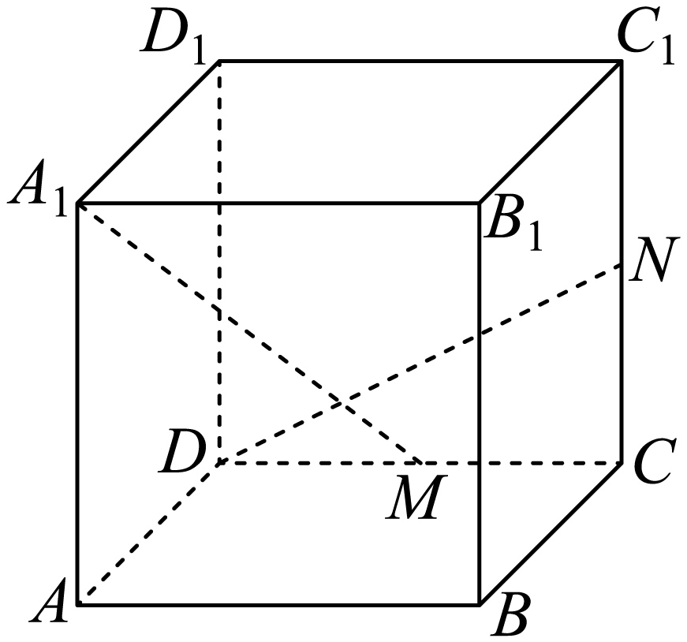
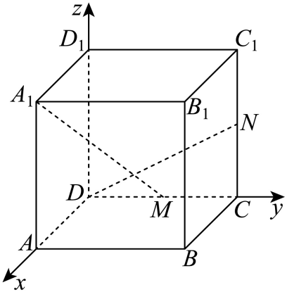
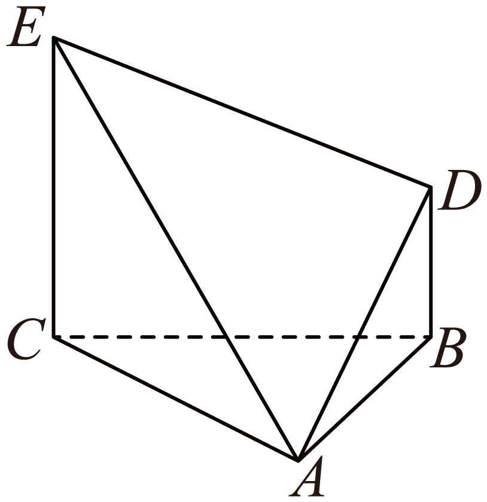
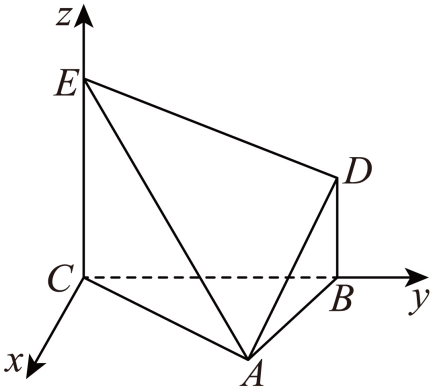

## 讲解

### 判据与流程

题要求垂直，先分清对象。线线方向垂直、线面垂直、面面垂直分别用不同向量关系，不能一律作某两个向量的点积。

1. **固定目标及非退化对象。**两线方向u、v非零；平面内两方向不共线，所得法向量n非零。若题要求相交垂直或完整位置，须同时准备相交/不相交的检验。
2. **线线目标用u·v=0。**点积零给所成角90°。需相交时解两线参数式；需异面垂直时进一步证不相交且不平行。数量积零不带有位置数据。
3. **线面目标用u=λn。**λ非零说明方向沿法线，因而垂直所有面内方向。也可直接证u与面内两个不共线方向点积都0；只证一条面内直线垂直不够，因为其余方向可能不垂直。
4. **面面目标用n·m=0。**两个非零法向量正交使第二法向量属于第一面方向，在第一面内可作一条垂直第二面的直线，故面面垂直。也可先找一个面内的直线，证明它垂直另一面，再用面面垂直判定。
5. **写出依据并回到对象。**点坐标来自题给边长/中点/垂直关系；每个非零和独立条件标清。结果用原题直线或平面名表述，不能只有一个“点积=0”结束。

## 易错

直线方向与平面法向量点积0给平行方向，而非线面垂直；线面垂直恰要共线法向量。面面垂直不是法向量平行。异面垂直仍是空间方向垂直，不能由90°强求两线交点。

知识与分类依据：`HSMA-B3-C1-Df3c5c6c7abec-P0248-P0260`（《专题1.5 空间向量的应用（一）：用空间向量研究直线、平面的位置关系（举一反三讲义）数学人教A版2019选择性必修第一册（解析版）.docx》）；`HSMA-B3-C1-Df3c5c6c7abec-P0261-P0261`（《专题1.5 空间向量的应用（一）：用空间向量研究直线、平面的位置关系（举一反三讲义）数学人教A版2019选择性必修第一册（解析版）.docx》）；`HSMA-B3-C1-Df3c5c6c7abec-P0324-P0324`（《专题1.5 空间向量的应用（一）：用空间向量研究直线、平面的位置关系（举一反三讲义）数学人教A版2019选择性必修第一册（解析版）.docx》）；`HSMA-B3-C1-Df3c5c6c7abec-P0396-P0396`（《专题1.5 空间向量的应用（一）：用空间向量研究直线、平面的位置关系（举一反三讲义）数学人教A版2019选择性必修第一册（解析版）.docx》）。原文、补条件与勘误分别说明。

## 例题

### 原例：先垂直方向再证明异面位置

来源：`HSMA-B3-C1-Df3c5c6c7abec-P0262-P0274`；原件《专题1.5 空间向量的应用（一）：用空间向量研究直线、平面的位置关系（举一反三讲义）数学人教A版2019选择性必修第一册（解析版）.docx》。题号、学年及地区按讲义原标注，未另作来源核验。

以下完整保留原题、原答案与原详解（仅统一等价公式排版及配图路径）：

【例5】（24-25高二上·全国·课后作业）如图，在正方体$ABCD-{A}_{1}{B}_{1}{C}_{1}{D}_{1}$中，$M$，$N$分别是$CD$，$C{C}_{1}$的中点，则直线${A}_{1}M$与$DN$的位置关系是（   ）

A．平行  B．垂直  C．异面垂直  D．异面不垂直

【解题思路】建立空间直角坐标系，利用空间向量求解判断即可.

【解答过程】以$D$为原点，$\vec{DA}$，$\vec{DC}$，$\vec{D{D}_{1}}$的方向分别为$x$轴、$y$轴、$z$轴的正方向，建立空间直角坐标系$Dxyz$，

设正方体$ABCD-{A}_{1}{B}_{1}{C}_{1}{D}_{1}$的棱长为2，

则${A}_{1}\left( 2,0,2\right)$，$M\left( 0,1,0\right)$，$D\left( 0,0,0\right)$，$N\left( 0,2,1\right)$，

$\therefore \vec{{A}_{1}M}=\left( -2,1,-2\right)$，$\vec{DN}=\left( 0,2,1\right)$，

$\therefore \vec{{A}_{1}M}\cdot \vec{DN}=0$，$\therefore {A}_{1}M\perp DN$，

又$DN\subset $平面$DC{C}_{1}{D}_{1}$，${A}_{1}M\not\subset $平面$DC{C}_{1}{D}_{1}$，$M\in $平面$DC{C}_{1}{D}_{1}$，且$M\notin DN$，

$\therefore $直线${A}_{1}M$与$DN$异面垂直．

故选：C．

#### 补充讲解

正方体可统一缩放取棱长2，缩放不改变位置关系。原方向u=A₁M=(−2,1,−2)、v=DN=(0,2,1)，点积−2×0+1×2−2×1=0，二方向非零且垂直，但还没确定是否相交。

直线A₁M上点为(2−2s,s,2−2s)，DN上点为(0,2t,t)。若相交，第一坐标令s=1，第三令t=0，而第二坐标要求1=0，矛盾。因此不相交；二方向不共线，所以两线不是平行，确为异面且所成角90°，原选C。

**选项口径提醒：**空间中“方向垂直”允许异面，两线垂直不自动指相交。原选项B只写“垂直”，在一般空间垂直定义下与C有覆盖；原解用C强调完整位置“异面垂直”。若将B理解为相交垂直，则B不符；不能把本例讲成数量积0已证明两线相交。

### 原例：有效法向量点积零的面面证明

来源：`HSMA-B3-C1-Df3c5c6c7abec-P0397-P0414`；原件《专题1.5 空间向量的应用（一）：用空间向量研究直线、平面的位置关系（举一反三讲义）数学人教A版2019选择性必修第一册（解析版）.docx》。题号、学年及地区按讲义原标注，未另作来源核验。

以下完整保留原题、原答案与原详解（仅统一等价公式排版及配图路径）：

【例7】（24-25高二上·山东菏泽·阶段练习）如图所示，$\triangle ABC$是一个正三角形，$EC\perp $平面$ABC$，$BD//CE$，且$CE=CA=2BD=2$．

(1)求平面$DEA$的法向量；

(2)求证：平面$DEA\perp $平面$ECA$．

【解题思路】（1）以$C$为原点建立空间直角坐标系，根据法向量与平面垂直求出法向量即可；

（2）证明两平面的法向量垂直即可.

【解答过程】（1）因为$EC\perp $平面$ABC$，$CB\subset $平面$ABC$，所以$EC\perp CB$，

以$C$为原点，$CB,CE$所在的直线分别为$y,z$轴建立如图所示的空间直角坐标系，

则$C(0,0,0),A(\sqrt{3},1,0),B(0,2,0),E(0,0,2),D(0,2,1)$，

所以$\vec{EA}=(\sqrt{3},1,-2),\vec{CE}=(0,0,2),\vec{ED}=(0,2,-1)$，

设平面$DEA$的一个法向量是$\vec{n}=(a,b,c)$，

则$\left\{ \begin{aligned}{n}^{\to }\cdot \vec{EA}=\sqrt{3}a+b-2c=0\\{n}^{\to }\cdot \vec{ED}=2b-c=0\end{aligned}\right.$，令$b=1$，则$\vec{n}=(\sqrt{3},1,2)$，

所以平面$DEA$的一个法向量为$(\sqrt{3},1,2)$.

（2）设平面$ECA$的一个法向量是$\vec{m}=(x,y,z)$，

则$\left\{ \begin{aligned}\vec{m}\cdot \vec{EA}=\sqrt{3}x+y-2z=0\\\vec{m}\cdot \vec{CE}=2z=0\end{aligned}\right.$，令$x=1$，则$\vec{m}=(1,-\sqrt{3},0)$，

因为$\vec{m}\cdot {n}^{\to }=1\times \sqrt{3}+(-\sqrt{3})\times 1+0\times 2=0$，所以$\vec{m}\perp \vec{n}$，

所以平面$DEA\perp $平面$ECA$.

#### 补充讲解

EC⊥底面使z轴垂直底面；正三角形边长2，以CB作y正轴，A的投影落CB中点，其高为√(2²−1²)=√3，所以A=(√3,1,0)。沿原图D与E在底面同侧的配置，BD长1且方向平行CE，D=(0,2,1)。如果仅给无向直线BD∥CE而不指定图中同侧配置，不能从“平行”单独推出D的正高度；本例按完整含图原题的位置读取。

EA=(√3,1,−2)、ED=(0,2,−1)不共线。n=(√3,1,2)与EA点积3+1−4=0，与ED点积2−2=0，且n²=8，所以它确为DEA的非零法向量。ECA中EA与CE=(0,0,2)也不共线；m=(1,−√3,0)分别与两方向点积√3−√3=0、0=0，m²=4，确为第二个法向量。

n·m=√3−√3=0，即两个非零法向量垂直。为何这推出面面垂直：n与m垂直，使m属于第一个平面的方向，在DEA内可作一条方向为m的直线；该直线垂直第二平面ECA，所以由面面垂直判定，两平面垂直。不是因为原图看上去张开直角。
