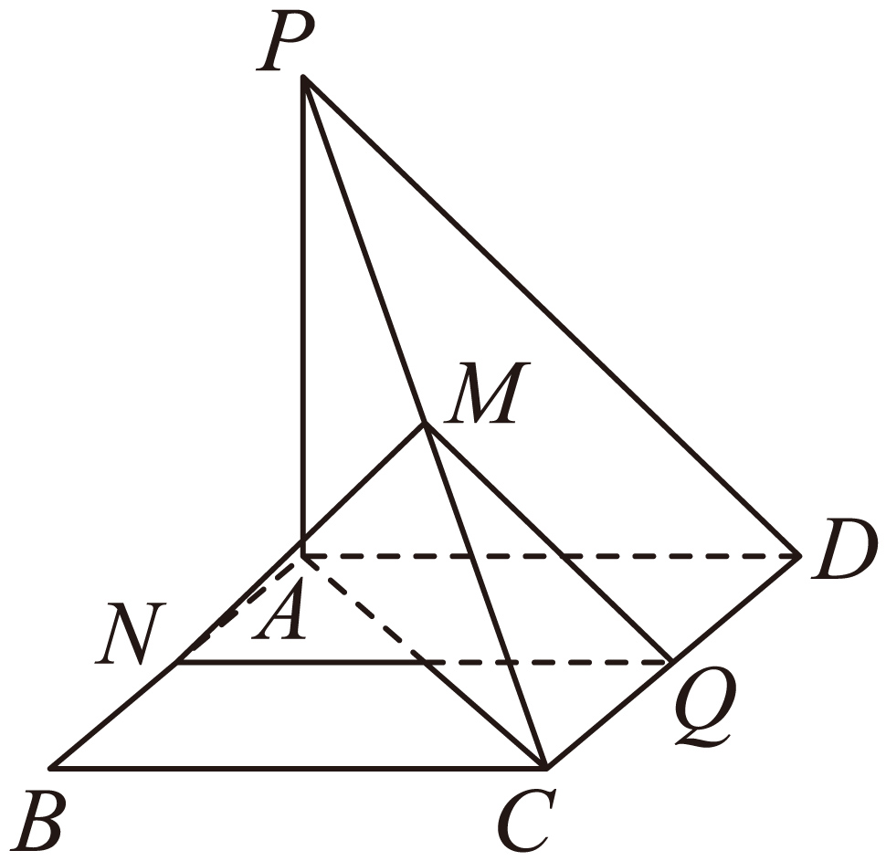
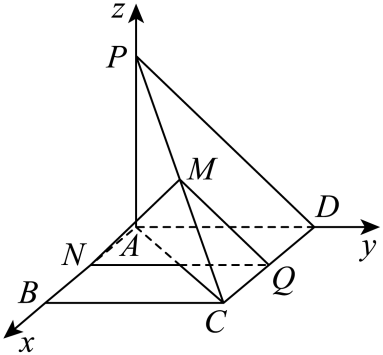

## 讲解

### 判据与流程

题要求线线、线面或面面平行，图中有已知坐标、中点比例或可直接建系的互垂方向时，把“方向相同”和“位置分离”作为两个分别要完成的判断。

1. **保证对象存在。**直线取两不同点的连接向量；平面取两个不共线面内方向求非零法向量。建直角坐标系要先证明三轴两两垂直，不能从画出的斜轴直接用普通点积。
2. **按目标翻译方向。**两线取u=λv，λ非零；线面取u·n=0，或把u写成面内两个独立方向的线性组合；两面取n=λm，λ非零。共线方程比“每项坐标比”稳妥，因为坐标0时不能作分母。
3. **检查位置。**两线方向共线时，取第二线上点B、第一线上点A，证明B−A不共线于u，以排除重合。线面方向相容时，证线上一点A不在α内，即对面内点Q有n·(A−Q)≠0，才排除包含。两面同方向时，证β中一点B不在α内，排除重合。
4. **连接回几何结论。**线上/面内的每次换点只增加与法向量垂直的方向，因此位置检验所得非零法向差对整个对象成立，严格平行得证。若用面内两条相交线各平行目标面来证面面平行，须写清相交、面内与线不在目标面内。
5. **若要解参数，保留合法值。**先解方向方程，再排除方向为0、三点共线或导致包含/重合的值。参数满足一条点积方程，并不自动满足完整平行题。

## 易错

方向向量反向仍表示同一条线，比例负不影响平行。平面法向量反向仍表示同一平面方向，不能以同向正比例作为必需条件。线面点积0是平行方向，几何排除步骤不能省。

知识与分类依据：`HSMA-B3-C1-Df3c5c6c7abec-P0060-P0073`（《专题1.5 空间向量的应用（一）：用空间向量研究直线、平面的位置关系（举一反三讲义）数学人教A版2019选择性必修第一册（解析版）.docx》）；`HSMA-B3-C1-Df3c5c6c7abec-P0074-P0074`（《专题1.5 空间向量的应用（一）：用空间向量研究直线、平面的位置关系（举一反三讲义）数学人教A版2019选择性必修第一册（解析版）.docx》）；`HSMA-B3-C1-Df3c5c6c7abec-P0110-P0110`（《专题1.5 空间向量的应用（一）：用空间向量研究直线、平面的位置关系（举一反三讲义）数学人教A版2019选择性必修第一册（解析版）.docx》）；`HSMA-B3-C1-Df3c5c6c7abec-P0170-P0170`（《专题1.5 空间向量的应用（一）：用空间向量研究直线、平面的位置关系（举一反三讲义）数学人教A版2019选择性必修第一册（解析版）.docx》）。原文、补条件与勘误分别说明。

## 例题

### 原例：坐标共线之后排除两线重合

来源：`HSMA-B3-C1-Df3c5c6c7abec-P0075-P0082`；原件《专题1.5 空间向量的应用（一）：用空间向量研究直线、平面的位置关系（举一反三讲义）数学人教A版2019选择性必修第一册（解析版）.docx》。题号、学年及地区按讲义原标注，未另作来源核验。

以下完整保留原题、原答案与原详解（仅统一等价公式排版及配图路径）：

【例2】（24-25高二上·河南·期末）在空间直角坐标系中，已知$A\left( 1,2,3\right)$，$B\left( -2,-1,6\right)$，$C\left( 3,2,1\right)$，$D\left( 4,3,0\right)$，则直线$AB$与$CD$的位置关系是（    ）

A．异面  B．平行  C．垂直  D．相交但不垂直

【解题思路】利用给定的坐标，求出向量$\vec{AB},\vec{CD},\vec{AC}$的坐标，再借助共线向量判断得解.

【解答过程】由$A\left( 1,2,3\right)$，$B\left( -2,-1,6\right)$，$C\left( 3,2,1\right)$，$D\left( 4,3,0\right)$，

得$\vec{AB}=\left( -3,-3,3\right)$，$\vec{CD}=\left( 1,1,-1\right)$，则$\vec{AB}=-3\vec{CD}$，即$\vec{AB}//\vec{CD}$，

而$\vec{AC}=(2,0,-2)$，显然向量$\vec{AB},\vec{AC}$不共线，即点$C$不在直线$AB$上，

所以直线$AB$与$CD$平行．

故选：B.

#### 补充讲解

由终点减起点，AB=(−3,−3,3)、CD=(1,1,−1)，AB=−3CD且两向量非零，故两线方向平行。还须排除重合：AC=(2,0,−2)，若AC=tAB，由第二坐标0=−3t得t=0，但第一坐标2≠0，矛盾。因此C不在AB上，两线不同，确为平行，选B。

负比例只表示所取方向相反，不使几何直线“不平行”。若只计算出AB=−3CD而未检验C是否在AB上，只能得到平行或重合；原解补AC的步骤正是为排除重合。A、C、D都不符合已经验证的两条不同平行直线。

### 原例：线面与面面平行的完整排除条件

来源：`HSMA-B3-C1-Df3c5c6c7abec-P0171-P0194`；原件《专题1.5 空间向量的应用（一）：用空间向量研究直线、平面的位置关系（举一反三讲义）数学人教A版2019选择性必修第一册（解析版）.docx》。题号、学年及地区按讲义原标注，未另作来源核验。

以下完整保留原题、原答案与原详解（仅统一等价公式排版及配图路径）：

【例4】（24-25高二上·全国·课后作业）如图所示，$ABCD$为矩形，$PA\perp $平面$ABCD$，$PA=AD$，$M$，$N$，$Q$分别是$PC$，$AB$，$CD$的中点．求证：

(1)$MN//$平面$PAD$；

(2)平面$QMN//$平面$PAD$．

【解题思路】（1）由已知可证得$AB,AD,AP$两两垂直，所以以$A$为原点，分别以$AB$，$AD$，$AP$所在直线为$x$轴、$y$轴、$z$轴建立空间直角坐标系，利用空间向量证明；

（2）证明$QN$平行于平面，结合面面平行判定定理证明结论.

【解答过程】（1）证明：因为$PA\perp $平面$ABCD$，$AB,AD\subset $平面$ABCD$，

所以$PA\perp AB,PA\perp AD$，

因为四边形$ABCD$为矩形，所以$AB\perp AD$，

所以$AB,AD,AP$两两垂直，

所以以$A$为原点，分别以$AB$，$AD$，$AP$所在直线为$x$轴、$y$轴、$z$轴建立空间直角坐标系，如图所示，

设$B(b,0,0)$，$D(0,d,0)$，$P(0,0,d)$.

则$C(b,d,0)$，因为$M$，$N$，$Q$分别是$PC$，$AB$，$CD$的中点，

所以$M\left( \frac{b}{2},\frac{d}{2},\frac{d}{2}\right)$，$N\left( \frac{b}{2},0,0\right)$，$Q\left( \frac{b}{2},d,0\right)$，

所以$\vec{MN}=\left( 0,-\frac{d}{2},-\frac{d}{2}\right)$.

因为平面$PAD$的一个法向量为$\vec{m}=(1,0,0)$，

所以$\vec{MN}\cdot \vec{m}=0$，即$\vec{MN}\perp \vec{m}$.

又因为$MN\not\subset $平面$PAD$，所以$MN//$平面$PAD$.

（2）因为$\vec{QN}=(0,-d,0)$，

所以$\vec{QN}\cdot \vec{m}=0$，所以$\vec{QN}\perp \vec{m}$，

又$QN\not\subset $平面$PAD$，所以$QN//$平面$PAD$.

又因为$MN\cap QN=N$，$MN,QN\subset $平面$MNQ$，

所以平面$MNQ//$平面$PAD$.

#### 补充讲解

ABCD是非退化矩形，所以b=AB>0、d=AD=AP>0。PA⊥底面使PA分别垂直AB、AD，矩形给AB⊥AD，三轴两两垂直后才能把点的坐标用于普通点积。

（1）M与N由中点公式得原坐标，MN=(0,−d/2,−d/2)非零，法向量m=(1,0,0)非零，点积0说明方向在PAD方向内。PAD是x=0，M、N的x都为b/2>0，因此整条MN在x=b/2上，确不在PAD内，才可断定MN∥PAD。

（2）Q、M、N均在x=b/2；QN=(0,−d,0)与MN不共线，因为前者z=0、后者z=−d/2≠0。这保证QMN是一个真正平面，且其法向量也可取(1,0,0)。两个平面x=b/2与x=0常数不同，故平行而不重合。原两条相交直线分别平行于PAD的证明也成立；排除条件不能只从图看起来分开得出。
