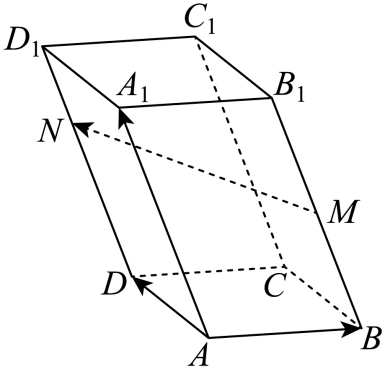
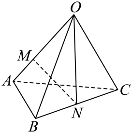

## 讲解

### 判据

题给MN的基向量表示、含未知倍数的分点，或要求系数之和时，先独立由几何位置表示MN，再在同一基底比较系数。起点端给的分比和终点端给的分比不一样。

### 流程

1. **核基底。** 四面体共同顶点三棱或非退化平行六面体三棱不共面，保证线性系数唯一。
2. **统一起点。** 取O或A，把每个分点写位置向量；上端给D₁N比例先转为从下端D出发的DN比例。
3. **终点减起点。** MN=ON−OM，逐项代位置信息，不预设目标的未知系数。
4. **比较完整展开。** 两边都只有同一三基向量后，依据唯一性分别相等，再算题求的和或未知数。
5. **核数量范围。** 点在线段内给倍率0—1；在线或射线上按题设范围，不自行添加内部条件。

## 例题

### 原例（HSMA-B3-C1-D6ae06c103585-P0166—P0172）

**原题与原解析（保留）**

【例4】（24-25高二上·福建莆田·期末）如图，平行六面体$ABCD-{A}_{1}{B}_{1}{C}_{1}{D}_{1}$中，点$M$在$B{B}_{1}$上，点$N$在$D{D}_{1}$上，且$BM=\frac{1}{2}B{B}_{1}$，${D}_{1}N=\frac{1}{3}{D}_{1}D$，若$\vec{MN}=x\vec{AB}+y\vec{AD}+z\vec{A{A}_{1}}$，则$x+y+z=$（    ）

A．$\frac{1}{6}$  B．$\frac{1}{3}$  C．$\frac{2}{3}$  D．$\frac{3}{2}$

【解题思路】根据空间向量的运算法则确定$\vec{MN}=-\vec{AB}+\vec{AD}+\frac{1}{6}\vec{A{A}_{1}}$，得到答案.

【解答过程】$\vec{MN}=\vec{MB}+\vec{BA}+\vec{AD}+\vec{DN}=-\frac{1}{2}\vec{A{A}_{1}}-\vec{AB}+\vec{AD}+\frac{2}{3}\vec{A{A}_{1}}=-\vec{AB}+\vec{AD}+\frac{1}{6}\vec{A{A}_{1}}$，

故$x=-1$，$y=1$，$z=\frac{1}{6}$，$x+y+z=\frac{1}{6}$.

故选：A.

### 补讲

以AB=a、AD=b、AA₁=c。M在BB₁中点，所以BM=c/2、AM=a+c/2。D₁N=D₁D/3意味着DN=2DD₁/3，不是DD₁/3；故AN=b+2c/3。

MN=AN−AM=(b+2c/3)−(a+c/2)=−a+b+(2/3−1/2)c=−a+b+c/6。平行六面体的三棱方向不共面，系数唯一，x=−1、y=1、z=1/6，和1/6，选A。关键是N的比例给自上端D₁，应先换为从D出发，不能直接套为DN=DD₁/3。

### 原例（HSMA-B3-C1-D6ae06c103585-P0173—P0180）

**原题与原解析（保留）**

【变式4-1】（24-25高二上·福建莆田·阶段练习）在四面体OABC中，$\vec{OA}=\vec{a}$，$\vec{OB}=\vec{b}$，$\vec{OC}=\vec{c}$，$\vec{OM}=\lambda \vec{OA}(\lambda >0)$，N为BC的中点，若$\vec{MN}=-\frac{3}{4}\vec{a}+\frac{1}{2}\vec{b}+\frac{1}{2}\vec{c}$，则λ=（    ）

A．$\frac{1}{3}$  B．$\frac{3}{4}$  C．$\frac{2}{3}$  D．$\frac{1}{4}$

【解题思路】利用空间向量的线性运算，求得$\vec{MN}=-\lambda {a}^{\to }+\frac{1}{2}{b}^{\to }+\frac{1}{2}{c}^{\to }$，结合已知条件，即可求解.

【解答过程】如图所示，因为N为BC的中点，所以$\vec{ON}=\frac{1}{2}\vec{OB}+\frac{1}{2}\vec{OC}$，

又因为$\vec{OM}=\lambda \vec{OA}$，所以$\vec{MN}=\vec{ON}-\vec{OM}=\frac{1}{2}\vec{OB}+\frac{1}{2}\vec{OC}-\lambda \vec{OA}=\frac{1}{2}\vec{b}+\frac{1}{2}\vec{c}-\lambda \vec{a}$，

因为$\vec{MN}=-\frac{3}{4}\vec{a}+\frac{1}{2}\vec{b}+\frac{1}{2}\vec{c}$，所以$\lambda =\frac{3}{4}$.

故选：B.

### 补讲

四面体使a、b、c不共面。N为BC中点，ON=(b+c)/2；M满足OM=λa。于是MN=ON−OM=−λa+b/2+c/2，与题给−3a/4+b/2+c/2比较相同基底唯一系数得−λ=−3/4，即λ=3/4，选B，且符合λ>0。

比较前要写清同一基底和目标向量方向；若误用NM，三个系数会全部反号。这里不是凭“形式一样”就比较，依据是空间基底表示唯一。

## 易错

- D₁N=DD₁/3意味着DN=2DD₁/3，起点端混淆会错一个系数。
- MN和NM相反；位置式终点减起点不能颠倒。
- 先确认不共面再比较系数；不能把任意三向量均称基底。

## 来源

原件：专题1.1 空间向量及其线性运算（举一反三讲义）数学人教A版2019选择性必修第一册（解析版）.docx；来源 ID：D6ae06c103585。

原件：专题1.3 空间向量基本定理（举一反三讲义）数学人教A版2019选择性必修第一册（解析版）.docx；来源 ID：D6e974c7bcf1d。

知识与分类定位：HSMA-B3-C1-D6ae06c103585-P0165—P0165, HSMA-B3-C1-D6e974c7bcf1d-P0019—P0022。

选用原例：HSMA-B3-C1-D6ae06c103585-P0166—P0172, HSMA-B3-C1-D6ae06c103585-P0173—P0180。
