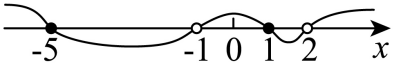

## 讲解

### 判据

多个绝对值相加减，或另一边也含未知数时，单个“到某点的距离小于固定数”不能直接处理整题。绝对值的定义给出入口：内部非负时保留，内部负时整体取相反数。内部式的零点把数轴切成符号确定的段，去掉绝对值后就能解普通不等式。

下面选例内部都是一次式。若内部是分式、根式或含参数，先求真实定义域，再判断零点、禁值和符号；零点未必是唯一分界，参数也可能改变次序或使一次项退化。不能把所有绝对值都直接换成内部式。

### 流程

1. **求齐分界点。** 每个内部式置零，写出原定义域。一次式 αx+β 仅在 α≠0 时有零点 -β/α；α=0 时直接取常数 |β|。目的在于找到内部正负可能改变的位置。
2. **排序并覆盖全域。** 不同分界点从小到大排好。相邻点之间及两边各成一段，端点归入一段或另算。参数使分界点相等时合并，不能留出没有检查的点。
3. **逐段按定义替换。** 对每个内部式分别判断符号，用 |u|=u 或 |u|=-u。绝对值外若有减号，替换后的整个负式必须用括号包住，再按分配律展开；两个负号可能抵消。
4. **解候选后交回本段。** 解新的普通不等式，得到的范围只在当前符号条件下有效，须与本段及定义域取交。交集空就说明这一支没有解，不能把候选范围单独留下。
5. **各支取并集并检验边界。** 任一允许分支满足就属于总解，所以合并用并集。把分界点和最终新边界代原式，区别“内部为零”和“整个不等式取等”——内部为零并不自动被严格不等式排除。

### 去掉绝对值时究竟用了什么

在一段上确认 u<0 后，|u|=-u。这是绝对值定义，不是把符号删除。例如一般结构 |u|-|v|，若这一段 u<0、v≥0，就成为 (-u)-v；若 u<0、v<0，就成为 (-u)-(-v)=-u+v。先保留括号，才不会让外面的减号吃掉一次取反。

选例 P0384(3)某一支得到 x>1，但那一支原本要求 x<1，所以交集为空。这不是推导矛盾，而是该符号分支没有满足者。P0405(2)的内部零点 1/2 也不是最终右侧解集边界，最终边界要由去绝对值后的目标式判断。

### 两个绝对值比大小何时可以平方

若题目确为 |u|>|v|，两边都是非负数，平方严格保序。对非负 s、t，s²-t²=(s-t)(s+t)；当 s≠t 时 s+t>0，因此差的正负与 s-t 相同。于是

$$
|u|>|v|
\ \Longleftrightarrow\
u^2>v^2
\ \Longleftrightarrow\
(u-v)(u+v)>0.
$$

这个方法可以与分段法互相核验。若右侧改成可能为负的 r(x)，就不能先平方：r(x)<0 时 |u|>r(x) 已经恒成立，r(x)≥0 时才进入非负两边比较。非严格比较时还要处理 s=t=0；结论仍保序，但不能无条件除 s+t。

下面两道原题包含分式和高次式小问，这些也完整保留并接齐原解；核心示范仍是一次式零点分段与交回本段。

## 例题

### 原题 P0384

> 来源ID HSMA-B1-C2-De3e177f3ec4c-P0384；原件 `第二章 一元二次函数、方程和不等式（举一反三讲义·基础篇）数学人教A版2019必修第一册（解析版）.docx`；DOCX正文段落 P0384—P0387；答案与详解 P0388—P0404。年份、地区和试题标签沿原资料记载，未独立核实。

**原资料题干与选项：**

4．（24-25高一上·江苏苏州·阶段练习）求下列不等式的解集：

(1)$\frac{5-x}{x+3}>0$

(2)$\frac{2{x}^{2}+3x-7}{{x}^{2}-x-2}\ge 1$

(3)$2x-\left| x-1\right|>2$．

**原资料答案与详解（完整保留，公式转写为LaTeX）：**

【答案】(1)$\left( -3,5\right)$

(2)$\left( -\infty ,-5\right]\cup \left( -1,1\right]\cup \left( 2,+\infty \right)$

(3)$\left( 1,+\infty \right)$

【解题思路】（1）把分式不等式转化为整式不等式求解.

（2）利用“穿根法”解高次不等式.

（3）分情况讨论，去掉绝对值符号，解不等式.

【解答过程】（1）$\frac{5-x}{x+3}>0$ $\Rightarrow $ $\left( 5-x\right)\left( x+3\right)>0$ $\Rightarrow $ $\left( x-5\right)\left( x+3\right)<0$ $\Rightarrow $ $-3<x<5$.

所以不等式的解集为：$\left( -3,5\right)$.

（2）由$\frac{2{x}^{2}+3x-7}{{x}^{2}-x-2}\ge 1$ $\Rightarrow $ $\frac{\left( 2{x}^{2}+3x-7\right)-\left( {x}^{2}-x-2\right)}{{x}^{2}-x-2}\ge 0$ $\Rightarrow $ $\frac{{x}^{2}+4x-5}{{x}^{2}-x-2}\ge 0$

所以$\frac{\left( x+5\right)\left( x-1\right)}{\left( x-2\right)\left( x+1\right)}\ge 0$， 

由穿根法：

原不等式的解集为：$\left( -\infty ,-5\right]\cup \left( -1,1\right]\cup \left( 2,+\infty \right)$.

（3）$2x-\left| x-1\right|>2$

当$x\ge 1$时，原不等式可化为：$2x-\left( x-1\right)>2$ $\Rightarrow $ $x>1$；

当$x<1$时，原不等式可化为：$2x-\left( 1-x\right)>2$ $\Rightarrow $ $x>1$，无解.

综上可知：原不等式的解集为：$\left( 1,+\infty \right)$.

**展开解析与核验（依据原详解补足，勘误另标）：**

（1）零点与禁点为5、-3，商在两者之间为正，外部为负；严格条件两个端点均不收，得$(-3,5)$。

（2）定义域排除$x=-1,2$。先减1通分，得$(x+5)(x-1)/[(x-2)(x+1)]\ge0$。按-5、-1、1、2排序，在五个开区间逐因子定号，商依次正、负、正、负、正。分子零点-5和1收，分母禁点-1和2不收，所以$(-\infty,-5]\cup(-1,1]\cup(2,+\infty)$。原图的实心与空心点须按分子零点、分母禁点分开理解。

（3）在$x\ge1$分支绝对值为$x-1$，得$x+1>2$即$x>1$，与分支取交集仍$x>1$；在$x<1$分支绝对值为$1-x$，得$3x-1>2$即$x>1$，与$x<1$交集为空。合并仅$(1,+\infty)$，分支推得的候选不能脱离原分支。

**补足第二问符号表：** 原式的分母为 (x-2)(x+1)，禁值 -1、2 不得收入。下表只列各开放段，等于零的临界点另代回。

| 因子或商 | x<-5 | -5<x<-1 | -1<x<1 | 1<x<2 | x>2 |
| --- | --- | --- | --- | --- | --- |
| x+5 | − | + | + | + | + |
| x-1 | − | − | − | + | + |
| x-2 | − | − | − | − | + |
| x+1 | − | − | + | + | + |
| 整个商 | + | − | + | − | + |

每行来自一次式过自身零点的前负后正；商按四个因子的负号个数合成。临界点 -5、1 使新分子为零且分母非零，对应原分式恰等于 1，非严格条件收；-1、2 是原分母零点，不收。第三问的 x=1 使原左侧恰为 2，所以严格号排除。

### 原题 P0405

> 来源ID HSMA-B1-C2-De3e177f3ec4c-P0405；原件 `第二章 一元二次函数、方程和不等式（举一反三讲义·基础篇）数学人教A版2019必修第一册（解析版）.docx`；DOCX正文段落 P0405—P0408；答案与详解 P0409—P0427。年份、地区和试题标签沿原资料记载，未独立核实。

**原资料题干与选项：**

5．（24-25高一上·辽宁大连·阶段练习）解下列关于x的不等式．

(1)$\frac{1}{x-4}\le 1-\frac{x}{4-x}$；

(2)$\left| 2x-1\right|-\left| x+1\right|>0$；

(3)${x}^{3}+2{x}^{2}-x-2>0$．

**原资料答案与详解（完整保留，公式转写为LaTeX）：**

【答案】(1)$x\le \frac{5}{2}$或$x>4$；

(2)$x<0$或$x>\frac{1}{2}$；

(3)$-2<x<-1$或$x>1$

【解题思路】（1）由分式不等式解法可得答案；

（2）分类讨论去掉绝对值可解不等式；

（3）注意到${x}^{3}+2{x}^{2}-x-2=\left( x+2\right)\left( {x}^{2}-1\right)$，后讨论$x+2,{x}^{2}-1$正负情况可得答案.

【解答过程】（1）$\frac{1}{x-4}\le 1-\frac{x}{4-x}\Rightarrow \frac{1}{x-4}-1+\frac{x}{4-x}\le 0\Rightarrow \frac{1-x+4-x}{x-4}\le 0\Rightarrow $

$$\frac{5-2x}{x-4}\le 0\Rightarrow \frac{2x-5}{x-4}\ge 0\Rightarrow \left\{ \begin{aligned}\left( 2x-5\right)\left( x-4\right)\ge 0\\x-4\ne 0\end{aligned}\right.\Rightarrow $$

 $x\le \frac{5}{2}$或$x>4$；

（2）当$x<-1$时，$\left| 2x-1\right|-\left| x+1\right|=-2x+1+x+1=-x+2>0\Rightarrow x<2$，

结合$x<-1$，则$x<-1$；

当$-1\le x\le \frac{1}{2}$时，$\left| 2x-1\right|-\left| x+1\right|=-2x+1-x-1=-3x>0\Rightarrow x<0$，

结合$-1\le x\le \frac{1}{2}$，则$-1\le x<0$；

当$x>\frac{1}{2}$时，$\left| 2x-1\right|-\left| x+1\right|=2x-1-x-1=x-2>0\Rightarrow x>2$，

结合$x>\frac{1}{2}$，则$x>2$.

综上：$x<0$或$x>2$；

（3）${x}^{3}+2{x}^{2}-x-2=\left( {x}^{3}-x\right)+\left( 2{x}^{2}-2\right)=x\left( {x}^{2}-1\right)+2\left( {x}^{2}-1\right)=\left( x+2\right)\left( {x}^{2}-1\right)$.

则

$${x}^{3}+2{x}^{2}-x-2>0\Rightarrow \left\{ \begin{aligned}x+2>0\\{x}^{2}-1>0\end{aligned}\right.$$

或

$$\left\{ \begin{aligned}x+2<0\\{x}^{2}-1<0\end{aligned}\right.$$

.

$$\left\{ \begin{aligned}x+2>0\\{x}^{2}-1>0\end{aligned}\right.\Rightarrow -2<x<-1$$

或$x>1$，

$$\left\{ \begin{aligned}x+2<0\\{x}^{2}-1<0\end{aligned}\right.\Rightarrow x$$

不存在.

综上：$-2<x<-1$或 $x>1$.

**展开解析与核验（依据原详解补足，勘误另标）：**

（1）两个分母$x-4,4-x$互为相反数，先排除$x=4$。右侧为$1+x/(x-4)$；左减右得$(5-2x)/(x-4)\le0$，等价于$(2x-5)/(x-4)\ge0$。零点5/2可收，禁点4不收，商两侧非负，得$x\le5/2$或$x>4$。

（2）分界点-1、1/2。在$x<-1$，差为$2-x>0$恒成立；在$-1\le x\le1/2$，差为$-3x>0$，与本段相交得$[-1,0)$；在$x>1/2$，差为$x-2>0$，相交得$(2,+\infty)$。合并$(-\infty,0)\cup(2,+\infty)$。

**原书答案栏错误：** 答案栏第二问写$x>1/2$，原完整详解结尾正确写$x>2$。代$x=1$，原差$1-2=-1$不满足，所以不能照答案栏收入$(1/2,2]$。保留答案栏与原详解并单独纠正。

（3）分组提公因式得$(x+2)(x^2-1)=(x+2)(x+1)(x-1)$。三个单根-2、-1、1，四段积依次负、正、负、正，严格排除根，得$(-2,-1)\cup(1,+\infty)$。

**补足等价依据与中间变形：** （1）在 x≠4 内，将两个相反分母统一，再相减：

$$
\frac1{x-4}-\left(1-\frac{x}{4-x}\right)
=\frac1{x-4}-1-\frac{x}{x-4}
=\frac{1-(x-4)-x}{x-4}
=\frac{5-2x}{x-4}.
$$

对这个完整差要求≤0；变成 (2x-5)/(x-4)≥0 是同乘 -1 后反向，不是直接乘符号未知的分母。

（2）用非负两边平方另核：|2x-1|>|x+1| 等价于

$$
(2x-1)^2-(x+1)^2
=[(2x-1)-(x+1)][(2x-1)+(x+1)]
=(x-2)(3x)>0.
$$

因 3>0，故 x(x-2)>0，即 x<0 或 x>2，与三个分段的并集相同。最终边界 0、2 代入时两个绝对值相等；分界点 -1 代入差为 3>0，应收入，分界点 1/2 代入差为 -3/2，不收。严格号排的是整个差为零的点，不能机械排除全部内部零点。

## 易错

- 在一段写对去绝对值公式，却把所得$x$范围直接收入总解：必须与该段范围取交集。
- 绝对值内有负号，去符号时只改一项：用$-(a x+b)$再完整展开。
- 将两个绝对值差大于0误当成单个绝对值对固定数：应先按各内部式的零点分段，或用非负平方比较。
- 原答案与详解冲突时仅照答案栏：代回原式；本条原题的$x=1$能直接否定错误答案区间。
